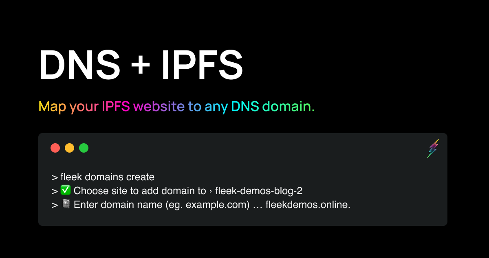

Thursday’s release day, and today we delivering another key service on the Fleek CLI beta: **the Custom Domains Service, allowing you to map DNS domains to your Fleek sites**!

Any user can now fully deploy a static website onto IPFS, add a DNS domain to it (e.g. yourdapp.com) and have it resolve, and be fully hosted via Fleek. You can find guides to all new features detailed in our [docs](/docs).

---

## Configure a DNS Domain with your IPFS Website

Fleek’s Custom Domain service is a set-it-and-forget-it feature. Once you configure your domain with your site, the content will be automatically updated without the need of your intervention.

Fleek will get the IPFS CID and update the references on the CDN pull zones that are configured into your domain during the setup process.

    > fleek domains create
    WARN! Fleek CLI is in beta, use it at your own discretion
    ✔ Choose site to add domain to › fleek-demos-blog-2
    ✔ Enter domain name (eg. example.com) … fleekdemos.online
    > Success! Domain "fleekdemos.online" successfully added.
    > Update DNS records for "fleekdemos.online":
    > CNAME @ <your pullzone>
    > Press any key as soon as you configure your domain provider for verification.
    > Success! Domain "fleekdemos.online" was verified.

We prepared a **quick video guide on how to set up your custom domain with your site in the CLI**!

<iframe width="600" height="350" src="https://www.youtube.com/embed/1KqIw2T4qUU?controls=0" title="YouTube video player" frameborder="0" allow="accelerometer; autoplay; clipboard-write; encrypted-media; gyroscope; picture-in-picture; web-share" allowfullscreen></iframe>

---

## Also Included In This Release

As part of this new version of the CLI we also include numerous improvements like:

- Deployment history
- Improved UX of site deployment adding a spinner and progress update messages
- Updated descriptions on commands
- Added optional parameters to domains commands

---

We’re excited to start seeing production-ready sites, hosted in IPFS, linked to a DNS domain… All through the Fleek CLI! Each milestone takes us a step further in feature parity with the legacy platform.

Found a bug, got an idea or request? Pay our [Discord](https://discord.gg/fleek) a visit and let us know.

For more resources visit [our LinkTree](https://linktr.ee/fleek)!
