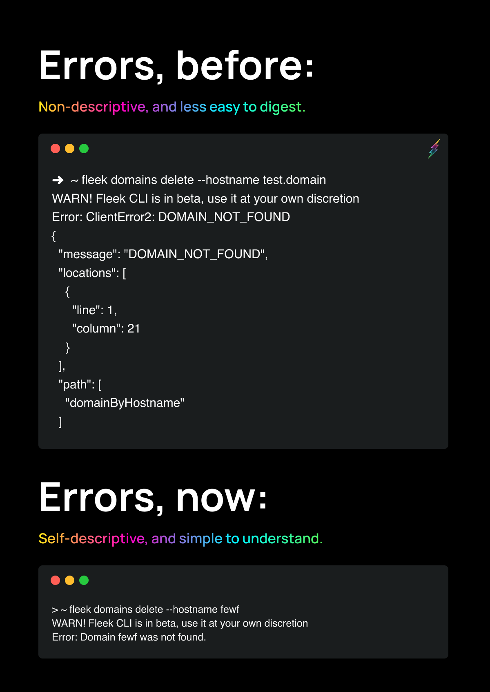
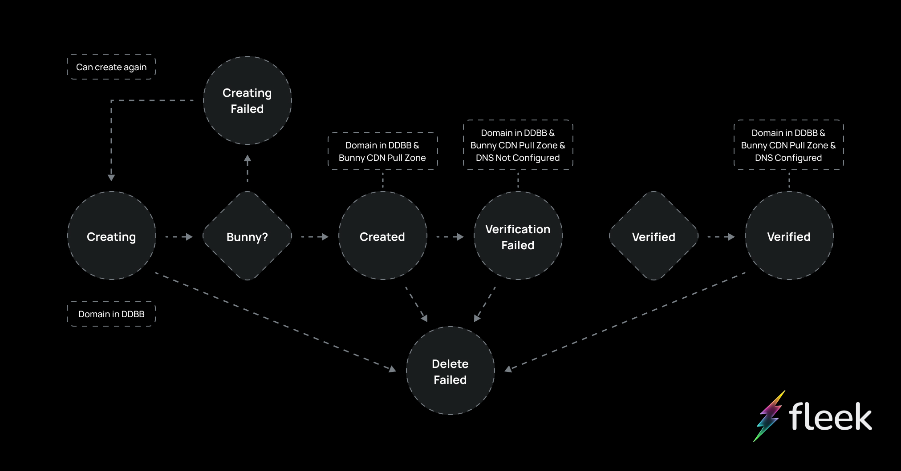

Let’s walk you through the latest enhancements we’ve made, **specifically in our error management, leveraging events to manage domain states, and our new private IPFS gateway**.

These improvements are designed to make your SDK, CLI, and incoming UI experience even smoother and more secure. Let's dive right in!

---

## Enhanced Error Management

We've made some improvements to how we manage errors across our services. Previously, when users encountered an error (like linking an already utilized Domain), they would receive a traditional error stack trace. This wasn't the most user-friendly approach and often required extra work for users to understand and address the issue.

Now, **our error-handling system is much more efficient and digestible, propagating error messaging across the CLI, SDK, and soon-to-come UI**:

- Errors now know how to handle themselves, users are only shown important information.

- Each type of error has its own custom implementation that extends from a custom implementation of the error class that we’ve named `Fleek Error`.

- Instead of handling each error itself, there’s now a custom error implementation that handles all unexpected errors, sending a generic, properly formatted and easy-to-digest error message in each instance.

- Users will benefit from easier handling of edge cases and a more streamlined experience.

- Error messages now contain everything the user needs to know, streamlining customer service by solving problems at their root cause.

---

## Domain States and Events

We're expanding domain statuses on our platform from our verified/not verified state to a more specific list, giving users a clearer look at a domain’s lifecycle as they link it to their sites on Fleek.

We’re leveraging our event-driven architecture to enhance how we update domains and the states they go through in their lifecycle! Previously, domains were only verified as true or false upon connection. Now, domains travel through a set of events with possible states upon creation. The updated domain events include:

- Users Deleting Domain:

  - Delete Fail Event State: Occurs when a user's attempt to delete their domain fails.

- BunnyCDN Pullzone Creation Failure:
  - Domain Creating Fail State: Occurs when a Bunnycdn pull zone for a user's domain fails to be created.

**These events are handled asynchronously** for a more efficient and reliable process. For more information on events, check out the Fleek Leak blog post about our [event-driven architecture](/blog/announcements/fleek-leak-04-event-architecture/)!

---

## New Private IPFS Gateway

We've also launched a new and improved IPFS gateway that brings better performance in obtaining data and increased security.

_The reason?_

Before, our IPFS gateways to preview raw IPFS sites and storage were publicly accessible to any (browsers, users, and crawlers alike) which meant any content, malicious or not, could be exposed. This affected Fleek's gateway's domain reputation and exposing users to potential phishing content.

Now, **gateways are hidden from the general public and will only serve the purpose of allowing users to map a custom domain on top of them to access their site's raw IPFS preview from a personalized private gateway endpoint**. This separates the scope and responsibility for the content to each user and ensures proper usage. For specifics on the changes we're making to improve security against phishing effects, check out our most recent [blog](/blog/announcements/gateway-phishing-security-improvements/)!

---

## Other Fixes and Improvements

- Added SDK baseline, authentication SDK, and CLI login feature

- Renamed "Remove" to "Delete"
- Implemented CLI prompt wrappers

- Added support for personal access token (PAT) names
- Improved PAT token serialization
- Simplified IPFS upload method in SDK
- Added node environment check in SDK
- Display a different message to users when deployment takes too long

---

For more resources and updates, visit [our LinkTree](https://linktr.ee/fleek).
