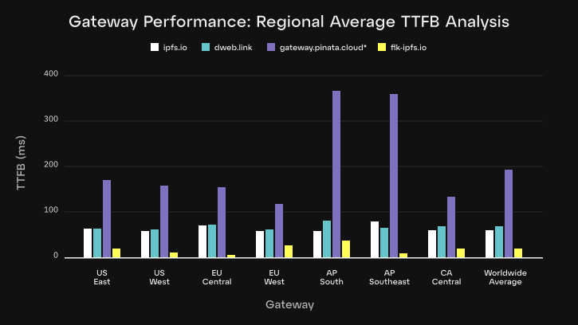
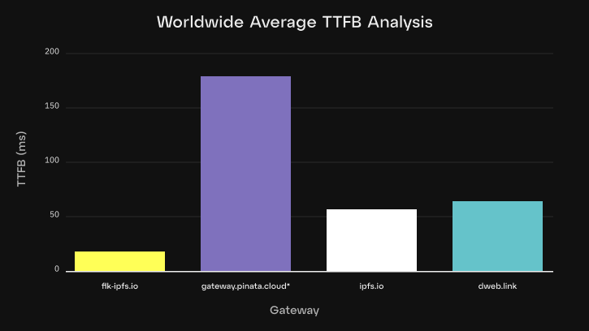

We are excited to introduce a new product line to the Fleek family: **a decentralized IPFS gateway that will leverage Fleek Network to achieve superior performance, reliability, censorship resistance, and long term sustainability** compared to traditional IPFS gateways. \
 \
Today we are releasing a [V0 of the gateway](https://fleek.xyz/docs/platform/gateways/), which is a highly performant, regionally distributed, traditional public IPFS gateway (built using [Rainbow IPFS gateway](https://github.com/ipfs/rainbow/)). The reason for releasing this V0 now is because several customers were looking for a quick Cloudflare replacement after they recently [sunset their public IPFS gateway](https://blog.cloudflare.com/cloudflares-public-ipfs-gateways-and-supporting-interplanetary-shipyard). However in subsequent releases over the coming months we will be transitioning the IPFS gateway to [Fleek Network](https://fleek.network/), which will result in further performance improvements and other benefits (decentralized, verified bandwidth, etc.)\
 \
This document serves as an introductory overview of the key design advantages behind Fleek’s new IPFS gateway, how to use it, and how it compares to other public IPFS gateways. Additionally, we will share our future plans for its decentralized evolution by leveraging Fleek Network. \
Now let’s dive in.

## **Fleek IPFS Gateway: Key Advantages**

### **1. Geographic distribution**

Fleek’s new IPFS gateway is currently distributed across 9 global regions. This multi-regional deployment is designed to minimize latency by ensuring that user requests are handled by the closest gateway, thereby significantly improving response times and content delivery speed. The benefits of this approach will increase further once the gateway is fully migrated to Fleek Network given the network's high edge node count.

### **2. Rainbow IPFS gateway integration**

Our gateway architecture is centered around the Rainbow gateway-only IPFS solution. The Rainbow gateway is renowned for its robust performance and high availability. Rainbow is specifically optimized for fetching content, making it more efficient and performant. This integration enables us to take advantage of advanced features like optimized content routing and seamless autoscaling, which are essential for managing the dynamic demands of IPFS traffic.

### **3. Autoscaling for peak performance**

Our gateway infrastructure is designed with autoscaling capabilities that automatically adjust to traffic demands. This means that during peak usage times, our system can expand to handle increased loads without compromising on performance. This autoscaling feature is a key differentiator from other alternatives, many of which lack the ability to dynamically scale resources in real-time. The benefits of this approach will increase further once the gateway is fully migrated to Fleek Network given traffic can be spread across all the network’s edge nodes, which also helps prevent DDOS attacks given the network can absorb and distribute traffic across a very large number of IP addresses.

### **4. High availability, redundancy, and data integrity**

Fleek’s gateway is built with high availability in mind. Pinning and caching strategies are employed to ensure that highly requested data remains available across multiple nodes, further enhancing redundancy and performance. By deploying across multiple regions we ensure that our gateway remains operational even if one region experiences downtime. This level of redundancy is essential for maintaining a reliable service, especially in a decentralized environment where uptime is critical. The benefits of this approach will increase further once the gateway is fully migrated to Fleek Network given the service will continue to operate so long as just one of the nodes on Fleek Network are operating (out of 1,000 total edge nodes).

### **5. Content caching for reduced latency**

One of the standout features of Fleek’s IPFS gateway is its advanced content caching mechanism. By utilizing the rainbow IPFS gateway for disk file caching, we can efficiently manage and distribute content across multiple nodes, ensuring high availability and quick access. After the first request for specific content or files are processed, the data is cached on disk at the regional gateway level.

Utilizing content-addressed mechanisms, CIDs (Content Identifiers) are mapped to the IP addresses of users storing that specific content, facilitating efficient data retrieval and distribution across the network. Subsequent requests for the same content are served directly from the disk cache, significantly reducing latency and improving load times. The integration with Rainbow's gateway enhances this caching capability, providing a robust layer that ensures content is quickly and efficiently delivered to users. The benefits of this approach increase further once the gateway is fully migrated to Fleek Network given the networks built in CDN service.

### 6. Decentralized, Permissionless, Trustless (coming soon)

As mentioned in the intro, and as detailed in the sections below, over the coming months Fleek’s IPFS Gateway will be migrated to Fleek Network’s edge-optimized onchain cloud infrastructure. By doing so, the gateway will unlock additional benefits, such as:

- Decentralized (runs on Fleek Network)

- Verified Bandwidth (thanks to Blake3 hashing)

- Permissionless (anybody can run their own gateway)

- Trustless (thanks to verified bandwidth and other [crypto-economic incentives](https://fleek.network/whitepaper.pdf#delivery)

- Censorship Resistant (since anybody can use their own URL on top of the gateway)

- Crypto Native (can pay directly to Fleek Network with USDC on multiple chains)

- Long Term Sustainable (all other public gateways are subsidized, and you can’t give away free bandwidth forever. ex. Cloudflare recent public gateway shutoff)

- No Corporate Nonsense (given the decentralized, permissionless, transparent nature of Fleek Network)

## **Measuring the performance of the public IPFS gateway**

For our performance testing we're using a simple [open source benchmarking tool](https://github.com/fleek-platform/latency-measure) that measures response times for IPFS requests against a consistent file. These tests are designed to evaluate the geo-routing efficiency and the caching response times. This also tests the server’s ability to handle load under different conditions. Anybody is free to try to replicate the test and results.

This approach gives us valuable insights into how well the system manages requests from various locations, and how quickly it can serve cached content, ensuring we maintain high performance even under pressure.

_Please note: the Pinata gateway is rate-limited; data may be skewed._

## **How to make use of the public IPFS gateway**

Users can easily take advantage of Fleek’s public IPFS gateway by[integrating it into their applications or websites](https://fleek.xyz/docs/platform/gateways/). Here’s how:

1. **Accessing content**: Users can access content stored on the IPFS network by making HTTP requests to Fleek’s IPFS gateway endpoints, formatted as:

- [https://flk-ipfs.io/ipfs/](https://flk-ipfs.io/ipfs/)`<CID>`

- [https://`<CID>`.ipfs.flk-ipfs.io](null)

Where `<CID>` is the content identifier.

2. **Hosting decentralized websites**: Developers and businesses can host decentralized websites on IPFS and use Fleek’s gateway to ensure their site is accessible globally with minimal latency. \

3. **API integration**: Fleek’s gateway can be integrated into applications via simple HTTP API calls, allowing developers to retrieve IPFS content programmatically with the added benefits of geo-routing and autoscaling.

## Future plans for decentralizing the public IPFS gateway on our roadmap

As part of our commitment to innovation and decentralization, Fleek has several exciting plans for the future of this public IPFS gateway:

### **1. Transitioning the gateway to leverage Fleek Network**

One of the key developments on our roadmap is transitioning the IPFS gateway to leverage Fleek Network’s decentralized edge network. This transition will enable even faster content delivery by distributing IPFS content closer to users, using the global network of edge nodes..

The core protocol team is also considering integrating a decentralized IPFS pinning service into Fleek Network to ensure that critical content remains available and easily accessible in perpetuity.

### **2. Enhanced security features**

We plan to introduce advanced security features, including end-to-end encryption, verified bandwidth, and enhanced DDoS protection, to further safeguard the content accessed through Fleek’s IPFS gateway.

### **4. Integration with permission-based access systems**

Fleek is exploring integration with decentralized identity solutions to create a robust permission-based access system for IPFS content. This ensures that developers and users have full control over their data, allowing them to securely manage who can access private content and how it’s accessed.

### **5. Developer tools and SDKs**

To make it even easier for developers to build on top of Fleek’s IPFS gateway, we will be releasing a suite of developer tools and SDKs. These tools will simplify the process of integrating IPFS into applications and allow for more seamless interactions with the Fleek gateway.

That’s all for now. You can learn more about getting started with the new IPFS gateway in our[docs](https://fleek.xyz/docs/), by joining our [Discord](https://discord.gg/fleek) server, or by following [Fleek](https://x.com/fleek) and [IPFS](https://x.com/ipfs) on X.

- Get started using the new Fleek IPFS Gateway

- Learn how to migrate from Cloudflare IPFS Gateway to Fleek

- Dive into IPFS Storage:[https://fleek.xyz/blog/learn/understanding-ipfs-storage-fleek/](https://fleek.xyz/blog/learn/understanding-ipfs-storage-fleek/)

- Host your dApp on IPFS:[https://fleek.xyz/blog/templates/ethereum-boilerplate-ipfs-nextjs/](https://fleek.xyz/blog/templates/ethereum-boilerplate-ipfs-nextjs/)
