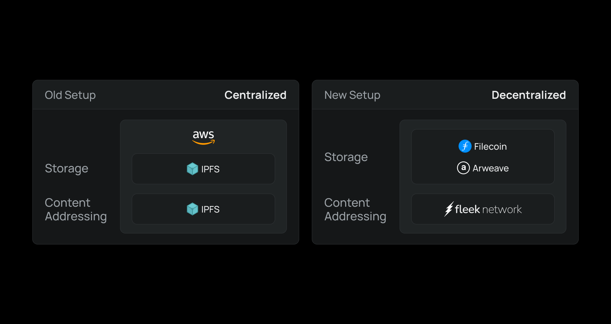

The other week we gave [an update on Fleek.xyz’s roadmap/launch timeline](/blog/announcements/fleek-platform-update/) and shared some alpha on a cool change coming to the new platform: **moving from a centralized IPFS setup (Digital Ocean + Cloudflare) to a decentralized IPFS setup (Filecoin/Arweave + Fleek Network).**

The move will happen in phases, and during all phases, the Fleek experience will remain the same across all products/services. Plus, as with all migrations to decentralized infra, we will keep the legacy centralized infra running in tandem until we are 100% confident in the performance and reliability of the decentralized infra. With that said, the benefits of this move include:

1. Better File & Data Storage/Availability Guarantees
2. Better Web3 Alignment (less use of centralized infra)
3. Equal Performance + **Better Pricing**

We accomplish this by separating the file storage layer of IPFS from the content addressing/routing layer of IPFS. Our goal is to make IPFS storage layer agnostic and bring the content addressing/routing benefits of IPFS to every file and data storage protocol/product, and eventually the entire web.

---

### How Will This Work?

As mentioned above, by separating the content addressing/routing layer of IPFS from the storage layer built into IPFS, we are now able to store IPFS content on any storage layer without losing the content addressing/routing benefits that people love about IPFS.

The new setup uses decentralized storage networks (Filecoin, Arweave, etc.) as the storage layer, and Fleek Network as the IPFS content addressing/routing layer. Fleek Network maps an IPFS CID to all files/data on the network’s storage layers, and keeps a mapping of the CID to Origin in perpetuity. In the beginning, while Fleek Network is working its way to mainnet and beyond, we will also store and utilize an off-chain copy of the mapping.

The best part is that this setup keeps everything 100% IPFS compatible, meaning the content can always be accessed via any IPFS gateway. One added benefit of this new setup however is that if the content for any reason ever falls off IPFS, Fleek Network would be able to fetch the content from the origin (Filecoin, Arweave, etc.) and keep the file available via IPFS for as long as it remained available on the origin. And that part of the process we will abstract and make super seamless for users on the Fleek platform.

### How Does This Enable Better Pricing Without Sacrificing Performance?

Today all ‘pinning providers’ are essentially running IPFS nodes on centralized cloud platforms like AWS, Digital Ocean, etc. and then accelerating those nodes with Cloudflare or another CDN. Therefore they must pass along those storage/bandwidth costs (plus a premium) to sustainably provide IPFS pinning services to their customers. However centralized cloud platform prices are quite high to begin with, and comparatively decentralized storage protocols typically offer [significantly cheaper storage](https://file.app/).

So by switching our IPFS storage layer to decentralized storage protocols, we can offer customers significantly lower rates for storage, while continuing to use a CDN (Fleek Network) to ensure performant and cost-effective retrieval/delivery of the content.

### Why Don’t All IPFS Users/Pinning Providers Use Decentralized Storage?

Today, decentralized storage protocols (Filecoin, Arweave, etc.) don’t speak “IPFS”. So, if you want to use decentralized storage protocols with IPFS, you essentially need to store the content twice: once on the storage layer, and again at the IPFS layer. The two layers don’t talk, so if the file isn’t on IPFS, you would need to write custom logic to know that it exists on another storage network and to go check for it. So the short answer is, _it really wasn’t feasible to do so before_.

But once Fleek Network is live, for the first time it will provide an opportunity to connect IPFS to all the file and data storage protocols/layers, and so we will hopefully see other pinning providers and users of IPFS switch to this setup. It will provides real benefits over the current setup/usage of IPFS in terms of **cost, performance, storage/availability guarantees, and censorship resistance/decentralization.**

### Will Fleek Users Notice a Difference?

Not unless you want to notice the difference. Your direct user experience will stay the same. You still can host sites, upload files and have them seamlessly uploaded/stored on ‘Fleek’, but now, we're storing your files/data on decentralized storage networks that you have the option to choose from (Filecoin, Arweave, etc.) instead of storing your files/data on Fleek controlled cloud platforms.

You might just see some added details/info in the UI to transparently show/share the details of your data living on those networks (ex. storage deal ID’s, costs/renewals, etc.). It will be like getting a new iPhone, your overall experience using the product will look/feel the same, but there will be some noticeable improvements under the hood ✅

### When Is This Coming?

The upgrade to decentralized storage will come with the full Fleek.xyz platform release in August.

---

That’s just a quick look at one of the exciting upgrades coming to the new Fleek.xyz platform launching in August.

For more info on the rollout of Fleek.xyz, check out our [Platform Timeline and Milestones Update blog](https://blog.fleek.xyz/post/fleek-platform-update/). If you want to jam more on decentralized storage join our [Discord](https://discord.gg/fleek) community and link up with our team!
