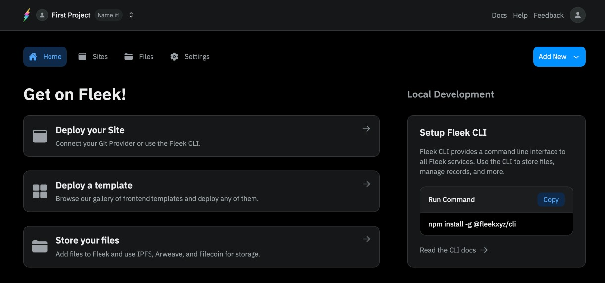
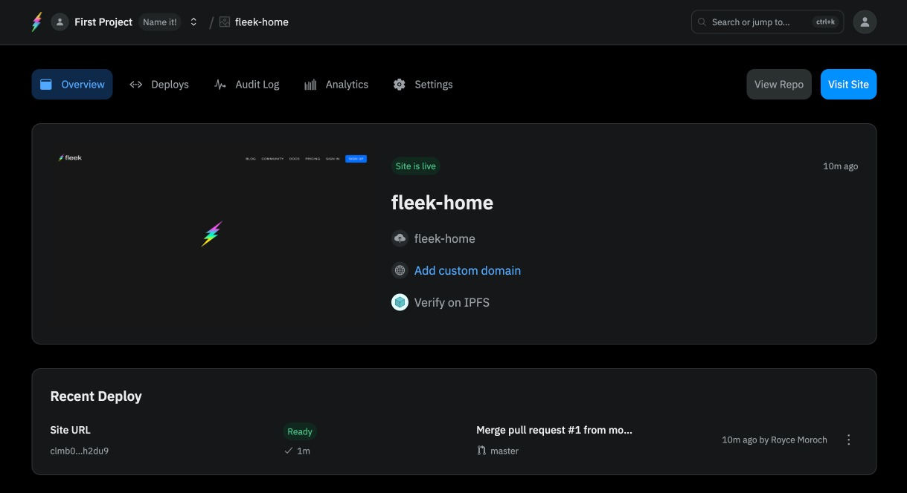

Hey there *Fleek Freaks*! The Fleek Alpha is here and new testers are being onboarded every day (if you haven’t [gotten access yet to the Alpha](https://fleekxyz.typeform.com/alpha-access), what in Vitalik’s name are you waiting for?

With the release of the alpha, setting the foundations for the release of V1, we’re bringing back **our frequent release notes updates at a constant cadence** under a new name: **Fleek Release Notes 📔**

What can you expect from *the release notes*? We'll be releasing our nitty-gritty changes in our documentation, and with each we'll post a **Fleek Release Notes** that does a double-click on the highlights and links to how to start using things. We'll cover:

- New Features
- Important Bug Fixes
- Enhancements
- Any other team updates.

Today, given it's the initial release, we'll cover the Alpha's base features - expect the next one to cover the fixes and enhancements we found in testing this week!

So, without further ado, let’s get into it ⚡

---

## New Features

### Projects

In the new Fleek, we have introduced Projects, a way to organize your sites, files, and else. This alpha release allows you to:

- [Create a new project](https://docs.fleek.xyz/docs/Projects#creating-a-new-project)
- [Invite other users to your projects](https://docs.fleek.xyz/docs/Projects/invites)

### Sites

In this initial release, users can deploy/host apps via a managed deployment CI/CD in the app, or opt for the the CLI-based deployments(a.k.a. Self-Managed and built deployments). Users can:

- [Deploy sites to IPFS storage by connecting their GitHub account](https://docs.fleek.xyz/docs/Sites/managed)
- [Create sites to manage via the CLI](https://docs.fleek.xyz/docs/Sites/self-hosted#setting-up-a-self-managed-deployment)
- [Deploy sites from templates created by the Fleek team and the community](https://docs.fleek.xyz/templates)
- [Configure a custom domain on their sites via the UI](https://docs.fleek.xyz/docs/Domains/custom-domains)
- [Configure ENS domains on their sites via the UI](https://docs.fleek.xyz/docs/Domains/ens#adding-an-ens-domain)
- [Configure environment variables on their sites via the UI](https://docs.fleek.xyz/docs/Sites/managed#build-parameters)
- [Configure build settings and deploy context for their sites](https://docs.fleek.xyz/docs/Sites/managed#configure-your-build-settings)

### Storage

The alpha release introduces the revamped decentralized storage feature, with file pinning, with Arweave/Filecoin storage options and general IPFS addressability for all files. Users are able to:

- [Store files in their projects using IPFS, Filecoin and Arweave](https://docs.fleek.xyz/docs/Storage#add-a-file-or-directory)
- [See the file’s IPFS/Arweave hash, or its Filecoin deal ID](https://docs.fleek.xyz/docs/Storage#content-addressing) (reminder: we use IPFS as the content addressing layer, no matter where the file is stored).

### Settings

In the alpha we also introduced several settings pages where you can test more advanced features, such as private gateways. Users are able to:

- Set up avatars for their accounts, sites and projects.
- [Configure via the UI private IPFS gateways to serve their content through them](https://docs.fleek.xyz/docs/Gateways#creating-a-private-gateway)
- [Configure a custom domain on their private gateways to serve their content through them](https://docs.fleek.xyz/docs/Domains/custom-domains#adding-a-custom-domain)

---

## CLI/SDK version 0.7.0

Our CLI & SDK packages have been updated to v0.7.0 as well. [both have improvements described here]

You can find the CLI release [here](https://www.npmjs.com/package/@fleekxyz/cli), and the SDK release [here](https://www.npmjs.com/package/@fleekxyz/sdk).

And this closes the first update from our team going into our closed Alpha. Expect all features from above to be expanded as we collect feedback and build around it.

---

## Useful Links

- [Get a seat to test the alpha of Fleek](https://fleekxyz.typeform.com/alpha-access)
- [Read our documentation in full](http://docs.fleek.xyz/)
- [Bookmark that release notes so you don’t miss anything](https://docs.fleek.xyz/release-notes)
- [Check out that sweet new homepage](http://fleek.xyz/)

See you soon! ⚡
