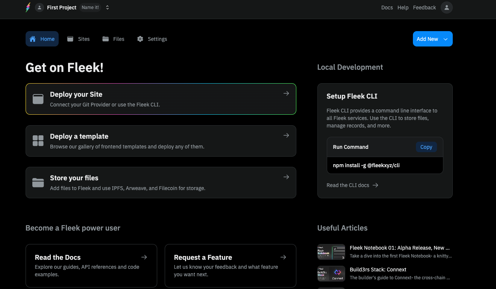

What’s up Fleek Freaks? We’re back with another Fleek Release Notes, giving y’all a look into the improvements and bug fixes we’ve implemented into the Fleek.xyz alpha over the last week. If you missed the previous Fleek Release Notes, get caught up [here](https://fleek.xyz/blog/announcements/fleek-notebook-01/)!

This week, the focus was mainly on some bug fixes, visual improvements, and foundational work for upcoming features like site deletion/template submission. _Don’t forget_: if you want to take part in the Fleek.xyz alpha, join our discord server and fill out [the application](https://fleekxyz.typeform.com/alpha-access) so you can join in the testing ⚡

Let’s dive into the updates, shall we?

---

## New Features

### UI & Experience:

We heard your feedback and have spent the week making dark mode the default, with some other improvements sprinkled in:

1. Dark Mode is now set as the Default UI Theme:

2. Template pages now render the repository’s Readmes as the description

<video width="100%" height="auto" autoplay loop>
 <source src="./tempreadme.mp4" type="video/mp4">
 Your browser does not support the video tag.
</video>

---

## Fixes

### UI & Experience:

This week, the frontend team worked on fixing several bugs from the interface, which include:

- Fixed site breadcrumbs to remove 304 redirect errors while navigating
- The flow to accept an invite [without having a Fleek account](https://fleek.xyz/docs/platform/accounts/) has been now implemented
- When logged out and visiting the templates page, if the user logins it now redirects them this section after doing so
- Added 150-character-max to Environment variables in sites
- Removed the redeploy option from [self-managed deployment sites](https://fleek.xyz/docs/platform/deployments/)
- Fixed `Go to Docs` button typo after CLI login
- Improved image caching and loading across the app
- Fixed issue with Fleek logo glitching on Templates pages
- Added extra information in the gateway for users to understand how to access their files
- Added a 1GB per file/folder maximum size validation in storage UI
- Fixed issue where a project’s GitHub app configurations persisted even when changing projects

---

## Inner-workings

While on the UI/user-facing front our updates end with the above, we have also been setting foundational work and improvements to the inner workings of Fleek.xyz, which prepare the platform for a couple of future releases:

- The base for the site and project deletion features have been set, and integrations can begin next.
- As well as the flow for community template submissions, with build settings validation, in preparation for integration of the feature to the frontend.

---

## Coming Next Release

- **Template submissions: Opening template submissions to the community**
- Site and project deletion
- Trackers for how many sites have been created for each template
- Adding custom build command and publish directory to templates
- Fixing Site previews

---

That’s all for this time! Just a small update to smooth out a few issues spotted by our first groups of testers. We’ll be back with Fleek Release Notes 03 after another week in the lab 🤙

Follow along with the release of the Fleek.xyz platform on [X](https://twitter.com/fleek) and join the community of testers in our [Discord server](http://discord.gg/fleek)!

See you soon ⚡

---

## Useful links ⚡

- [Alpha submissions for Fleek are still open](https://fleekxyz.typeform.com/alpha-access)
- [Read our documentation in full](https://fleek.xyz/docs/)
- [Bookmark the changelog so you don’t miss a single thing](https://fleek.xyz/blog/changelog/)
