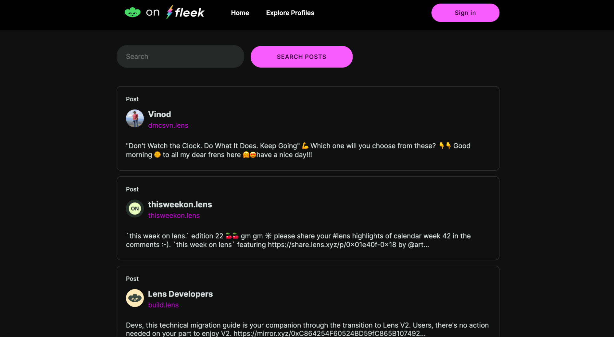

It’s that time again! We’re back for another bi-weekly update to the Fleek.xyz Alpha– this time with a new template option, faster file uploads, a few new features, and fixes.

Application form for the next batch of testers, who will get onboarded with v0.0.3 coming in ~2 weeks, is open [here](https://fleekxyz.typeform.com/alpha-access)!

Let’s get into the changes coming to the Fleek.xyz alpha with v0.0.2:

---

## Primary Domains

In an effort to simplify domain management, we're introducing a new "Primary Domains" feature. **The platform will now automatically reference your chosen primary domain for tasks related to sites or gateways**. When you set up your first active domain, it becomes the default primary. As you add more domains, you have the flexibility to set a new one that your site defaults to.

If you decide to switch things up and remove your primary domain, you’ll get a prompt to set up a new one from your list of domains.

<video width="100%" height="auto" autoplay loop>
 <source src="./primary-domains.mp4" type="video/mp4">
 Your browser does not support the video tag.
</video>

---

## Lens Template

Head over to the templates page to try our new Lens template! **Spin up your own fully functioning Lens social app in minutes with an easy-to-configure and customized template**. Start with a timeline, as well as post and user search, and build from there.

You can access the new template [here](https://app.fleek.xyz/templates/)- give us a tag on [X](https://twitter.com/fleek) with your finished Lens build ⚡

---

## Upload Improvements

You may have noticed uploads on the platform feel faster over the last week– that’s because we did a little refactoring on the backend and gave upload speeds a pretty significant boost! **Files of all sizes upload ~10 times faster than before on the UI** 🤙

---

## Other Fixes and Improvements

As always, we’ve squashed a ton of bugs and added a few small improvements with this release!

- Increased memory in our deploy lambda to accommodate bigger site repositories
- Fixed a bug where the IPNS values were not being updated after a deployment
- Fixed a bug where the GitHub listener was not catching all the commits for deployments
- Improved error handling when the user is not using the default Fleek configuration files while deploying with GitHub Actions
- Created a canary project to monitor site deployment flow for better customer support and availability
- Fixed an error where we were showing the incorrect message when a site name was not available
- Fixed an issue with some users getting stuck in the welcoming screen
- Added an auto-generated domain on the site overview if there is no domain set
- Fixed a bug where the view site button on the recent deployment cards was not working

---

That’s all we have to share for v0.0.2! We’ll be back in about 2 weeks with another set of improvements, along with the next batch of alpha testers ⚡

Follow along with the release of the Fleek.xyz platform on [X](https://twitter.com/fleek) and join the community of testers in our [Discord server](http://discord.gg/fleek)!

See you in a few weeks 🤙
