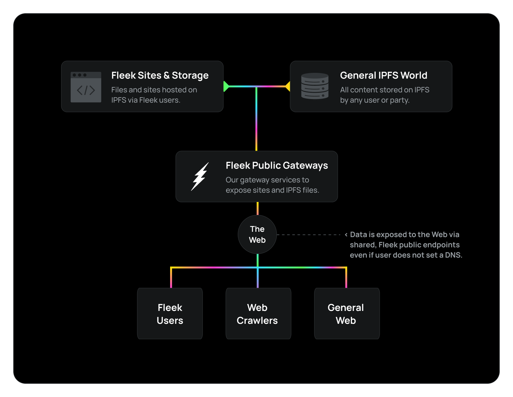
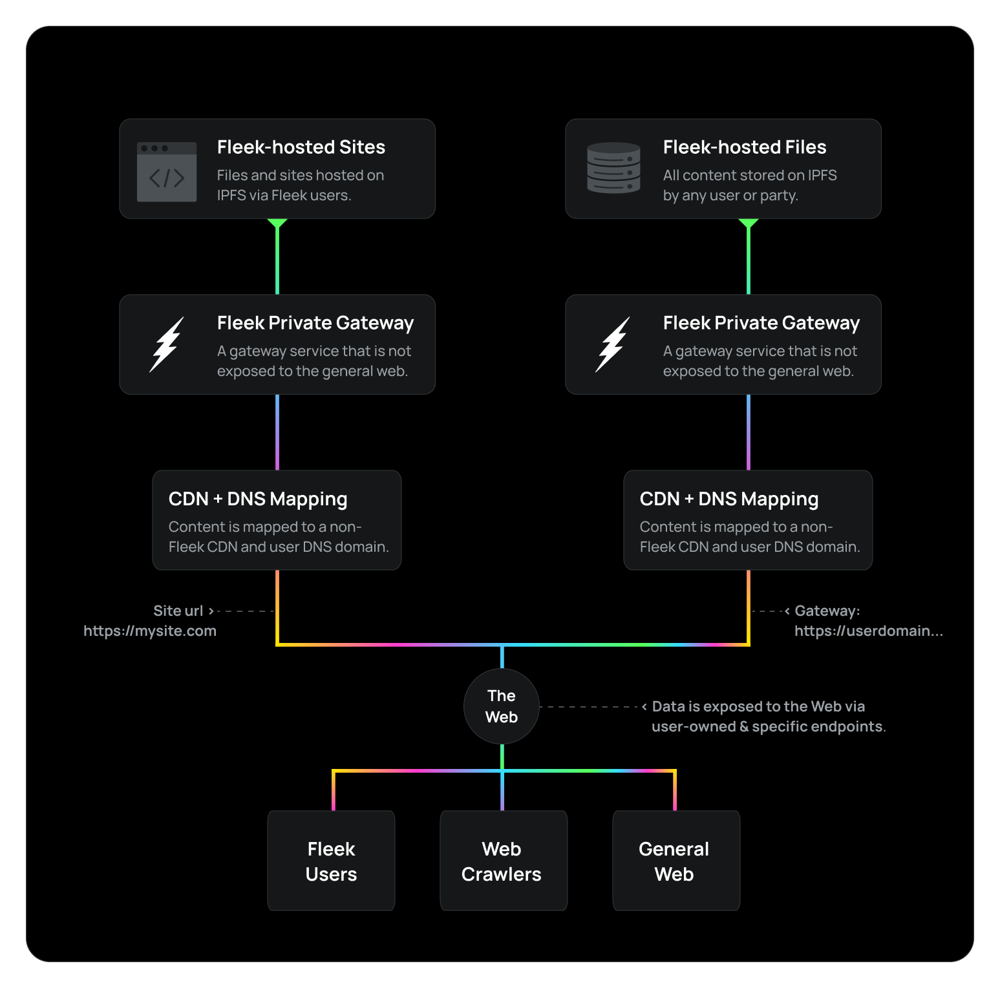

As we prepare to [migrate](/blog/announcements/road-to-sunsetting-from-xyz-to-co/) from [Fleek.co](https://fleek.co/) to [Fleek.xyz](https://fleek.xyz/), we are doing heavy work on Fleek.xyz to further **strengthen aspects of our infrastructure and services** in order to protect our users and their projects.

One of those aspects… **Improving protection towards phishing effects for our gateways to sites and content hosted through Fleek**, limiting the harm of any attempts to host malicious content. Let’s dive into this change.

---

## Our Gateways, Before:

For a long-time, Fleek.co was one of the main public IPFS gateways available. These gateway were not only used by Fleek users, to view the sites and files they hosted on Fleek via HTTPS, but by the general public to access any file on IPFS performantly.

These gateways were:

- Used in tandem by both Fleek users and the general public.
- Open to the entire general web, crawlers, and users.
- Hosted under two main Fleek domains.

Which, from a risk-perspective can cause issues such as:

- Gateways being judged by non-Fleek content.
- Fleek users being affected by other user’s content.
- General centralization risk of having single domains.

Content takedowns requirements or malicious content handling **were handled at Fleek**, at the endpoint level, which put at risk the stability of the service for other users in case an online provider decided to deem the endpoint/domain risky.

---

## Our Gateways, Now:

As we move to Fleek.xyz, we are building our gateways model to be private and user-specific, with a clear separation of scope to reduce all possibilities of risk, especially with phishing content.

### Gateways to Fleek-Hosted Sites:

**Before**, the gateways allowing users to view previews of sites hosted on Fleek were public. **Now, on Fleek.xyz, this gateway will be private and closed to the general web**. It will only allow our CDN service to access it, so that users can map a custom DNS domain to their site with the appropriate signature, and expose it to the general web that way (or via a public, non-Fleek IPFS gateway).

Malicious content removals and serving will be the responsibility of the CDN layer or at the end-user’s domain, **not affecting Fleek’s endpoints**.

### Gateways to Fleek-Hosted Storage:

As we have shared in previous updates, when it comes to the storage endpoint’s to each user’s IPFS storage bucket **we are transitioning to a gateway-as-a-service model**, and will allow users to configure custom DNS domains to have personal endpoints and avoid the same risks detailed above.

---

As we continue to work preparing our migration from Fleek.co to Fleek.xyz, we’ll keep sharing the infrastructure and resilience improvements we are preparing for all our Fleek users, based on the learnings and requests gathered in the last years running Fleek.co. Stay tuned!

If you need more resources, please visit our [LinkTree](https://linktr.ee/fleek).
