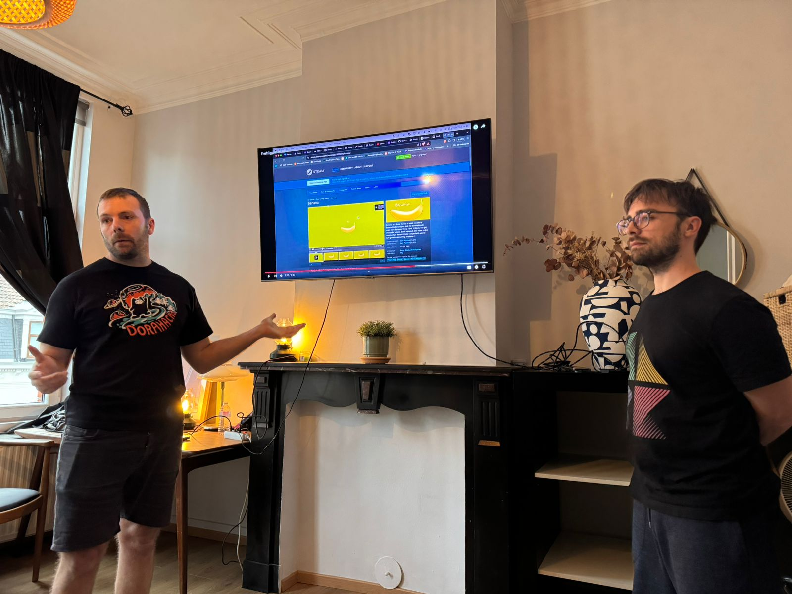
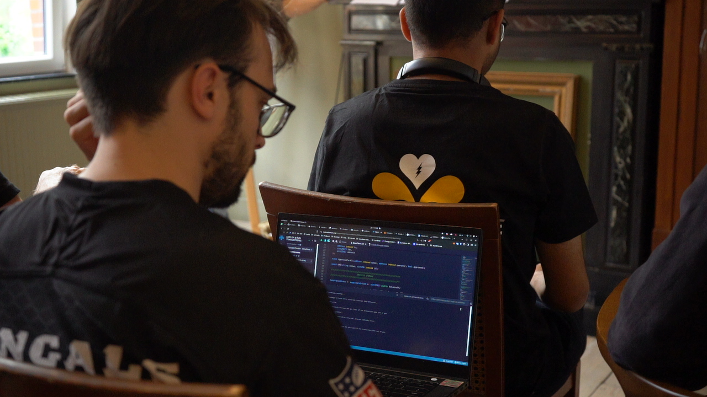
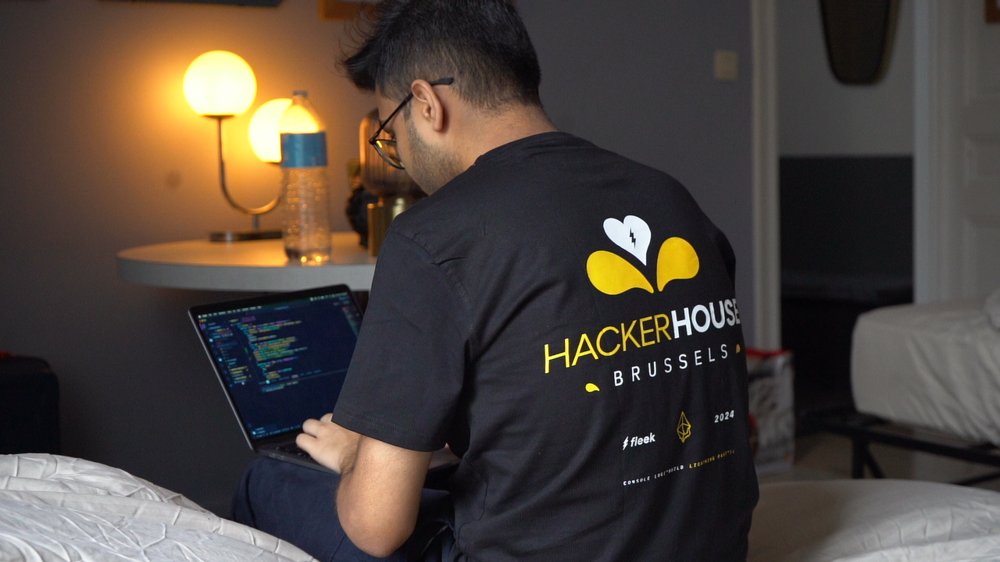

Fleek Functions launched about a month ago, and we’ve been super stoked about the early usage! In addition to organic discovery, the Base Onchain Summer Hackathon, and the first Fleek Hacker House (at EthCC in Brussels), resulted in a bunch of developers who are already building cool things with Fleek Functions and providing lots of valuable feedback.

Today let’s dive into some of the highlights, winners, and interesting projects built with Fleek Functions at the inaugural Fleek Hacker House.

---

# Fleek Hacker House Winners

The Fleek Hacker House was an in-person hackathon with 15 hand-selected engineers that ran from July 3rd-July 8th 2024 in Brussels. After 5 full days of serious problem-solving, brainstorming, and building, we received 14 complete projects, all of which heavily leverage  Fleek Functions. Given the proximity to EthCC, a lot of the projects addressed onchain use cases such as AVS’ (EigenLayer), Account Abstraction, and Rollups, but there were also a few submissions for general use cases such as image optimization.

Below are the top 5 winning projects along with their respective Hackers:

### Farcaster Frames and Idle Mining Game on Fleek

Two hackers built a classic roguelike dungeon crawler and deployed this as a Farcaster Frame. One of the most creative things about this project was the state management of the game. They handled the performance and stats of the player by making an intelligent mix of client-side and server-side state handling. They also used ROT.js to build a dynamic graphical interface for the game map.

⚡Hackers - <u>[@eugenioclrc](https://x.com/eugenioclrc)</u> <u>[@rotcivegaf](https://x.com/rotcivegaf)</u>

⚡Total Bounty Secured - $2500

⚡Source Code - <u>https://github.com/eugenioclrc/fleek-user-dungeons</u> and <u>https://github.com/eugenioclrc/fleek-eggs</u>

### Cron Jobs and AVS Boilerplate on Fleek

Three hackers built 2 solutions that leverage EigenLayer’s AVS capabilities along with Fleek Functions to provide verified and performant execution of tasks. The first solution is called “Fleek Automator”, and it essentially enables cron job like automation for Fleek Functions, allowing them to execute at specified intervals over a set period of time. This is powered by EigenLayer, and operators here act as nodes that execute schedules. They also attached a proxy automation function which generates ‘proof of hit’ which is a unique idea to add additional guarantees for calls to Fleek Functions. The second solution is a helper template to build AVS’ on EigenLayer using Fleek Functions. It helps AVS devs deploy their common functions on Fleek. So they don't all have to each keep deploying them repeatedly.

⚡Hackers - <u>[@mbcse50](https://x.com/mbcse50)</u> <u>[@supernovahs444](https://x.com/supernovahs444)</u> <u>[@zemse\_](https://x.com/zemse_)</u>

⚡Total Bounty Secured - $2500

⚡Source Code - <u>https://github.com/mbcse/fleek-automater</u> and <u>https://github.com/supernovahs/hello-avs-fleek/tree/main</u>

### WASM Bundler and Image Optimizer

One of the coolest things about Fleek is its open source nature where everyone can learn how Fleek operates by looking at the Lightning repo. Leveraging this, a hacker was able to figure out how to bundle WebAssembly with Fleek Functions and enable a large variety of packages to get deployed on Fleek. The Hacker then moved on to also build an Image Optimization use case on top of this WASM Bundler.

⚡Hacker - <u>[@404ouch](https://x.com/404ouch)</u>

⚡Total Bounty Secured - $1500

⚡Source Code - <u>https://github.com/BlossomLabs/fleek-image-optimizer</u> and <u>https://github.com/BlossomLabs/fleek-function-wasm-starter</u>

### MEV-aware OrderBook DEX

One hacker built a MEV-aware OrderBook DEX implemented as a micro-rollup using the Stackr Typescript SDK. The rollup outsources the sequencing of transactions (in this case, orders) to a third-party searcher, which is also deployed as a Fleek Function. This searcher accepts a list of orders from the rollup, calls into the first Fleek Function to simulate the rollup's state machine to obtain the next state, and implements algorithms to detect MEV opportunities (like Arbitrage) by analyzing the price movements between the current and the next states. The rollup has an AppInbox smart contract on Ethereum and uses Avail for its Data Availability.

⚡Hacker - <u>[@zkcat_eth](https://x.com/zkcat_eth)</u>

⚡Total Bounty Secured - $1000

⚡Source Code - <u>https://github.com/eshaan7/orderbook-dex-mru</u>

### 2FA on Fleek

One hacker made a tool for Two-Factor Authentication (2FA) that leverages the power of Telegram Bots and Fleek Functions to provide a highly secure and easier authentication mechanism. It specifically presents a very modular way where we can also attach other bots/SDKs to implement 2FA on almost any platform. It presented a seamless integration with Biconomy SDK to complete the user flow and the final website was also deployed on Fleek.

⚡Hacker - <u>[@kourin_crypto](https://x.com/kourin_crypto)</u>

⚡Total Bounty Secured - $750

⚡Source Code - <u>https://github.com/Kourin1996/telegram-2fa</u>

We were super impressed with all the hackers for coming up with such interesting ideas and solutions. Their feedback also has led to significant improvements to Fleek Functions and the DevEx around them, including the Fleek CLI. Also special shoutout to all the speakers who took out time and came to the hacker house to explain valuable concepts and help the hackers build end-to-end solutions with sound technical architectures. We had talks led by team members from <u>[@eigenlayer](https://x.com/eigenlayer)</u>, <u>[@AvailProject](https://x.com/AvailProject)</u>, <u>[@KakarotZkEvm](https://x.com/KakarotZkEvm)</u>, <u>[@berachain](https://x.com/berachain)</u>, <u>[@inconetwork](https://x.com/inconetwork)</u>, and <u>[@Gaianet_AI](https://x.com/Gaianet_AI)</u>.

Thank you <u>[@0xabhk](https://x.com/0xabhk)</u>, <u>[@remi_gai](https://x.com/remi_gai)</u>, <u>[@zmunro2](https://x.com/zmunro2)</u>, <u>[@weswfloyd](https://x.com/weswfloyd)</u>, <u>[@bajpaiharsh244](https://x.com/bajpaiharsh244)</u>, and <u>[@codingwithmanny](https://x.com/codingwithmanny)</u>!

We are excited to continue working closely with developers to further refine and improve Fleek Functions. Stay tuned for further improvements, features, functionality, and use cases around Fleek Functions being rolled out over the rest of the summer.

In the meantime feel free to check out the <u>[docs](https://fleek.xyz/docs/cli/)</u>, or <u>[download the CLI](https://app.fleek.xyz/)</u> and try deploying your own Fleek Function today!

Fleek Team ⚡
