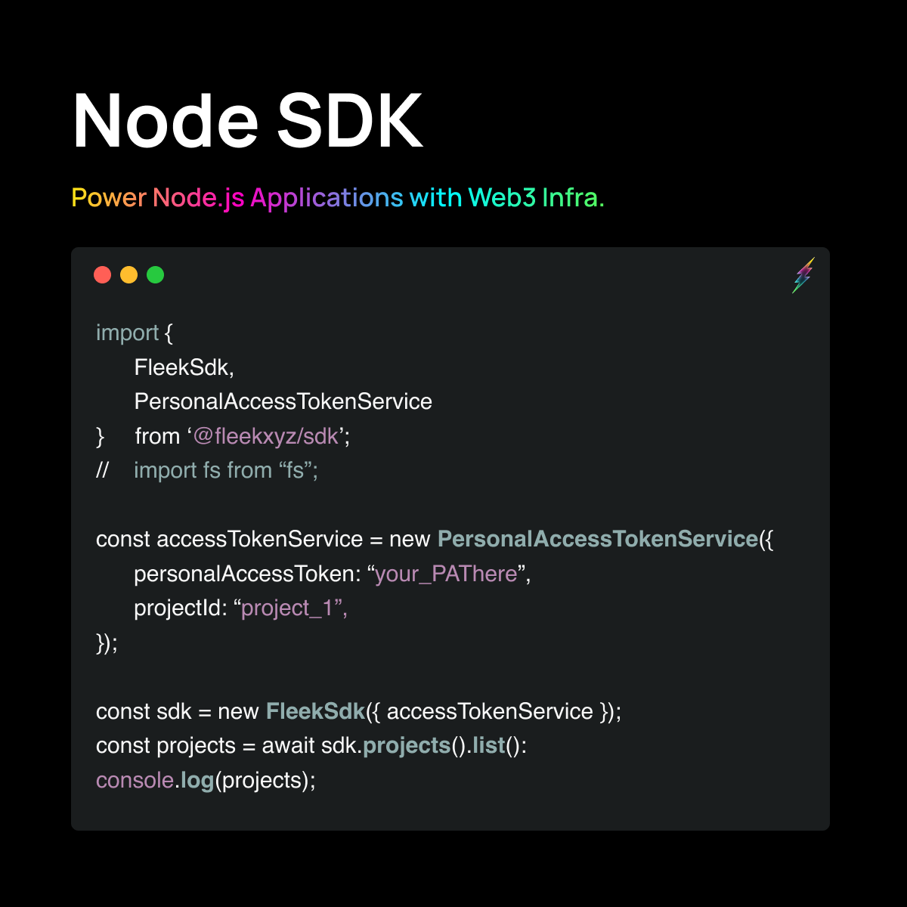

We’re excited to announce that the beta for our **Node SDK is now live**, and ready for developers to start integrating Fleek’s services!

Let’s dive into this release, and do a rundown of what you can build and achieve with the Node SDK today. Find a detailed guide on how to use it in [our SDK documentation](https://docs.fleek.xyz/docs/SDK/).

---

## The Fleek Node.js SDK

First in our Beta came the CLI, an interface to use Fleek.xyz’ services from the command-line helping developers do quick storage operations or site deployments through Fleek.

Now, comes our Node SDK, making these services, and more to come, **embeddable into any Node.js experience or application**! Meaning you can build applications that leverage **these services as the underlying infrastructure**, or to power use cases for users themselves.

Currently, we are surfacing **IPFS Storage, IPNS management, and project management only in node environments**. Web browser support is not part of this release, though it will be part of future iterations.

<iframe width="600" height="350" src="https://www.youtube.com/embed/ETbFztiCmGU?controls=0" title="YouTube video player" frameborder="0" allow="accelerometer; autoplay; clipboard-write; encrypted-media; gyroscope; picture-in-picture; web-share" allowfullscreen></iframe>

In the case of Node.js, **that applies to any app with a Node.js backend**. The only thing you need is to request a Personal Access Token from the CLI to authorize your app to leverage your Fleek services, and integrate away!

What can you achieve? For example, you could build a desktop web3 game that **integrates the SDK to store your user’s progress data on IPFS**, or an NFT minting application web app with a Node.js backend that stores the user’s NFT collection metadata and images on web3 storage automatically!

### Getting Started with the SDK

Visit our new [SDK documentation](https://docs.fleek.xyz/docs/SDK/) page to learn how to install, integrate, and leverage Fleek via this interface. To get started run:

    npm install -g @fleek-platform/sdk

To setup and authenticate your SDK you will need to create a Personal Access Token via the [Fleek CLI](https://docs.fleek.xyz/docs/SDK/#personal-access-token-service), as so:

    > fleek pat create
    WARN! Fleek CLI is in beta, use it at your own discretion
    > Please follow this link to log in to Fleek.
    > https://app.fleek.xyz/login/200e4c811d843dd7c5f29af12765c5af
    > Success! Your new personal access token is: your-personal-access-token

---

## Also Included in This Release:

This release comes with a lot more features for domain management, and general enhancements in Fleek’s services!

- Domain Statuses
- Access Token Improvements
- General QoL improvements

---

Time to build away! Let us know what ideas pop up as you test the SDK, and tweet your builds at us or share them on Discord. The team’s excited to start opening up Fleek as the infrastructure layer for all web3 apps.

Found a bug, got an idea or request? Visit our [Support repository](https://github.com/fleekxyz/fleekxyz-support/) and open up an issue! Or pay our [Discord](https://discord.gg/fleek) a visit and let us know.

For more resources visit our [LinkTree](https://linktr.ee/fleek) ⚡
