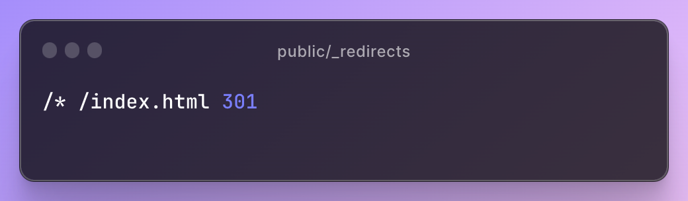
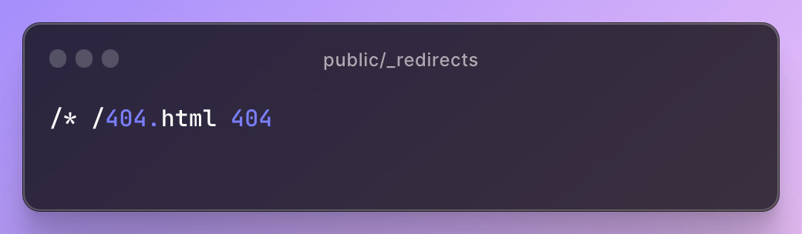

Gonza here from the Fleek Customer Support team! Being a power user of the Fleek platform, I've helped deploy multiple user's sites that suffer from the same issue:

_**The links aren't properly resolving on IPFS.**_

Let’s start by creating a new `Next.js` App. We’ll also be using our CLI to deploy our site and adding a custom domain to it.

> You can skip all the `next.config.js` configuration steps by using our [Next.js + Fleek template](https://github.com/fleekxyz/nextjs-template) which comes pre-configured.

Since we want our site to be static, we will modify our `next.config.js` file to set the output to `export`, enabling react strict mode & disabling the image optimization. It should look something like this:

```typescript
/** @type {import('next').NextConfig} */

const nextConfig = {
  reactStrictMode: true,
  images: {
    unoptimized: true,
  },
};

module.exports = nextConfig;
```

Now let’s try to add a subpage `/about` to our site. At first glance the site seems to be correctly deployed and the routes work as intended.


We can now initialize our site in Fleek CLI by running `fleek sites init` and deploy it by running `fleek sites deploy`. You can test it at [https://base-nextjs.angarita.dev/](https://base-nextjs.angarita.dev/)

But If we try to access the `about` subpage directly [https://base-nextjs.angarita.dev/about](https://base-nextjs.angarita.dev/about), we will get the following error:

```typescript
ipfs resolve -r /ipfs/bafybeicqg7bnj26ojgzjuc2cidm5j4lfpsevmj64wi23pogjmehrfeg2ey/posts/dynamic-routing:
	no link named "about" under bafybeicqg7bnj26ojgzjuc2cidm5j4lfpsevmj64wi23pogjmehrfeg2ey
```

This is a really bad experience for anyone using the site. But don’t worry, we can fix it! By using **trailing slashes**, we ensure that the URLs of our website are properly resolved. Specifically, when we use trailing slashes, we're indicating to the IPFS network that the URL represents a directory, _rather than a file_.

This is important because **IPFS uses a content-addressed system**, which means that each piece of content is identified by a unique hash. Let’s add it to our `next.config.js`:

```typescript
/** @type {import('next').NextConfig} */

const nextConfig = {
  reactStrictMode: true,
  trailingSlash: true,
  images: {
    unoptimized: true,
  },
};
module.exports = nextConfig;
```

> **Note:** If you were using React, instead of adding `trailingSlash: true`, you would replace `BrowserRouter` with `HashRouter` to achieve the same behavior.

Now let’s try to deploy again. I’ve deployed it to a separate site to compare the behavior. Notice that this time, I’m able to refresh the subpages, and access them directly without errors:

[https://trailing-nextjs.angarita.dev/about/](https://trailing-nextjs.angarita.dev/about/)

But what would happen if one of your links expire, or a user queries a page that doesn’t exist? like:

[https://trailing-nextjs.angarita.dev/terms/](https://trailing-nextjs.angarita.dev/terms/)

```typescript
ipfs resolve -r /ipfs/bafybeidqxqh4io3eeg2ovbx4almtkfzzjngqfj77pzw6eulkrxsfcosmrq/terms:
	no link named "terms" under bafybeidqxqh4io3eeg2ovbx4almtkfzzjngqfj77pzw6eulkrxsfcosmrq
```

We would get this pesky IPFS error again. So how do we ensure that our site will never display this error?

## **_Enter the `_redirects` file._**

This feature enables support for redirects, single-page-applications, custom 404 pages and moving to IPFS-backed hosting without breaking existing links. It is very easy to implement, we only need to **add a file called \_redirects to the public folder of our project.** You can read more about the implementation cases [here](https://docs.ipfs.tech/how-to/websites-on-ipfs/redirects-and-custom-404s/#evaluation), As an example let’s redirect all invalid links to our index page with a `301` HTTP code:



Once we update our site with this change, we can now access [https://redirects-next.angarita.dev/broken](https://redirects-next.angarita.dev/) and instead of seeing an intimidating IPFS error message, we will see our home screen. You can customize your `_redirects` file to redirect any broken links to a custom 404 page instead of your homepage:



As you can see, a wide array of possibilites open up with simple IPFS \_redirects support. In this blog, we've covered multiple options to ensure proper link resolution on your IPFS site. How you handle your site's pages and links is now completely up to you!

If you are still encountering issues with your Domains, or anything else on the Fleek platform/beta, open a ticket in our [Discord](https://discord.gg/fleek) server and let's chat ⚡️

For more resources, and to follow us on social media, check out our [Linktree](https://linktr.ee/fleek)
