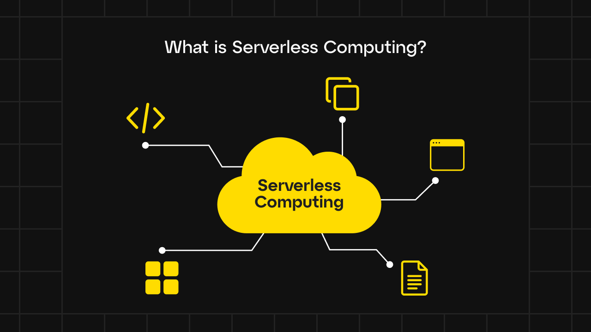
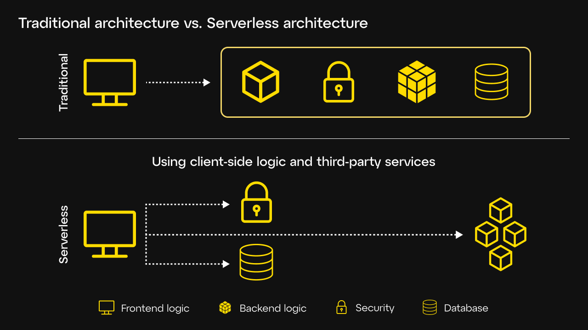
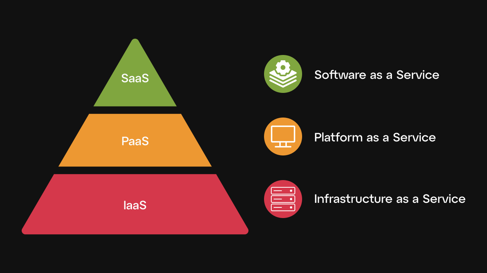
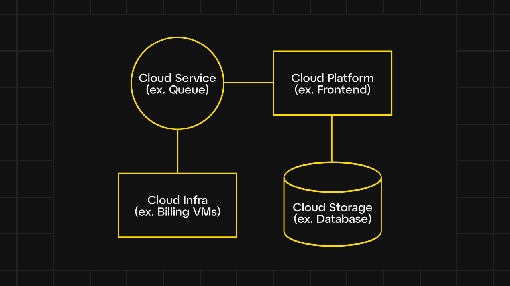
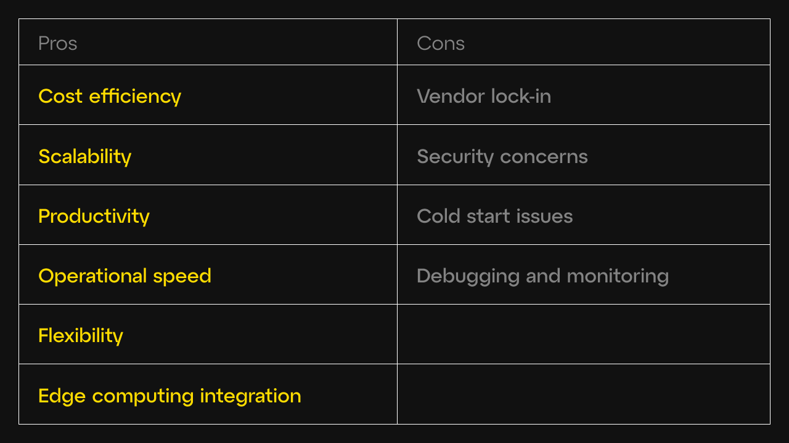
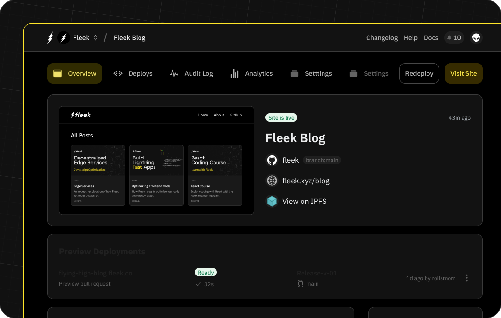

As developers aim for innovation and efficiency, serverless cloud computing has emerged as a transformative technology in 2024. This approach not only simplifies the deployment of applications but also optimizes costs and enhances scalability. In this comprehensive guide, we will dive into why it has become the hottest trend of the year and how it's reshaping the web development landscape.

---

## **What is serverless cloud computing?**

Serverless computing is a model that allows developers to build and deploy applications without managing underlying servers. In this environment, developers focus solely on writing code, while the cloud provider handles server management tasks such as resource allocation, scaling, and maintenance. This approach differs from traditional cloud computing models where developers manage the server infrastructure.

In a serverless architecture, applications are composed of small, stateless functions that are triggered by specific events. These functions are executed only when necessary, meaning businesses pay only for the compute time and computing resources they actually use. This pay-as-you-go model is one of the key reasons why serverless computing is so cost-effective.

There are a variety of serverless cloud vendors that developers can use, including Vercel, Netlify, AWS, Digital Ocean, and Fleek. Each of these cloud platforms provides access to cloud computing, with its benefits and constraints.

Despite its name, "serverless" doesn't mean that servers are absent. Instead, the servers are abstracted away, where the cloud provider manages them. This abstraction allows developers to concentrate on developing features and functionalities without getting bogged down by the complexities of server management.

### **Understanding the cloud computing execution model**

Serverless computing falls within the broader cloud computing execution model, which includes Infrastructure as a Service (IaaS), Platform as a Service (PaaS), and Software as a Service (SaaS). Each model offers different levels of abstraction and control:

- **IaaS** provides virtualized computing resources over the internet, allowing businesses to rent servers, storage, and networking hardware.
- **PaaS** offers a platform allowing customers to develop, run, and manage applications without dealing with the underlying infrastructure.
- **SaaS** delivers software applications over the internet, managed by a third-party provider.

Serverless computing can be seen as an extension of PaaS, where the platform not only manages the infrastructure but also automatically scales resources based on demand.

### **The rise of edge computing in serverless architectures**

An emerging trend within serverless computing is the integration of edge computing. Edge computing brings computation and data storage closer to the location where it's needed, reducing latency and bandwidth use. By processing data at the edge of the network, serverless applications can achieve faster response times and greater efficiency, especially for real-time applications like IoT devices, gaming, and video streaming.

This convergence of this and serverless enables a new wave of innovative cloud computing services, offering unparalleled performance and scalability. Developers can now deploy serverless functions at the edge, ensuring that applications are not only cost-effective but also highly responsive.

---

## **Why serverless cloud computing is a hot trend in 2024**

### **Increasing demand for cost-efficiency**

In today's competitive market, cost reduction is a priority for many organizations. Serverless cloud computing offers a highly efficient pay-as-you-go model, where businesses are billed only for the compute time they actually consume. This eliminates the cost of maintaining idle servers — a significant expense in traditional cloud environments.

For startups and small to medium-sized enterprises (SMEs), the ability to scale up without investing in extensive cloud infrastructure is enticing. By leveraging these services, businesses can deploy applications rapidly without the overhead of managing physical or virtual servers.

### **Enhanced developer productivity and operational agility**

Serverless significantly enhances developer productivity by offloading server management tasks to the cloud provider. Developers can focus on writing and deploying code, without worrying about scaling, patching, or maintaining servers. This shift allows for faster development cycles and quicker time-to-market for new features and applications.

Furthermore, serverless computing promotes operational agility by enabling businesses to respond swiftly to changing market conditions. Deploying updates and new features instantly, without downtime, is a key advantage in today's fast-paced digital environment.

### **Scalability on demand**

One of the most compelling benefits of cloud computing is its ability to automatically scale resources to meet demand. Traditional cloud environments often require manual intervention to scale resources, which can lead to inefficiencies and increased costs.

Scaling is automatic and seamless. When an application experiences a surge in traffic, the cloud provider dynamically allocates additional resources to handle the increased load. Conversely, when demand decreases, resources are scaled down, ensuring that businesses only pay for what they use.

This dynamic scalability is especially beneficial for applications with variable workloads, such as e-commerce websites during holiday seasons or media streaming services during major events.

### **Rapid advancements in technology**

The rapid adoption of the cloud computing trends is driven by its integration with cutting-edge technologies such as artificial intelligence (AI), machine learning (ML), and the Internet of Things (IoT). These technologies require significant computational power, which serverless computing can provide on-demand, without the need for extensive upfront investment.

It also simplifies the deployment of AI and ML models, allowing businesses to incorporate advanced analytics and automation into their applications with minimal effort. As these technologies evolve, serverless computing will play a critical role in enabling businesses to leverage their full potential.

### **Growing ecosystem and community support**

The serverless ecosystem has expanded rapidly, supported by a robust community of developers and a wide range of tools and services from major cloud providers. Platforms such as AWS Lambda, Google Cloud Functions, and Microsoft Azure Functions have made serverless computing accessible to a broad audience, from small startups to large enterprises.

In addition to the major centralized providers, decentralized platforms like Fleek are emerging, offering edge-optimized cloud computing environments that are open-source and permissionless. These platforms provide developers with greater flexibility and control, enabling them to deploy applications without the constraints of vendor lock-in.

The growing community of developers contributing to open-source serverless projects has also fostered innovation and collaboration, addressing challenges such as debugging, monitoring, and security in serverless environments.

---

## **Benefits of cloud computing**

### **Cost efficiency**

Serverless computing offers significant cost savings by eliminating the need for businesses to manage and maintain servers. The pay-as-you-go model ensures that businesses are only charged for the actual compute time they use, avoiding the costs associated with idle server resources. This is particularly beneficial for applications with unpredictable or fluctuating workloads.

### **Scalability**

Serverless architectures automatically scale resources in response to demand, ensuring that applications can handle varying workloads without manual intervention. This scalability is crucial for applications that experience sudden spikes in traffic, such as online stores during peak shopping periods or media streaming services during live events.

### **Productivity**

By offloading infrastructure management to the cloud provider, developers can focus on writing and improving code, rather than dealing with the complexities of server management. This leads to faster development cycles, allowing businesses to bring new features and products to market more quickly.

### **Operational speed**

Serverless computing enables rapid deployment and iteration of applications, allowing businesses to respond swiftly to market changes and enable real-time data processing. The ability to deploy updates and new features without downtime is a significant advantage in today's fast-paced digital landscape.

### **Flexibility**

The serverless model supports a wide range of programming languages and frameworks, allowing developers to choose the best tools for their specific needs. This flexibility makes it easier to integrate serverless functions into existing applications and workflows.

### **Edge computing integration**

The integration of edge computing with serverless architectures allows businesses to deploy functions closer to the end-users, reducing latency and improving performance. This is particularly beneficial for real-time applications, such as IoT devices and video streaming, where low latency is critical.

---

## **Challenges and considerations of cloud infrastructure**

### **Vendor lock-in**

One of the primary challenges of recent cloud computing trends is the potential for vendor lock-in. Since each cloud service provider has its own proprietary tools and services, migrating an application from one provider to another can be complex and time-consuming. To mitigate this risk, businesses should consider multi-cloud strategies or leverage open-source serverless frameworks that are provider-agnostic.

### **Security concerns**

While serverless computing abstracts much of the underlying infrastructure, it also introduces new security challenges. Ensuring the security of distributed serverless applications requires a comprehensive approach, including securing data in transit and at rest, managing access controls, and regularly monitoring for vulnerabilities.

### **Cold start issues**

A common issue with serverless computing is the "cold start" problem, where functions experience initial latency when they are invoked after being idle. This can impact the performance of applications that require near-instantaneous response times. However, cloud providers are continuously working on improving the cold start performance, and there are techniques, such as keeping functions warm, that can help mitigate this issue.

### **Debugging and monitoring**

Debugging and monitoring serverless applications can be more challenging compared to traditional architectures, due to the distributed and stateless nature of serverless functions. However, a growing number of tools and best practices are emerging to address these challenges, helping developers gain better visibility into their serverless environments.

---

## **Key players and future outlook**

### **Centralized cloud providers**

Major cloud service providers like AWS, Google Cloud, and Microsoft Azure are at the forefront of the serverless revolution. These companies are continually enhancing their serverless offerings, providing developers with powerful tools to build and deploy applications at scale.

- **AWS Lambda**: As one of the pioneers of serverless computing, AWS Lambda continues to be a leading choice for developers. AWS provides a comprehensive suite of cloud services that integrate seamlessly with Lambda, enabling developers to build complex applications with minimal infrastructure management.
- **Google Cloud Functions**: Google Cloud offers a robust serverless platform that integrates with Google's extensive cloud services, including AI and ML tools. This makes it an attractive option for businesses looking to build intelligent, data-driven applications, with powerful data processing.
- **Microsoft Azure Functions**: Azure Functions provides a flexible serverless environment that supports multiple

### Best Alternative to Serverless Cloud

Fleek is a decentralized edge-optimized cloud computing platform providing an alternative to the major centralized providers. Supercharged by Fleek Network, developers can deploy sites and apps with a high-performance, permissionless, self-sovereign and open-source system requiring no DevOps or vendor lock-in and at very low cost. This enables developers to spend more time with their codebase and less time on the management of their applications.

All you need to deploy your first app on Fleek is a GitHub repository. Connect the repo to <u>[Fleek.xyz](http://fleek.xyz/)</u>, configure your build settings, and deploy the site to the decentralized web in minutes. Head to <u>[Fleek.xyz](http://fleek.xyz/)</u> to create an account!

---

Serverless cloud computing has undeniably become one of the hottest trends in 2024, driven by its ability to enhance efficiency, reduce costs, and provide seamless scalability. As organizations continue to seek innovative and agile solutions, serverless architectures are poised to play a central role in the future of cloud computing.

The rapid advancements in technology and growing ecosystem support are further solidifying serverless computing as a cornerstone of modern cloud strategies. While challenges such as vendor lock-in and security concerns remain, the benefits of serverless far outweigh the drawbacks for many businesses.

As we move forward, serverless cloud computing trends will likely continue to evolve, as cloud platforms address current limitations and expanding its capabilities. Whether you're a startup looking to minimize overhead or a large enterprise seeking to enhance agility, this is a powerful solution for navigating the complexities of the digital age.

- <u>[Sign up](https://app.fleek.xyz)</u> to try yourself
- Join our <u>[Community Chat](https://discord.com/invite/fleek)</u>
- Follow on <u>[X
](https://twitter.com/fleek)</u>
- Check out our <u>[Tech Docs](https://fleek.xyz/docs/)</u>

**Relevant articles**:

https://fleek.xyz/blog/learn/understanding-edge-computing/