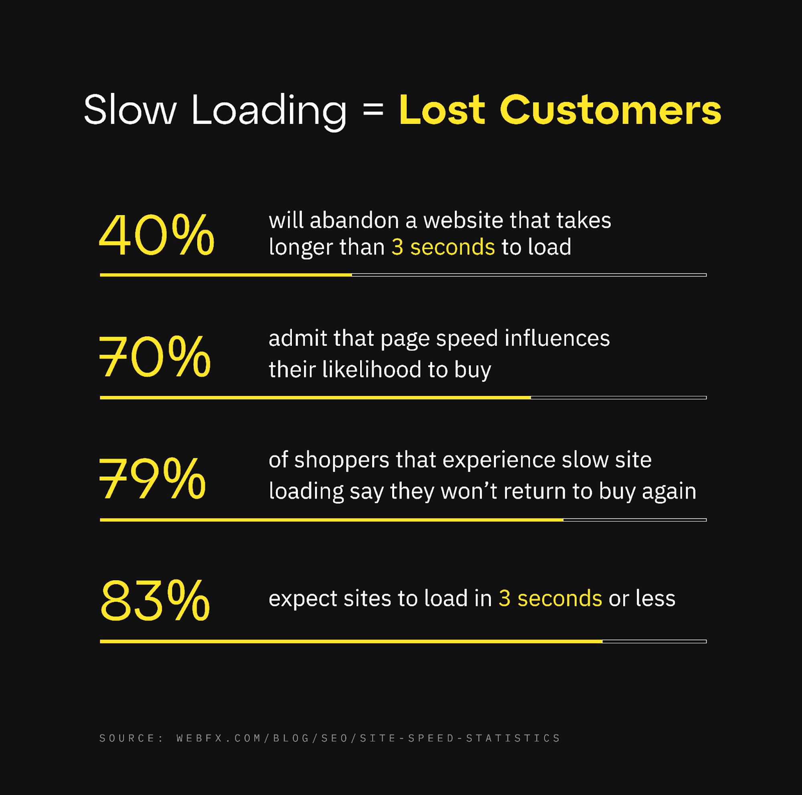
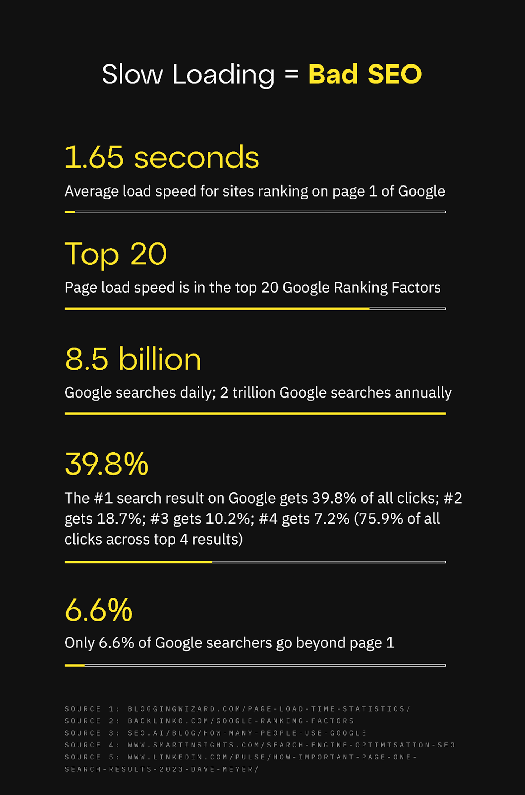
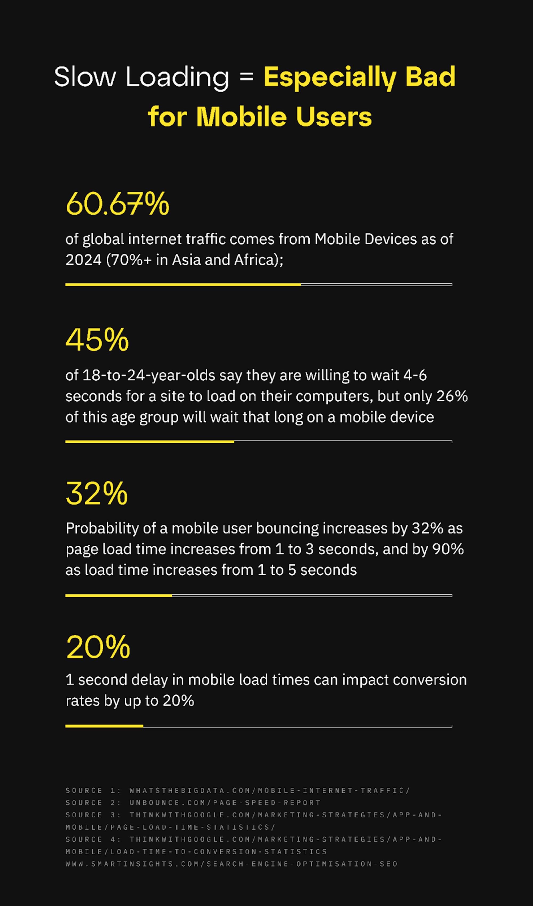

Speed can make or break the user experience of a website or app. Latency is a vital component that impacts everything from bounce rates to conversions, SEO rankings, user experience, and ultimately, the desired goals of your project.

Even minor delays can have a massive effect: **Amazon estimates a [1% drop in sales](https://www.digitalrealty.com/resources/articles/the-cost-of-latency) with every 100ms increase in load time.** With net sales of $574.8 billion in 2023, the smallest drop in performance costs them billions of dollars.

Let’s dive into why this is the case, and why it has never been more important to optimize the speed of your applications and sites, on both desktop and mobile:

---

## Slow Loading = Lost Customers

Let’s start with some [facts](https://www.webfx.com/blog/seo/site-speed-statistics/#:~:text=The%20average%20website%20takes%20around%208.6%20seconds%20to%20load%20on%20mobile%20devices.&text=83%25%20of%20online%20users%20expect,than%20three%20seconds%20to%20load.):

- 83% of online users expect sites to load in 3 seconds or less;
- [40% of online users](https://www.akamai.com/uk/en/about/news/press/2009-press/akamai-reveals-2-seconds-as-the-new-threshold-of-acceptability-for-ecommerce-web-page-response-times.jsp#:~:text=Forrester%20found%20that%2040%20percent,especially%20for%20high%2Dspending%20shoppers) will abandon a website that takes longer than three seconds to load.
- 70% of consumers admit that page speed influences their likelihood to buy;
- [79% of shoppers](https://huckabuy.com/20-important-page-speed-bounce-rate-and-conversion-rate-statistics/) who experience slow site loading say they won’t return to buy again;
- Pages that take only 1-2 seconds to load have an [average bounce rate of 9%](https://royal.pingdom.com/page-load-time-really-affect-bounce-rate/), but pages that take 5 seconds to load have an average bounce rate of 38% (322% increase)

## Slow Loading = Bad SEO

- The [average page load speed](https://bloggingwizard.com/page-load-time-statistics/) for sites ranking on page 1 of Google is 1.65 seconds;
- Page load speed is in the [top 20](https://backlinko.com/google-ranking-factors) Google Ranking Factors;
- 8.5 billion [Google searches](https://seo.ai/blog/how-many-people-use-google#:~:text=Google%20processes%20approximately%2099%2C000%20search,trillion%20global%20searches%20per%20year.) daily; 2 trillion Google searches annually;
- The #1 search result on Google gets [39.8% of all clicks](https://www.smartinsights.com/search-engine-optimisation-seo/seo-analytics/comparison-of-google-clickthrough-rates-by-position/); #2 gets 18.7%; #3 gets 10.2%; #4 gets 7.2% (75.9% of all clicks across top 4 results);
- Only [6.6% of Google searchers](https://www.linkedin.com/pulse/how-important-page-one-search-results-2023-dave-meyer/) go beyond page 1

SEO is super important for most sites/apps because it helps you gain visibility for search queries related to your product or service organically. And with 8.5 billion Google searches a day (2 trillion a year), getting organic search traffic can have a very material impact on the success of your project. But as the data shows, Google has no interest in showing users slow-loading sites/apps, as they know better than anybody how big of an impact slow loading has on user behavior. Google just like everybody else wants their users to have a good experience, so they have no interest in showing them slow-loading sites/apps.

## Slow Loading = Especially Bad for Mobile Users

- 60.67% of [global internet traffic](https://whatsthebigdata.com/mobile-internet-traffic/) comes from Mobile Devices as of 2024 (70%+ in Asia and Africa);
- 45% of 18-to-24-year-olds say they are [willing to wait 4-6 seconds](https://unbounce.com/page-speed-report/#:~:text=45%25%20of%2018%2Dto%2D,that%20long%20on%20a%20cellphone.) for a site to load on their computers, but only 26% of this age group will wait that long on a mobile device;
- Probability of a [mobile user bouncing](https://www.thinkwithgoogle.com/marketing-strategies/app-and-mobile/page-load-time-statistics/) increases by 32% as page load time increases from 1 to 3 seconds, and by 90% as load time increases from 1 to 5 seconds
- [1 second delay](https://www.thinkwithgoogle.com/marketing-strategies/app-and-mobile/load-time-to-conversion-statistics/) in mobile load times can impact conversion rates by up to 20%

There are over [5.3 billion mobile internet users globally](https://whatsthebigdata.com/mobile-internet-traffic/) already, and mobile’s share of global internet traffic has witnessed growth of 75% from 2015 to 2024. This trend is almost certain to continue as things like 5G, Starlink, and other connectivity improvements continue to advance, coupled with the behavior and usage preferences of the younger generations. It’s not enough for your site/app to perform well on desktop, it needs to be fully mobile optimized in order to keep up with today's (and tomorrow's) modern internet users.

## How to Speed Up Your App

First and foremost you should check the current performance of your app. You can do that by using some of the following tools. They provide useful insights into exactly what is slowing you down:

- [Google PageSpeed Insights](https://pagespeed.web.dev/)
- [Google Lighthouse](https://developer.chrome.com/docs/lighthouse/overview/)
- [KeyCDN Speed and Performance Tests](https://tools.keycdn.com/)
- [Pingdom Website Speed Test](https://tools.pingdom.com/)

Now that you know how your app currently performs. Below are a few long-hanging fruit performance optimizations you can look into:

- **Use a CDN (Content Delivery Network)**: If you aren’t already, utilizing a CDN to cache your apps files/content in different geographic locations in order to deliver them to users from the closest location leads to faster load times.

- **Optimize Images**: You can compress and format images to reduce their file size without compromising quality. Since images are typically the largest files and take the longest to load, this can have a big impact.

- **Minimize HTTP Requests**: Every page of your site requires multiple HTTP requests, each of which requires a roundtrip from client to server, which can significantly impact load times. By reducing the number of elements on each page, you can limit the number of HTTP requests and help improve load times.

- **Leverage Browser Caching**: You can take advantage of browser caching on your users devices to store certain files related to your app, allowing users to load and reload pages of your site

- **Use SSR (Server Side Rendering)**: SSR allows you to pre-render your site's content server side and send it to the user rather than rendering it all on the user's browser. This typically leads to faster load times and better UX, especially for users with older devices and/or poor internet connections.

## How Fleek Helps Speed Up Your App

Fleek is an edge-optimized cloud platform that makes it easy to take advantage of a lot of these performance enhancements with little to no effort. Below is a list of current and upcoming features that make building lightning-fast apps a breeze:

- Built-in CDN
- DDOS Protection
- DNS Management
- Global Deployments
- Edge Compute (coming May)
- Image Optimization (coming May)
- Server Side Rendering (coming May)

You can test it out and deploy your first app to [Fleek](https://fleek.xyz/) in just a few minutes. All you need to do is link your GitHub.
