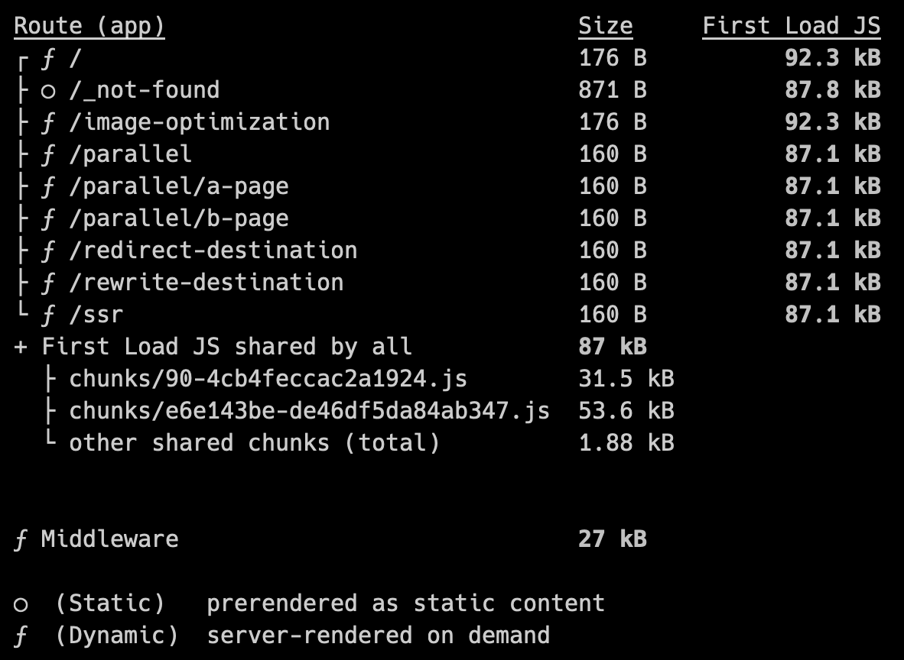

The dev team is working on introducing Fleek Functions to the platform, which are lightning fast edge functions built using Fleek Network’s [cloud infrastructure](https://blog.fleek.network/post/fleek-network-testnet-phase-3-results/). We are testing and experimenting to guarantee support for diverse use cases and compatibility with multiple frameworks and tools. One of those is support for Next.js.

Let’s take an early sneak peek into how the team is going about adding Next.js support on Fleek.

### Next.js

Next.js is an opinionated zero-configuration framework based on React. It is a natural fit due to its focus on server-side rendering and routing features.

---

## What To Deploy

The first challenge we encountered was deciding what to deploy. For a self-hosted solution, Next.js recommends standalone mode. This mode bundles the application and wraps it with a server we can easily containerize and deploy anywhere.

However, the output server doesn't fit a serverless approach, so we need to look elsewhere. Tools such as [open-next](https://open-next.js.org/) are becoming common and can deploy serverless Next.js to other serverless providers.

### Open-Next

Open-Next is an adapter that makes the Next.js output deployable to any serverless product. While it is extensible to some extent, the tool focuses on AWS and Cloudflare and targets Node.js runtimes, so we needed some modifications for our use case.

Next.js already builds your application for split routes, as you can see from the build output.



> Next.js build output

When building your application with `open-next`, you can configure it to create a function for each route. The configured wrapper and converter will bundle and wrap each function you see on your Next.js build output.

The tool provides an entry point through a configurable wrapper, which uses a converter to translate events from our serverless platform to Next.js events. We’re going to write our own.

The following piece of code is the most straightforward wrapper we can write:

```typescript
const wrapperHandler = async (
  handler: (event: InternalEvent) => Promise<InternalResult>,
  converter: Converter<InternalEvent, InternalResult>,
) => {
  return async (event: FleekRequest): Promise<FleekResponse> => {
    const internalEvent = await converter.convertFrom(event);
    const response = await handler(internalEvent);
    return converter.convertTo(response);
  };
};
```

Fleek request and response objects are also straightforward. They match the `open-next` internal events quite well, besides the headers, so our converters are also easy to write:

```typescript
export type FleekRequest = {
  method: HttpMethod;
  headers?: Record<string, string>;
  path: string;
  query?: Record<string, string>;
  body: string;
};

export type FleekResponse = {
  status: number;
  headers: Record<string, string>;
  body: string;
};

async function convertFrom(event: FleekRequest) {
  return {
    type: 'core', // default value
    method: event.method,
    rawPath: event.path,
    url: event.path,
    body: Buffer.from(event.body ?? '', 'utf8'),
    headers: { host: '', ...event.headers },
    query: event.query,
    cookies: {}, // we can handle these later
    remoteAddress: '0.0.0.0', // dummy value, we don't share remote addresses at the moment
  };
}

async function convertTo(result): Promise<FleekResponse> {
  return {
    status: result.statusCode,
    headers: convertHeaders(result.headers),
    body: result.body,
  };
}

function convertHeaders(headers: Record<string, string | string[]>) {
  return Object.entries(headers)
    .map(([key, value]) => ({
      [key]: Array.isArray(value) ? value.join(',') : value,
    }))
    .reduce((acc, curr) => ({ ...acc, ...curr }), {});
}
```

That was the easy part. What we now want to do is take all of those functions and deploy them to Fleek.

---

## Next.js on Fleek Functions

Getting these bundled functions to run on the Fleek Function runtime is easier said than done, as open-next is still working on full edge support and currently only targets Node, which isn’t fully Web API compliant. We can fix this with a fork of open-next and [some tweaks](https://github.com/sst/open-next/compare/main...fleekxyz:open-next:main) to make the tool more friendly for the Fleek Function runtime. We plan to push these tweaks to the open-next repo once they are more polished.


> We're edgy now.

Since the Fleek Function runtime doesn’t support Node, we resort to bundling the functions with Node.js polyfills. With some trial and error, we've added a few polyfills to our function bundles, such as `buffer`, which we're working on adding to our runtime. The polyfills bundle the needed Node.js libraries with your Next.js code to make sure nothing’s missing during execution.

The one issue we've encountered when adding polyfills is AsyncLocalStorage, which the Fleek Function runtime does not support yet. However, a [simple implementation](https://github.com/sst/open-next/compare/main...fleekxyz:open-next:main#diff-5b24519a92767c3da6501a0ce9b061f18e8f4a350203ee41024b634f245bd4a9) to serve as a polyfill can fix this while we work on adding support.

---

## Next.js on Fleek

The above explains how our [tool](https://github.com/fleekxyz/fleek-next) works, but if you just want to deploy your Next.js application to Fleek, you also have the option to disregard our configuration and simply follow these steps:

> Note: This is a very experimental first implementation of Fleek Functions. Please be mindful of that when using or integrating into your deployments. A more stable version will be officially released in the coming weeks.

1. Make sure to configure any routes that run server-side code to [run on the edge](https://nextjs.org/docs/app/api-reference/file-conventions/route-segment-config#runtime) by adding the following piece of code to them:

```tsx
export const runtime = 'edge';
```

1. Install the Fleek Next CLI:

```bash
npm i -D @fleekxyz/next
```

1. Set your Fleek environment variables and execute the following command to build and deploy your application with:

```bash
FLEEK_PROJECT_ID=<your id> FLEEK_TOKEN=<your pat> npx fleek-next deploy
```

This is all you need to get your Next.js application to run on Fleek Functions, and to get out of the box:

- High availability and fault tolerance;
- Faster response times and improved performance;
- Automatic scaling and reduced operational overhead;
- A focus on cost-effectiveness and developer experience;

---

## Future Work

We still have some work to do to fully support Next.js on Fleek Functions, with Middleware and Incremental Static Rendering support still to come, to provide developers with performant, low cost, easy to use, and self-sovereign alternatives for their cloud infrastructure. You can check out our [repo](https://github.com/fleekxyz/fleek-next) and play around.

If you’re interested in these deep dives, keep an eye on our blog as we’ll go through the routing used in our tooling and keep you up to date with any advances on our Next.js support as well as Fleek Functions.

Relevant articles:

[Fleek Next.JS deploy guide](https://fleek.xyz/blog/fleek-nextjs-deploy-guide/](https://fleek.xyz/guides/fleek-nextjs-guide/)

[Fleek Network developer guide on JS runtime](https://blog.fleek.network/post/fleek-network-developer-guide-js-runtime/)
