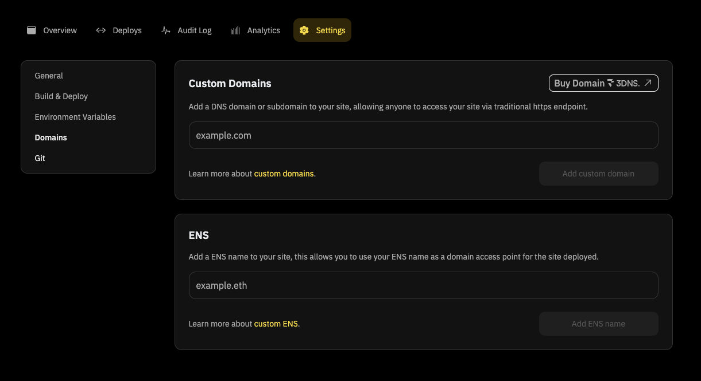

Here’s a myth: Domains are mere digital pin codes that point to a website or content.

Domains are more than that– they also play a key role in website security, content delivery networks, and SEO algorithms.

The possibilities are now being further pushed by decentralized domains — the foundation for the building of a decentralized internet. More than merely being a human-readable access point to websites and content, these domains are opening up new avenues like digital identities, composable domains, and tradable assets.

3DNS does this by bringing in unique capabilities like tokenization and liquidity to decentralized domains.

From enabling domain owners to self-custody their domains to selling and transferring them at their will, 3DNS is pushing the boundaries of what a domain can do. But, what does all this mean to the end user, does the buzz translate to real-life use cases, and how can you set up your 3DNS domain on Fleek?

## **Why Do We Need Decentralized Websites And Domains?**

Decentralized domains and websites are the core components of the decentralized internet. They operate on a blockchain, are run by smart contracts, and are free of centralized service providers.

**Decentralized websites** are stored and hosted on decentralized storage solutions like InterPlanetary File System (IPFS) and Arweave. To make these websites easily identifiable, decentralized domains are a must-have since the traditional identifiers of centralized domains are plagued with risks of single points of failure.

**Decentralized domains** such as 3DNS help developers and users self-custody their domains, rather than rely on centralized players like GoDaddy. These domains are managed using smart contracts which are encoded with ownership, transfer, and other rules.

Apart from identification, decentralized websites need an easy access point which is provided by **gateways** that bridge traditional internet and decentralized websites.

Now, why do these decentralized websites and domains matter?

**1. Censorship resistance:** Decentralized websites and domains are inherently resistant to censorship. This ensures that content remains accessible globally, without interference from government or corporate entities.

**2. Immutability:** Decentralized storage ensures that once content is published, it cannot be altered without a trace, offering an immutable record of changes and revisions.

**3. True ownership:** Decentralized domain owners have complete ownership over their domains and website content. There are no arbitrary policies or terms and conditions that they need to abide by.

With 3DNS, developers and businesses gain absolute control over their online presence.  They fully own their website and domain, unlocking unlimited creative potential and the ability to profit directly from their digital assets.

## **Introducing 3DNS — an onchain web domain registrar**

3DNS is an onchain domain registrar that aims to bridge the traditional internet with a decentralized web3. It tokenizes domains into non-fungible tokens (NFTs), enabling users to have self-custody over their domains and give them true ownership.

The key superpower of 3DNS is its ICANN compliance which helps it support any traditional domain (.com, .io, .org). Owners can import their traditional domains on-chain as 3DNS domains, and link them to websites and content of their choice.

<u>[Fleek](http://fleek.xyz/)</u> offers a user-friendly interface to simplify access to 3DNS domains and their management.

More importantly, 3DNS integrates with Ethereum Name Service (ENS), offering decentralized identities. This effectively means every 3DNS domain is an NFT and is identifiable using its ENS name.

The functionalities this integration enables are immense — your domain can also act as a digital wallet, sending and receiving payments.

## **Why should developers consider 3DNS domains?**

Self-custody of domains and their integration with ENS names make 3DNS domains more composable and flexible, allowing for several functionalities to be built on top of them. Apart from the composability, 3DNS domains offer many other benefits:

### **Enhanced security**

Tokenized domains as NFTs means tying the domain ownership to the users' private keys. This solves the security risks associated with centralized players and their custody services. Also, tokenized domains improve the self-custody ethos of web3 and uphold a new narrative of, 'not your keys, not your domains'.

### **Instant liquidity**

Tokenization of 3DNS domains means they can be tradeable. Users can instantly transfer their domains via a peer-to-peer exchange. This reduces reliance on centralized marketplaces and escrow services with opaque rules and conditions.

### **Composability and innovation**

3DNS domains unlock composability and innovation, enhancing the user experience across existing websites and web3 applications. For example, 3DNS domains act as identity verification on on-chain social media platforms.

On the other hand, new use cases can arise out of 3DNS domains. For example, users can run an e-commerce marketplace without relying on a third-party payment service provider.

Zooming out on 3DNS domains, it offers a unique intersection of decentralized identity, liquidity, and security. As mentioned above, this offers a lot of room for value creation in terms of composable websites and for digital verification through verifiable decentralized identity.

## **Connect your 3DNS domain to an IPFS-hosted website using Fleek**

Now, after owning a 3DNS domain, developers can use the domain as a digital pointer to any content or website. To connect a 3DNS domain with a website or content, developers can use Fleek which offers a simple, user-friendly interface to make this possible.

Anyone can host their websites on IPFS, Arweave, and Filecoin, and store their content on these decentralized storage providers using Fleek. And, for any content hosted on IPFS using Fleek, 3DNS domains can be linked as an identifier to simplify the user experience.

Here is a step-by-step guide to connecting a 3DNS domain to Fleek-hosted content:

**1. Create an account and deploy**

Sign up on <u>[Fleek.xyz](http://fleek.xyz/)</u>, upload your site or select and deploy a template, and begin with "add new".

**2. Navigate to settings**

Go to your site's dashboard settings and look for the **‘domains’** option.

**3. Add 3DNS domain**

Add your 3DNS domain, confirm its availability, and select "Add Custom Domain".

**4. Set DNS on 3DNS**

After your domain shows up on Fleek, Copy the "value" from Fleek and paste it into your 3DNS settings. Set an ALIAS record (not a CNAME) with the host set to "@". Choose your desired TTL value and click "save" and confirm the transaction in your wallet.

**5. Verify and launch**

Fleek will take a moment to verify the DNS changes. Once verified, your custom domain will be fully operational.

Visit your website and enjoy the security of your 3DNS domain!

## **Self-custody domains with 3DNS**

Decentralized domains like 3DNS are shifting the control and ownership of domains from centralized big tech companies to actual users and businesses. Especially, with tokenized domains, users can truly own their domains and websites, enabling new opportunities for trading and monetizing domains.

The friction in the adoption of decentralized domains lies in their integration with decentralized storage solutions like IPFS and Arweave. Fleek solves this friction by abstracting all the backend complexities of integration and giving a simple process to link 3DNS domains with IPFS-hosted content.

Apart from the adoption hurdles, the self-custody of 3DNS domains opens up room for a lot of innovation, liquidity, and composability.

## **FAQs**

**1. Are decentralized domains compatible with traditional web browsers?**

Most traditional web browsers do not natively support decentralized domains and require specific browser extensions or dedicated browsers to make it work. 3DNS domains, however, are compatible with traditional web browsers, courtesy of their ICANN compliance.

**2. Can I use my existing domain with 3DNS?**

Yes, you can migrate your existing traditional domain to 3DNS by registering it through an ICANN registrar and then minting an NFT on the 3DNS platform.

**3. How do I link my 3DNS domain to a website hosted on IPFS?**

You can use platforms like Fleek to host your website on IPFS and then link your 3DNS domain to the IPFS content through DNS settings.
