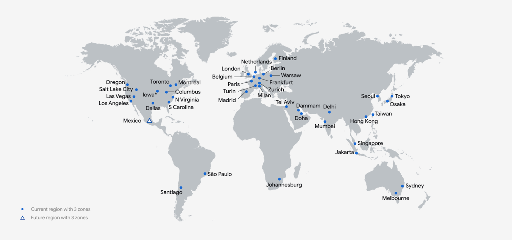

Why is your morning coffee often cold? Because the nearest Starbucks might be 10 miles away. Now, imagine a Starbucks kiosk outside your office parking or a vending machine in your office pantry, resulting in a fresh, hot coffee to start your day.

There is a similar concern in the digital world where nearly <u>[167 trillion GB (gigabytes)](https://www.statista.com/statistics/871513/worldwide-data-created/)</u> or 180 zettabytes of data is estimated to be transmitted within 2025.

We all know data and digital footprint are valuable resources and their processing time in milliseconds can make or break digital products and services like Google.

Now, look at the current cloud server locations of Google and how underserved Africa, LATAM, and Asia are. Even a basic Google search in such locations needs to traverse many miles before the data is retrieved and made available to the user.

> Source: <u>[Google](https://cloud.google.com/about/locations#lightbox-regions-map)</u>

The inaccessibility within the computing space aggravates as more users, data, digital products, and services come in.

To solve this, the world has moved towards **edge computing** which effectively brings computation closer to the source, reducing latency and bandwidth requirements.

**In this blog, we will dive into the ABCs of edge computing, its history, current state, and the future i.e. decentralized edge computing with Fleek.**

## **Understanding The ABCs of Edge Computation**

Edge computing is a distributed framework that processes data and executes tasks near the source. The computation in edge computing is processed by edge nodes. These nodes can be in the form of edge devices like smartphones or censors, or edge servers like hyper-localized computers maintained by the computing provider.

Before going into the technicalities, here are three examples of edge computing that happen around you daily:

- **Wearable devices like smartwatches** continuously record and monitor vital signs like heart rate and blood pressure.
- **Cameras and radar units** that capture real-time traffic footage and speeds at which vehicles are moving.
- **Augmented reality devices like AR vision and headsets** that have real-time object recognition and surface tracking.

That’s how regular edge computing has turned out to be in our daily lives. Now, let’s learn about the history and origins of edge computing.

## Cloud Computation Makes Edge Computing Mainstream

Cloud computing began to gain widespread adoption in the mid-2000s, especially after 2006 when Amazon Web Services (AWS) launched its Elastic Compute Cloud (EC2) and Simple Storage Service (S3).

These services allowed organizations to outsource the management of their IT infrastructure and scale their computing resources up or down based on demand. Plus, these services adopted a pay-as-you-go model which helped reduce the upfront costs associated with setting up and maintaining data centers.

Despite these benefits, several limitations of cloud computing became apparent, especially as the number of connected devices increased.

- **Increased bandwidth costs:** As more data is generated, processed, and stored in centralized servers, the demand for data transmission also rises, leading to higher bandwidth usage and associated costs.
- **High latency:** Cloud data centers are often located far away from end-users or devices generating data. Data must travel long distances over the internet, resulting in delays due to physical limitations like signal propagation time.
- **Unreliable performance**: In multi-user or multi-tenant cloud environments, where multiple applications or users share the same infrastructure resources, high latency, and network congestion can result in resource contention. This can lead to uneven performance across different applications or users, affecting overall system stability and reliability.

### **How Edge Computing Addresses Cloud Computing Constraints?**

Edge computing effectively addresses the limitations posed by cloud computing in the following ways:

- **Bandwidth costs:** Edge computing devices process data locally, performing computations and analysis closer to where the data is generated. This reduces the amount of raw data that needs to be transferred over long distances to centralized cloud servers, thereby reducing bandwidth usage and costs.
- **Performance**: By supporting offline operation and local processing, edge computing reduces dependency on constant internet connectivity and centralized cloud services. This not only improves performance in offline scenarios but also enhances overall system resilience and robustness.
- **Latency**: By bringing computational resources closer to the data source, edge computing mitigates latency issues associated with data transfer over long distances.

### **The Architecture of Edge Networks**

The edge network architecture typically involves a distributed computing framework where data processing is done at or near the source of data generation, rather than relying solely on a central data center.

Along with edge devices, other components make up the edge network architecture:

- **Data storage:** Local storage solutions at the edge to temporarily store and process data near its source before it might be sent to centralized data centers for long-term storage or further analysis.
- **Networking infrastructure:** Communication infrastructure, including routers, switches, and networking protocols, that connects edge devices to edge servers and potentially to larger networks or cloud services.
- **Cloud or centralized data centers:** While much of the processing happens at the edge, edge networks often remain integrated with larger, centralized data centers or cloud environments.

These central systems can perform additional processing and store large amounts of data that are not needed immediately at the edge.

- **Management and orchestration software:** Software tools used for managing, monitoring, and dynamically orchestrating tasks across edge devices and edge servers to optimize resource use and operational efficiency.

### **Drawbacks of Centralized Edge Networks**

While centralized edge networks offer many applications and significant advantages, such as enhanced data processing speeds and improved network efficiency, they also present certain drawbacks.

- **Single points of failure:** Although edge computing aims to decentralize processing, it still relies on cloud data centers which can create potential single points of failure.
- **Vendor lock-in:** Organizations may face vendor lock-in issues with proprietary systems and software that limit their flexibility to integrate with other technologies or switch providers. This can hinder scalability and adaptability in rapidly changing technological landscapes.
- **Privacy and security concerns:** edge networks process and store significant amounts of data locally, which can pose increased risks of data breaches or unauthorized access.

## **The Future of Edge Computing: Fleek’s Onchain Edge Network**

Despite the drawbacks mentioned, why do businesses still prefer centralized edge service providers like Amazon Web Services (AWS)?

Two reasons: **Reliability and high speed.**

Fleek Network, a decentralized edge network retains both these factors — edge functions on Fleek had a Time to First Byte (TTFB) <u>[7 times faster than AWS and 2.7 times faster than Vercel](https://blog.fleek.network/post/fleek-network-testnet-phase-3-results/)</u> — while eliminating single points of failure and vendor lock-in.

Additionally, it offers benefits like:

- **Geographic awareness and smart routing:** In Fleek’s network, nodes that exhibit lower latency and fewer hop counts are considered closer and more suitable for receiving and processing tasks.

In other words, when a task or request comes into the network, the system routes the task to the node that can respond the quickest to reduce latency and balance the load across the network.

- **Stateless execution:** State-related dependencies often create bottlenecks because the system's performance becomes tied to the slowest or busiest component.

Fleek’s stateless design prevents this issue and allows it to shuffle services across nodes effectively, enhancing security by reducing risks of collusion

- **VM-less core:**  The core of Fleek Network does not rely on virtual machines (VMs), which often introduce additional overhead and complexity.

This design choice allows for a leaner, more efficient use of network resources and facilitates faster deployment and execution.

- **Integration with decentralized storage systems:** By integrating with decentralized storage protocols like IPFS, Filecoin, and others, Fleek allows applications to leverage a secure storage system.

All in all, Fleek Network offers more speed compared to traditional edge networks without compromising on reliability. And with the proliferation of interconnected devices, the demand for decentralized edge networks like Fleek is only going to rise.

## **FAQs**

**How does edge computing work?**

Edge computing works by placing networks of computers close to the source of data (like IoT devices or local servers), rather than relying on a central data center far away. This setup allows data processing and analysis to occur almost in real-time at the point of data collection.

**Why use edge computing?**

Edge computing is used primarily to improve response times and save bandwidth by processing data close to the source. This is especially beneficial for real-time applications that require quick data processing, such as IoT devices, smart vehicles, and remote monitoring systems.

**Will edge computing replace cloud computing?**

No. Edge computing complements cloud computing instead of replacing it. That’s because edge computing excels at processing data closer to its source while cloud computing handles large-scale data processing, storage, and complex tasks not needing immediate responses.\*\*\*\*
