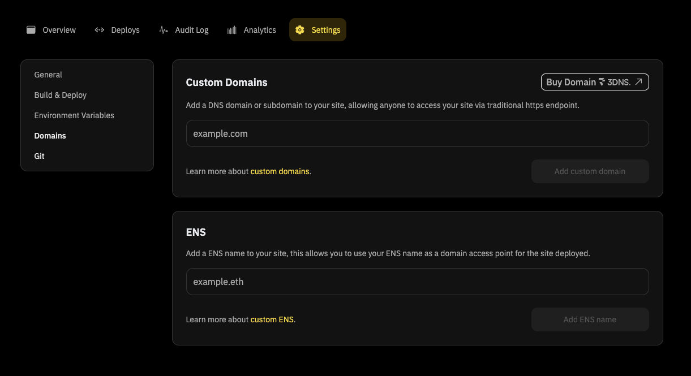

Do you truly own your domain or are you just renting it?

Your domain name is the foundation of your online presence. It's a unique digital address that guides visitors to your e-commerce store, your personal blog, or your small business.

A strong domain name also acts as a signal of quality and boosts your credibility with both search engines and potential customers.

Given the importance of a domain name, you would think that the domain owner truly owns it and has absolute control over it.

But the surprising truth is that the ‘.com’ domain names you purchased are effectively owned by Internet Corporation for Assigned Names and Numbers (<u>[ICANN](https://www.icann.org/)</u>) and leased out to you by middlemen like GoDaddy. As long as you’re paying the domain renewal fee, you pseudo-own it and have certain rights to it, but the ultimate control isn’t in your hands.

Then, how can you truly own your domain, website, and the content on it?

Enter onchain domains — censorship-free domains that are truly owned by you.

**In this blog, we will explain what decentralized domains are, how they work, what possibilities they enable, explore a few key players in this vertical, and show you how you can quickly attach a decentralized domain to your site on Fleek.xyz.**

## **Onchain domains: Think outside the ‘.com’**

Onchain domains are naming systems that operate on blockchains. Domain providers like <u>[Ethereum Name Service (ENS)](https://ens.domains/)</u> and <u>[3DNS](https://3dns.box/)</u> offer human-readable domain names that are mapped to machined-readable data like cryptocurrency addresses or content identifiers.

Registries like ICANN or any other centralized player do not control these domains.

The domain ownership, their records, and other data are stored on a distributed database, enabling censorship resistance. Further, smart contracts are employed to govern the rules and logic of domain registration and ownership, ensuring transparency.

## **Basic anatomy of a onchain domain**

The anatomy of an onchain domain consists of several components that work together to help websites and apps to be identifiable. Here are the key elements:

- **Domain name** is a human-readable identifier like example.eth. It follows a hierarchical naming structure, with the possibility for subdomains.
- **Blockchain address** is the unique cryptographic hash like 0x123..... that represents the domain name on a blockchain.
- **Domain registry** is a smart contract that maps the domain names with the blockchain addresses. It contains the metadata related to the ownership, transfers, and other domain-related activities.
- **Resolver record** is a data structure that contains all the data necessary to resolve a domain name to various types of resources, such as IP addresses (for traditional web hosting), IPFS hashes (for onchain storage), or cryptocurrency wallet addresses.
- **Resolver contract** is a smart contract that translates a domain name like "example.eth" into resource information such as cryptocurrency addresses, IP addresses, or content hashes (like IPFS hashes).
- **Cryptographic keys** are the pair of public and private keys that are necessary to manage the onchain domains.

Along with these components, three processes are integral to the working of an onchain domain. They are:

### **1. Auction and bidding process**

The auction starts when a sought-after domain becomes available. Interested bidders lock their funds on-chain to participate. Post-auction, the smart contract evaluates bids, selecting the highest as per set criteria, and transferring ownership by updating the domain registry.

The winner's funds are then transferred to the domain owner accordingly.

### **2. Resolver record update flow**

To update resources, a domain owner sends a transaction with new resource records to the blockchain. The resolver contract verifies the owner's authority and the records' validity.

Upon successful verification, the resolver contract updates the resolver record with the new information and all queries to the domain will now point to the updated resources.

### **3. Domain resolution flow**

When a user queries a domain name, the request is directed to the associated resolver contract which fetches the owner's details from the registry and the associated resource record (e.g., IP address, cryptocurrency address).

This information is returned to the requester, enabling access to the related resource, such as navigating a website or interacting with a wallet.

## **Key players in the onchain domains market**

The onchain domains market is a young one and two key players stand out — Ethereum Name Service (ENS) and 3DNS.

### **Ethereum Name Service (ENS)**

<u>[Ethereum Name Service (ENS)](https://ens.domains/)</u> is a onchain domain name system on Ethereum.

ENS's purpose is to translate machine-readable Ethereum addresses, content hashes, and metadata into human-readable names like example.eth. By enabling users to interact with Ethereum using easily memorable names, ENS improves the on-chain user experience.

Smart contracts are the backbone of ENS as they help manage the domains in terms of registering and transferring of domains. The automation in smart contract execution removes human error and ensures transparent operations.

**Unique features of ENS**

- **.eth top-level domain (TLD):** Ethereum Name Service (ENS) is unique in offering the .eth TLD, specifically designed for integration with Ethereum blockchain addresses.
- **Subdomain flexibility:** ENS users can create an unlimited number of subdomains without additional costs after owning the main domain.
- **onchain governance:** Key decisions and proposals regarding the ENS protocol are governed by $ENS token holders.
- **Digital identity support:** ENS domain owners can attach information like email addresses, social media handles, and bios to their ENS domains, upholding the domain as a digital identity.
- **Reverse resolution:** ENS allows for reverse resolutions where Ethereum addresses can be redirected back to human-readable names.

### **3DNS**

<u>[3DNS](https://3dns.box/)</u> is an onchain domain registrar that combines traditional DNS (domain name systems) with web3. It enables users to register domains as ERC-721 tokens i.e. NFTs. Unlike most onchain domain providers, 3DNS complies with ICANN standards, making it recognizable by the traditional web too.

With features like composable domain names, tokenization, and user-centric security (private keys), 3DNS brings a lot of innovation to the space of onchain domains.

**Unique features of 3DNS**

- **ICANN integration:** 3DNS is the first onchain domain provider to integrate with ICANN, allowing 3DNS to offer TLDs like .com, .net., .org, etc.
- **Dual ownership:** 3DNS domains are registered in an off-chain ICANN registrar and then a NFT is minted on-chain. Credibility of traditional DNS system coupled with composability and innovation of NFTs.
- **Tokenization:** 3DNS domains are ERC-721 tokens, allowing users to buy, sell, and trade domains on various NFT marketplaces like OpenSea, introducing instant liquidity.
- **Security:** Because 3DNS domains are NFTs, the owners' private key is the security measure to protect the domains. This also brings in the self-custodying of domains.

## **Differences between ENS and 3DNS domains**

Onchain domain providers come with the same promise — making blockchain addresses readable and thereby making on-chain activity more user-friendly. But, there are certain contrasts in the approaches of these providers.

Along similar lines, let’s take a technical examination of the differences between ENS domains and 3DNS domains.

|                                  | ENS                                                                      | 3DNS                                                                                                            |
| -------------------------------- | ------------------------------------------------------------------------ | --------------------------------------------------------------------------------------------------------------- |
| Domain minting process           | Minted directly on-chain through smart contracts on Ethereum.            | Initially registered off-chain through an ICANN compliant registrar and then its paired NFT is minted on-chain. |
| Integration with traditional DNS | Operates exclusively with .eth TLD.                                      | Supports integration with traditional TLDs like .com, .xyz, and .io.                                            |
| Name resolution                  | Cannot be resolved natively in browsers and requires browser extensions. | Resolve natively in standard web browsers, courtesy of their ICANN compliance.                                  |
| Purpose                          | Primarily focuses on making Ethereum more readable and user-friendly.    | 3DNS domains focus on making the transition to web3 easier for traditional businesses.                          |
| Security                         | Inherits security from Ethereum.                                         | Users self-custody their 3DNS domains as ERC-721 tokens.                                                        |

## **How to choose an Onchain domain provider?**

We have understood how an onchain domain works, the processes involved, and key service providers. Now, at the actual building stage, how does a developer choose which onchain domain provider to go with?

Here are five simple factors that a developer needs to consider while making this decision.

1. **Compatibility**

Developers need to assess whether the onchain domain provider supports popular TLDs and traditional DNS infrastructure. This offers a sneak peek into how seamless a transition it will be for businesses going from traditional to onchain domains.

Similarly, compatibility with other blockchain networks and protocols also needs to be evaluated, to think of cross-chain interactions and transactions.

1. **Accessibility**

Domains are a tool of technical convenience. If they are not accessible or usable easily, they don't serve their primary purpose of being convenient. For this, developers should opt for onchain domains that resolve across different platforms and browsers directly i.e. native resolution.

If the user has to install a plugin and download a separate browser to interact with a specific domain type, it adversely impacts accessibility.

1. **Ecosystem and community support**

The onchain storage and domain space is young and there is very little tooling and resources available for developers. Now, community and ecosystem resources are the only reliable source of support.

A large user base, technical documentation, and an active community are a must-have for a domain provider, indicating accessible support.

**Referencing these three factors with the discussion of ENS vs 3DNS, here is a short section to help developers make a choice.**

### **Should you opt for ENS domains or 3DNS domains?**

There is no sure-shot answer to this question as it totally relies on the kind of project and its requirements. However, based on the unique features that each of these domain providers offers, here is a quick answer that aims to be directionally right.

**Choose 3DNS if:**

- Your web3 project needs compatibility with traditional TLDs like .com.
- You need to establish credibility using ICANN compliance.
- You're integrating your traditional business and website with blockchain, cryptocurrency, or NFT functionality

**Choose ENS domains if:**

- You are building a pure crypto or blockchain native product or application.
- Your project is exclusively for the Ethereum ecosystem.

## **Roadblocks in using onchain domains**

Onchain domains, despite the advantages, are currently a hassle to work with. Especially for developers trying to adopt them in their products and applications, the technical hindrance is aplenty.

Here are five key challenges that every developer faces while working with onchain domains:

1. **Poor user and developer experience** due to a lack of intuitive interfaces and complex workflows, hindering mass adoption.

2. **Compatibility and integration issues arise** while integrating onchain domains with existing web infrastructure. The workarounds needed to make these integrations possible far outweigh its benefits.

3. **The scalability of onchain domains is uncertain** as they rely on blockchains that are prone to congestion, leading to high costs and slow transactions.

4. **The regulatory framework** for blockchain and digital assets, including onchain domains, is still **uncertain** for users and service providers alike.

5. Onchain domain providers are infrastructurally quite young. Hence, developers have **very little resources or tooling support** to work with onchain domains.

## **Fleek: Using onchain domains made easy**

Onchain domains represent the future of digital identity for applications, websites, and content. However, the mass adoption of this has been hindered by several roadblocks as discussed above.

To solve this, enter Fleek — making it simple to store data and host websites and content on IPFS, Arweave, and Filecoin. Users can connect custom domains from ENS and 3DNS to Fleek-hosted onchain content and websites, directly in the Fleek.xyz UI

Here are two tutorials that offer a step-by-step guide on how to connect Fleek-hosted content with <u>[ENS and 3DNS domains.](https://fleek.xyz/docs/cli/domains/)</u>

---

With a user-friendly interface and complexity-free workflow, Fleek makes working with onchain domains simpler and easier, for all.

## **FAQs**

**1. Can I use onchain domains along with traditional DNS for a hybrid approach?**

Yes. Onchain domains can be used along with traditional DNS if they support integrations. 3DNS with its ICANN compliance makes this possible.

**2. What are some tools and libraries available for integrating ENS or 3DNS into my web3 projects?**

<u>[ENS](https://docs.ens.domains/web/libraries)</u> and <u>[3DNS](https://docs.3dns.box/3dns/product-overview/api-docs)</u> have their specific tools and libraries for web3 projects and developers to use. If not, developers and teams can use Fleek to bypass complexities and integrate custom domains into their websites and apps easily.

**3. How can developers build solutions around the concept of onchain domains?**

Developers can build solutions and applications using domains for identity, payments, and similar use cases.
