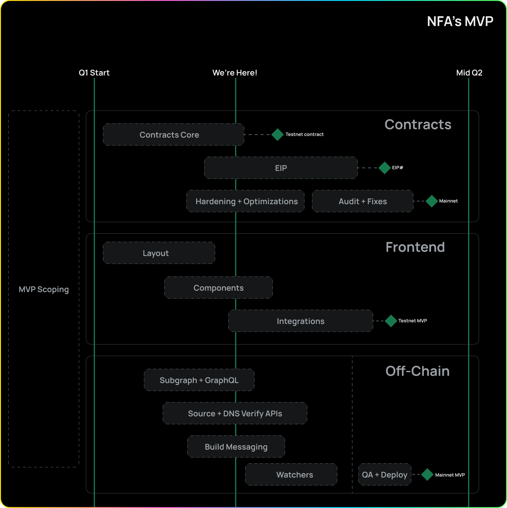

## TLDR;

- EIP Discussion: Community input, three-phase approach, and modular implementation
- Improved mint UI interface, added recent mint listings
- Updated subgraph indexing and enabled playground functionality
- Established release timeline and began discussion on a few topics, including ENS verification

---

## EIP Discussion: Interfaces & Call for Community Input

In our [last update](https://fleek.xyz/blog/uncategorized/nfa-minting-flow-eip-kickoff/), we opened a discussion to build our EIP skeleton. Now, we’re furthering this initiative and we believe that community input is invaluable for the development and success of non-fungible applications as a standard at this point. We encourage you to participate in the discussion and share your insights [here](https://github.com/fleekxyz/non-fungible-apps/discussions/158)!

To continue with the EIP initiative, we plan to fork the EIP repository and update it with initial interfaces, effectively transforming the ongoing discussions into a tangible Proof of Concept (PoC). To achieve this, we have devised a three-phase approach:

- **Interfaces for sites, access points (APs), and verification**: Our primary focus in this phase is to establish ways to describe and access frontends, laying the first example of types and using sites as the example.
- **Extension framework and new types of integration with ERC1155**: Building on the groundwork laid in the first phase, we will work on integrating new features and functionalities, including the extension framework and exploring novel integration methods with the ERC1155 standard.
- **Multisig integration and contract types**: This is a longer-term outlook, and we are actively engaged in discussions to determine the most effective implementation strategies for multisig integration and diverse contract types.

We aim to maintain a modular approach by continuing to split contract features into submodules to maintain a lean and clean core interface. This will ensure flexibility and granularity in implementation as well! Read and contribute in these discussions:

- [NFA EIP Kick-off](https://github.com/fleekxyz/non-fungible-apps/discussions/158)
- [Refactor on App Struct](https://github.com/fleekxyz/non-fungible-apps/discussions/163)

---

## NFA Check-In: Feature Updates & Discussions

<iframe width="600" height="350" src="https://www.youtube.com/embed/cRArN9ZK7hY" title="YouTube video player" frameborder="0" allow="accelerometer; autoplay; clipboard-write; encrypted-media; gyroscope; picture-in-picture; web-share" allowfullscreen></iframe>

### NFA Minting UI

In [Sprint 4](https://github.com/fleekxyz/non-fungible-apps/releases/tag/v0.0.4), we expanded upon the simple UI for listing minted NFAs, which features the following updates:

- GitHub login failed dialogue box: We've added a notification for when GitHub login attempts fail.
- Updated repository and branch selection: We've improved the repository dropdown menu and added search functionality, as well as search functionality for GitHub branch selection.
- Verify NFA step: This feature allows us to initially verify sites are Fleek-deployed.
- Recent NFA Listings: The most recently minted NFA will now appear on the new listing screen with a link to its OpenSea page. Users will eventually be able to create access points (APs) from this view as well.

Although our original roadmap placed the listing feature further down the road, we felt it was natural to include it in the current flow since the next hard part is to integrate Access Point creating and selecting that from a list of NFAs seemed like the correct flow. We've added a dummy version and will enhance its appearance closer to launch.

### Subgraph

We have implemented subgraph updates, allowing minted NFAs to be indexed with The Graph's playground. Users can select individual events, owners, tokens, and more with granularity in the graph playground. Some of the features include:

- Refactor based on update to access control logic
- Cleaning up of unused entities and adding unit tests

Give it a try for yourself [here](https://thegraph.com/hosted-service/subgraph/emperororokusaki/flk-test-subgraph)!

### Ongoing Discussions on ENS Verification & Matchsticks Tests

We are exploring ways to make our ENS verifications as decentralized and efficient as possible. We want to be able to verify the owner of an ENS domain throughout the lifecycle of an NFA. If someone transfers ownership of an ENS address, we need to be able to flag this and remove ENS verification from the connected NFA.

In an effort to optimize our testing process, we have also explored the proposal of replacing matchstick tests with queries during this sprint. First brought forward by a member of the community, this is a proposal we have been exploring over the last few weeks. You can see, and contribute to, the discourse on [GitHub](https://github.com/fleekxyz/non-fungible-apps/discussions/168)!

### Release Timeline

As work on NFAs progresses, we have updated our timelines and milestones:

- **Start of April**: We'll work on Polygon → ETH migration, creating APs, and implementing verifications.
- **April-May**: This period will be dedicated to audits and testing.
- **May-June**: We'll conduct final audits and polish our project before the official release.

---

We'll be back with another update in approximately two weeks to share more on our EIP progress and other developments. Stay tuned and we’ll see ya then 👋

If you would like to be involved with the product development side, just reach out on [Twitter](https://twitter.com/fleek_net) or [Discord](https://discord.gg/fleek)!

For more resources visit our [LinkTree](https://linktr.ee/fleek) ⚡
