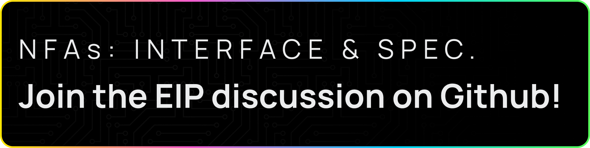
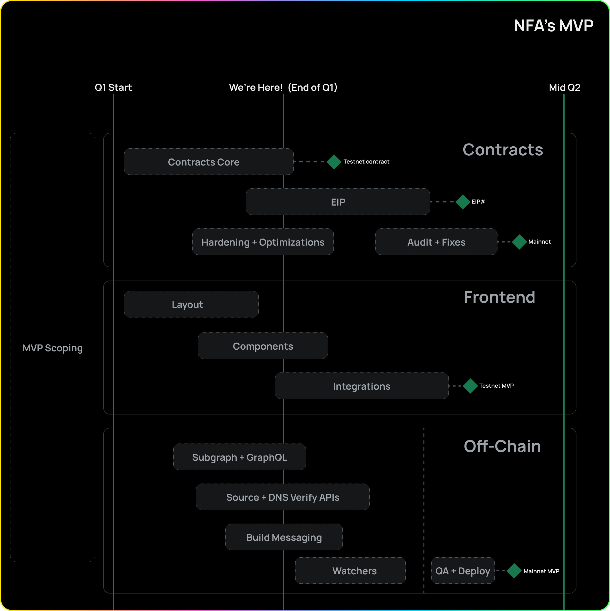

**TL;DR**

- We last spoke 2.5 sprints ago here so we want share what we’ve been working on
- Switched from Polygon Mumbai to Ethereum Mainnet for our MVP release
- We are targeting for a June/July MVP release
- EIP process kicked off internally with the goal of having a proposed strategy and skeleton, [opening a Github discussion for feedback.](https://github.com/fleekxyz/non-fungible-apps/discussions/158)
- Follow our development on Github - create an issue or discussion or PR

---

Standardization, in the form of an **[Ethereum Improvement Proposal submission (EIP)](https://eips.ethereum.org/) and ERCs, is a major milestone for NFAs**. First and foremost though, we want to focus on building a useful new standard to web3, and aim for opening up the debate early to gather feedback from the ecosystem, and reach a widely-agreed on consensus on:

- NFAs purpose and feature scope
- NFAs contract specifications
- NFAs core versus module/extension interfaces

To prepare for this process we started drafting a **skeleton EIP proposal for Non-fungible applications**, with a breakdown of its specification, purpose, and a base proposed approach to this new standard.

### **We’re excited to have opened the EIP discussion on Github, [join and contribute here!](https://github.com/fleekxyz/non-fungible-apps/discussions/158)** ⚡

We welcome all developers to contribute to this new proposed standard, and participate in the creation and submission of the EIP itself. What are the key discussion points we want to cover?:

- The interface for the initial NFA type which is sites (frontends)
- For NFA specific attributes, should we use more on-chain attributes or create more URIs
- Should new types and submodules be new mappings to structs or interfaces and be more polymorphic

---

## Sneak Peek: Minting Preview 👀

<iframe width="600" height="350" src="https://www.youtube.com/embed/x7DqD27Xl7s?controls=0" title="YouTube video player" frameborder="0" allow="accelerometer; autoplay; clipboard-write; encrypted-media; gyroscope; picture-in-picture; web-share" allowfullscreen></iframe>

_Important: This is an in-development demo and does not represent the final look-and-feel or final functionality of the app._

**The first preview for our NFA minting UI is here, and if we do say so ourselves, it’s beautiful!** We've recently introduced some exciting customization options, ensuring that every NFA you create looks unique and fresh. From customized colors to personalized logos, you can tailor your NFAs exactly how you want them! Keep reading for an early preview of the Mint flow– we think you’ll like what you see 👀.

- To mint an NFA users will need to:
- Connect ETH Wallet and GitHub account
- Select the repository being minted as an NFA
- Select the branch and Git commit
- Input fields for NFA metadata
  - Name, Description, Logo, Colour, ENS Address (if applicable), DNS
- Finalize Details
- Mint NFA

It’s that easy ⚡. Through the ConnectKit integration we did in Sprint 3, we plan to expand wallet support past the current providers (Metamask, Coinbase, etc.), and expand support to more EVM wallets.

---

## NFA Check-in: Roadmap and Development Progress

In our last NFA development [update](https://fleek.xyz/blog/uncategorized/nfa-community-hosting/), we were about halfway through Sprint 1– we’re now wrapping up [sprint 3](https://github.com/fleekxyz/non-fungible-apps/releases/tag/v0.0.3) and have lots to get you caught up on.

We’ve not only made upgrades across the entire stack over the last two sprints, but we’ve also made some **fundamental (but exciting) changes to our architecture.**

Primarily, we’ve made the decision to **transition from using Polygon Mumbai to Ethereum Mainnet for the release of our MVP**. The move to Ethereum mainnet will open up the door to a variety of different features that may not have been possible before, one example being integration with on-chain ENS!

The team is in progress on refactoring the work we’ve done to deploy on Polygon, to ready it for our deployment on Ethereum mainnet. We’re still exploring ways to optimize gas costs during the mint flow, and are open to any suggestions from community members on our processes!

**New NFA MVP Release Plan ⚡:**

- June/July Ethereum Mainnet release pending audit successfully completing
- Anyone can mint, some partners will be verified, Fleek users with an Ethereum address configured will have access to verification.
- Verifications to minting contract to introduce anti-fishing & anti-spam fail safes during MVP release
- Gather feedback and start iterating
- Fleek verification will be included in the release but we do have longer term vision on more types of verifications and hardening post MVP

Through Sprints 2-3 the team put a focus on getting our contracts features added, and testing started, to ensure they’re hardened and ready for our MVP release. **Features like Access Point (AP) and Proxy have been added**, as well as the above mentioned optional/configurable payment system to mitigate phishing and spam during the first phase of our release.

**A lot of work was also done on our Subgraph integration, giving us even more flexibility in how we index and surface data** from our contracts. What does that entail? Well, we’ve added a reverse GitHub token lookup to allow us to **confirm whether or not a repo has previously been minted as an NFA**. As well as refactor our access control so that we clean unnecessary roles and also update to use custom errors across the board instead of strings.

**In the coming sprints, we plan put a focus on:**

- View pages
- Verifications
- Community access points
- ENS Integration

For more information on community hosting through access points, check out our [last NFA update](https://fleek.xyz/blog/uncategorized/nfa-community-hosting/)– or contribute to the conversation yourself in our [GitHub](https://github.com/fleekxyz/non-fungible-apps)!

---

## Get Involved: Become an NFA Contributor

That's all for this day! Now we invite you to help shape up NFAs. As a team we’ve gained some critical mass in terms of NFA development momentum and **would love to invite the community to engage with us more.**

As an open-source project, we believe it's important to have forums and avenues for the community to submit feedback after trying it themselves. To get involved, check out our [GitHub](https://github.com/fleekxyz/non-fungible-apps):

- [Discussions](https://github.com/fleekxyz/non-fungible-apps/discussions)
- [Issues](https://github.com/fleekxyz/non-fungible-apps/issues)
- [PRs](https://github.com/fleekxyz/non-fungible-apps/pulls)
- [Releases/Sprints](https://github.com/fleekxyz/non-fungible-apps/releases/)

And start making contributions! We’re excited to see the debate spark up in our EIP discussions.

If you would like to be involved with the product development side, just reach out on [Twitter](https://twitter.com/fleek) or [Discord](https://discord.gg/fleek) and we can add you to our Shortcut project. We can’t wait to start seeing more community members get involved with what we’re building in NFAs!

For more resources visit our [LinkTree](https://linktr.ee/fleek).
