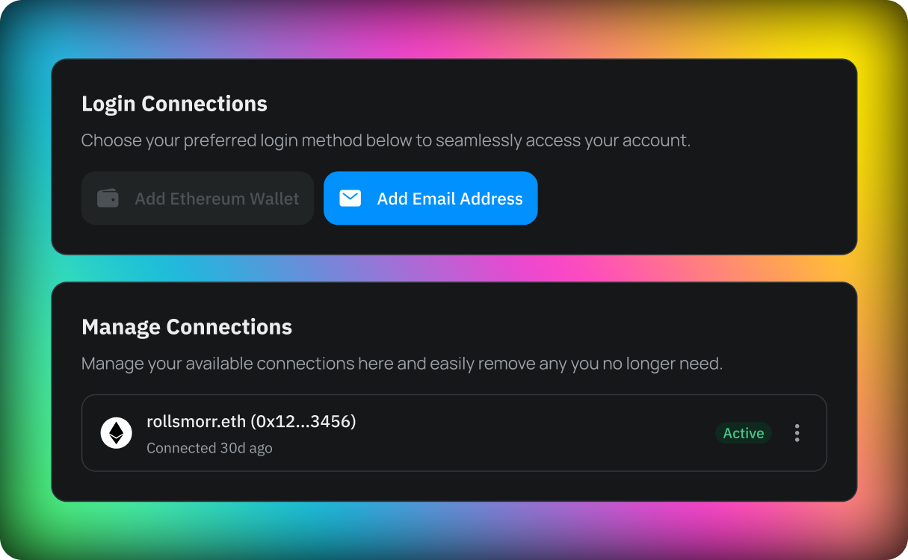

What’s up Fleek Freaks?

We're back with an update to the Fleek.xyz Alpha! This jam-packed v.0.0.4 update brings us to near-feature parity with the Fleek.co platform, an important goal for the team as we approach the start of the [Fleek.co to Fleek.xyz migration](/blog/announcements/fleek-co-to-fleek-xyz-migration-details/).

If you haven’t been added to the closed alpha yet and you want to try any of the new features we’re rolling out with this release, fill out this [Typeform](https://fleekxyz.typeform.com/alpha-access) and we’ll get you onboarded!

Let’s get into everything coming with v0.0.4, starting with ENS:

---

## ENS Integration

A major step in the direction towards the sunsetting of Fleek.co is reaching feature parity with the Fleek.co platform. With v0.0.4, we’re excited to reintroduce a familiar feature for our long-standing users from Fleek.co – **the ability to directly configure ENS records within Fleek**.

**An improvement on the Fleek.co iteration that users are familiar with, this version allows users to set the content hash for their domains without leaving the Fleek platform, as well as now handle subnames and name unwrapping in-app**. It’s quick, easy, and allows you to use your ENS domains for any of your builds on Fleek:

<video width="100%" height="auto" autoplay loop>
 <source src="./ens_automatic_setup.mp4" type="video/mp4">
 Your browser does not support the video tag.
</video>

## Deployment Details Page

The v0.0.4 update also comes with a little upgrade to the deployment details page! Now, you will see a more detailed overview of each step in the deployment process. **The new page shows progress and failures for each step, with copy-to-clipboard details**, making deployments more transparent and support a little more streamlined.

## File Upload Size Limit Increase

Thanks to some improvements to our build creation handling and storage upload processes, we’ve been able to **double the maximum file upload size. Users can now upload files up to 2GB in size** (previously 1GB maximum) 🤙

## Wallet Linking

Now, users can effortlessly link their wallets to their Fleek accounts, enabling a range of features like **secure logins, access to the new ENS features, and more wallet-exclusive features in the future**.

If you didn't sign up for the Fleek.xyz alpha with a wallet, linking yours is super easy. Just navigate to your `Account Settings`, and `Log-In Connections` to connect any supported wallet to start trying the wallet-exclusive features on Fleek.xyz.

Oh, and with v0.0.4, we’ve added the ability to do it the other way around too! If you signed up with a wallet address, you can now link your email address to your profile in your Account Settings.

---

### Other Fixes and Improvements

Along with the above, the devs did their usual bug squashing and fixes including:

- Changed the way we create pins so we display them immediately in the UI after the upload is complete.
- Increased the docker image name character size to 50 characters and the env variable value character size to 250 characters.
- Improved the efficacy of the site screenshot generation.
- Site slug now has a maximum of 63 characters long.
- Fixed a problem where the site slug was not clickable after the first deployment.
- Project name can be changed on Arc Browsers.

You can see a full list of changes included in the v0.0.4 release of the Fleek.xyz alpha in our [docs](https://docs/)!

---

And that’s what’s changed in this v0.0.4 update of the Fleek.xyz alpha. We’re pumped to be back this year rolling out updates to the new platform– we can’t wait for you to see what we have cookin’ up 🤙

We have more updates coming to the new Fleek.xyz platform in the near future, including community-submitted templates. Stay tuned ⚡

Follow along with all of the coming releases on [X](https://twitter.com/fleek) and join the community of testers in our [Discord](http://discord.gg/fleek) server.

If you want to try any of the new features we’re debuting with this update and you aren’t a part of the alpha yet, fill out this [Typeform](https://fleekxyz.typeform.com/alpha-access) and we’ll get you onboarded.

See you soon for the next update!
