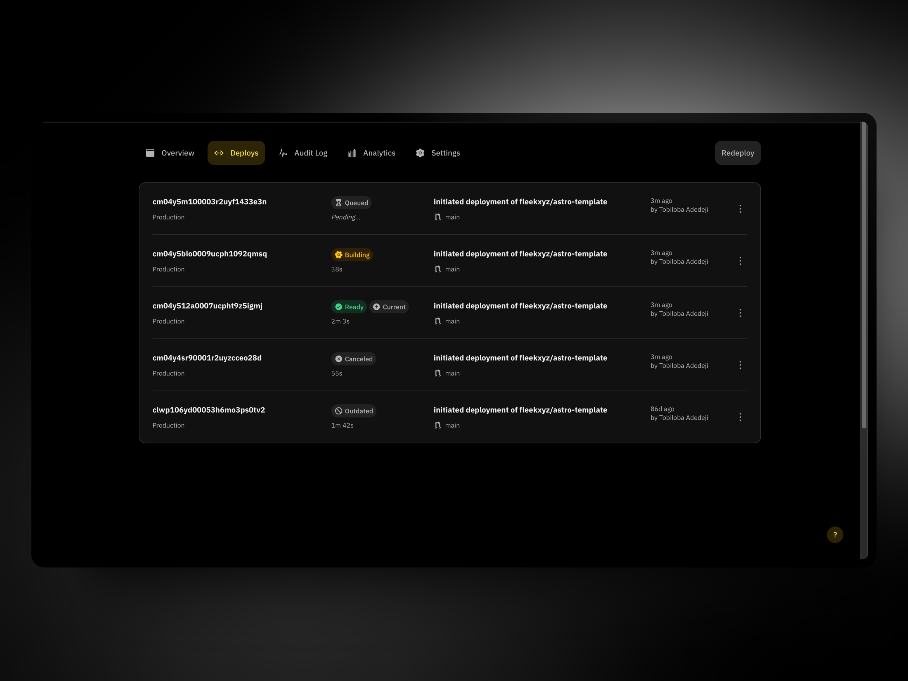

What's up, Fleek Freaks?

We’re back again with new, exciting updates to the Fleek platform that we've been working on for the past few weeks. Today, we’re highlighting a few new things: Fleek Functions UI to create and deploy Fleek Functions, improvements to the deployments page, updates for our migration from .co to .xyz, and the start of support for multiple Git providers. ⚡

You can try out all the new features for yourself directly in the <u>[Fleek app](https://app.fleek.xyz)</u>. Let’s dive into what the team has been working on in August:

---

## Email invitations

Fleek users can now invite others to their projects via email addresses with any permission deemed fit by the user sending out an invitation.

With our new transactional email feature shipped, the invited user gets an email with a CTA button they can click on to be redirected back to their Fleek dashboard.

<video width="100%" height="auto" autoplay loop controls>
  <source src="./email-invitation.mp4" type="video/mp4" />
  Your browser does not support the video tag.
</video>

---

## Fleek Functions UI

Previously, Fleek Functions were accessible only via the Fleek CLI. That’s changed with this new release as you can now create, manage, and customize Fleek Functions directly from the <u>[Fleek app](https://app.fleek.xyz)</u> UI!

Fleek Functions are onchain serverless edge functions powered by Fleek Network. If you're unfamiliar with Fleek Functions, you can learn more <u>[here](https://fleek.xyz/docs/platform/fleek-functions/)</u>. The team is super pumped to see all the cool things developers are testing since the alpha CLI <u>[release](https://fleek.xyz/blog/announcements/introducing-fleek-functions/)</u>.

Deploying your first Fleek Function just got a lot easier 🤙

<video width="100%" height="auto" autoplay loop controls>
  <source src="./fleek-functions-ui.mp4" type="video/mp4" />
  Your browser does not support the video tag.
</video>

---

## Deployment page improvements

- We no longer calculate the total build duration including queued time-- true build times should now be more accurate

- [Preview URLs](https://fleek.xyz/docs/platform/deployments/#previewing-a-deployment) for deployments are now available

- Queued deployments can now be canceled if necessary

- Commit messages will now be displayed without a delay and on a more timely basis

- The redeploy button is no longer disabled if there is an ongoing deployment, allowing for queued deployments

---

## Changelog page

We now have a dedicated changelog page! Previously, changelogs and release notes lived in our blogs and guides sections on the [Fleek website](https://fleek.xyz). With this latest release, we now have one page to list all of the exciting improvements made by the team, in chronological order.
<video width="100%" height="auto" autoplay loop controls>
  <source src="./changelog-page.mp4" type="video/mp4" />
  Your browser does not support the video tag.
</video>

---

## Git provider management

Deployment Git integrations with GitHub can now be managed from within your account’s Settings page. This allows you to configure the GitHub apps necessary for managing deployments in your GitHub repositories from within the app.

You can now:

- See the statuses of the Fleek CI App
- Check which repositories have permission
- See which needs to be installed

<video width="100%" height="auto" autoplay loop controls>
  <source src="./github-integration.mp4" type="video/mp4" />
  Your browser does not support the video tag
</video>

---

## Other fixes and improvements

- New customer support feedback experience from within the app for in-app users.

- The Git integration flow that allows the re-installation of a new GitHub app no longer affects existing sites

- Transactional emails for synchronized updates on activities on user’s accounts
- Fleek CLI version 2.9.0: Amends and enhancement to bundling parameters, among other things.

### Upcoming features:

- Public IPFS gateway

- Backend rewrite to Rust

---

## Coming soon: Migration from Fleek.co to Fleek.xyz

In the interest of providing the smoothest possible transition period from <u>[Fleek.co to Fleek.xyz](https://fleek.xyz/blog/announcements/fleek-co-to-fleek-xyz-migration-details/)</u> for our users, we have put in a lot of effort into testing to ensure that our infrastructure internally migrated successfully before opening up the floodgates to user projects.

With the migration, users will see:

- Improved UX
- Access to many of the new features the team has been shipping to enable seamless Fleek integration across your stack.
- Improved user support
- Access to a ton of resources for users and teams to better utilize Fleek’s tools, including templates, boilerplates, guides, and more.

Stay tuned for more details on the migration process, as well as the release of the migration assistance tools, soon.

---

That's all for this changelog!

You can see a list of all changes made to the app on the new <u>[Changelog page](https://fleek.xyz/changelog)</u> on Fleek.xyz.

Don't forget to:

- Follow us on <u>[X](https://x.com/fleek)</u>
- Join our <u>[Discord](http://discord.gg/fleek)</u> server
- Catch up on all our <u>[guides](https://fleek.xyz/guides/)</u> and <u>[resources](https://fleek.xyz/docs/)</u>

And stay up to date with that the team is cookin'!
