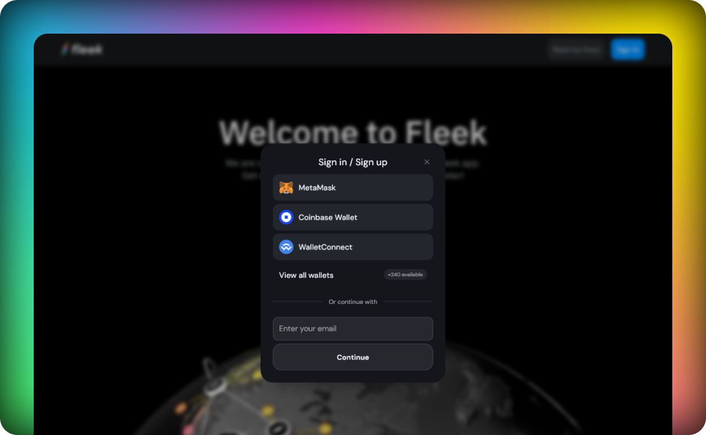

### Authentication

We use [Dynamic.xyz](https://dynamic.xyz) for authentication, this means that you can use any of the following methods to authenticate in Fleek:

- Wallet Authentication
- Email Authentication (using OTP)
- Social Logins (Google, Github, Twitter)

### Username

In Fleek we use usernames to identify users we will be using this in internal comunications and also in the UI. The username can be changed at any moment.

### Email

Email in Fleek is not mandatory but it is highly recommended to have one associated with your account as our notification system will use it to send you important information about your account and projects.

### Deleting an account

At any moment you can delete your account, this will delete all the projects and data associated with it. This action is irreversible. If you want to delete your account, you can do it from the account settings page.
