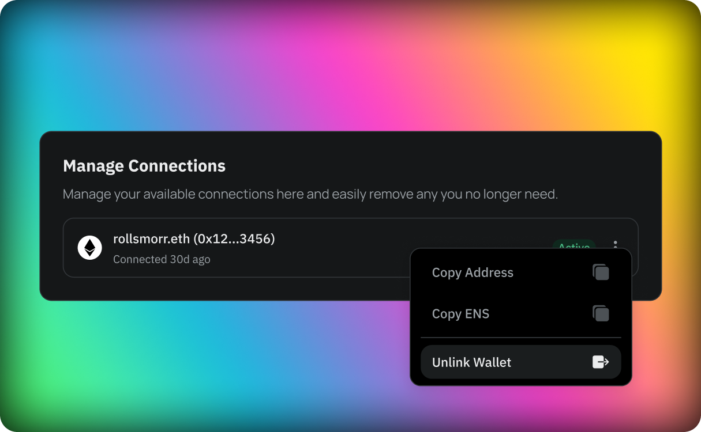

In our platform, users have the flexibility to enhance their login experience by linking wallets and emails to their accounts. This feature is designed to provide a seamless and secure way of accessing accounts, catering to the diverse preferences of our users.

### Account Linking Limitations

It is important to note that each account is limited to having only one email and one wallet linked. This limitation ensures the security and uniqueness of each account, preventing any conflicts or confusions that may arise from multiple links.

### How to Link a Wallet or Email

To link a wallet or an email, users should navigate to the 'Log In Connections' section found within the account settings. This area is dedicated to managing all aspects of your login connections.

#### Adding an Ethereum Wallet

For users looking to link an Ethereum wallet, the process is straightforward:

1. Go to the 'Log In Connections' section of the account settings.
2. Click on the 'Add Ethereum Wallet'. 
3. This will open the wallet linking modal.
4. Select your wallet of choice and scan the provided QR code.
5. Upon successful scanning, the wallet becomes linked to the user's account.

#### Unlinking a wallet

If you decide to unlink your wallet, you can do so by:

1. Going to the 'Manage Connections' section in the 'Log In Connections' section of the account settings.
2. Clicking on the three-dotted menu on your wallet.
3. Selecting 'Unlink Wallet' from the available options.

#### Adding an Email to a Wallet-Created Account

If you created your account using an Ethereum wallet also have the option to add an email address. This can be done by:

1. Go to the 'Log In Connections' section of the account settings.
2. Clicking on the 'Add Email Address' button.
3. Following the prompted steps, which include OTP validation to ensure the email's validity.

#### Updating your Email Address

Changing a linked email address is also a simple process:

1. Go to the 'Log In Connections' section of the account settings.
2. Under managed connections click on the three-dotted menu of your email.
3. Select the option to change your email.
4. Like in the process of adding an email, you will need to confirm the new email using OTP validation.