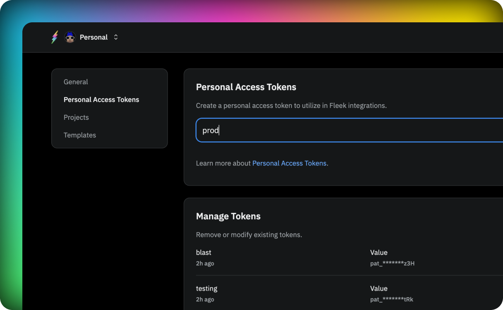

Personal Access Tokens are used to authenticate with Fleek's services. You can create as many tokens as you need, and you can delete them at any time.

## Create a PAT

To create a PAT, go to your [Account Settings](https://app.fleek.xyz/profile/settings) and click on the **Personal Access Tokens** tab. You can create a new one by indicating a name to identify it and clicking on **Create**. You will be prompted to confirm the creation by completing the authentication process and will recieve a token that you can use to authenticate with Fleek's services.

:::info
Ensure that you diligently copy and store your PAT (Personal Access Token) in a safe and secure manner. It's crucial to understand that the value of this token will be revealed only once, and if lost, might not be retrievable. Taking precautionary measures now can prevent potential complications or security breaches in the future.
:::

## Delete a PAT

To delete a PAT, go to your [Account Settings](https://app.fleek.xyz/profile/settings) and click on the **Personal Access Tokens** tab. You can delete a token by clicking on the **Delete** button next to the token you want to delete. Once deleted all resources using the PAT will stop working.
