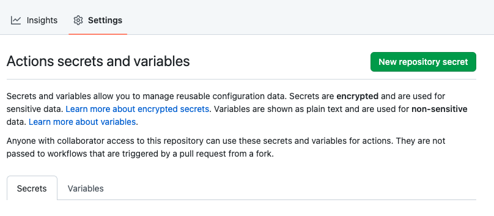
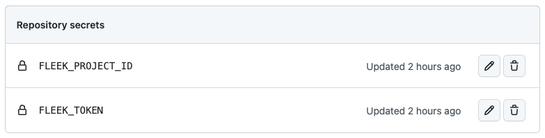
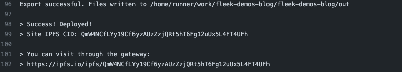

### Seting up a Site

To begin a deployment, you must first set up a site. To do this, you must be authenticated in the CLI and have a project selected. If you are not authenticated or have not selected a project, the CLI can help you. Use the `sites init` command to start the setup process.

For this example we are using a Next.js application that you can find in the [template repository](https://github.com/fleekxyz/templates/tree/main/example-apps).
When you start the process, you will be prompted to create a new site or use an existing one. 

```shellscript filename="Initializing a site" copy
> fleek sites init
WARN! Fleek CLI is in beta phase, use it under your own responsibility
? Choose one of the existing sites or create a new one. › 
❯   Create a new site
```

Let's start by creating a new one and inputting a name for the site. 

```shellscript filename="Initializing a site" copy
✔ Choose one of the existing sites or create a new one. › Create a new site
✔ Type name of you new site. … fleek-demo-docs
```

With the site name in place, you will have to input the directory where the build files will be stored. In this example, we are using a Next.js application thus the output directory is `out`.

```shellscript filename="Initializing a site" copy
✔ Choose one of the existing sites or create a new one. › Create a new site
✔ Type name of you new site. … fleek-demo-docs
✔ Specify the dist directory from where the site will be uploaded from > out
```

Then you'll need to configure the build command that will run before the files are uploaded. In this case we have configured the `npm run build`

```shellscript filename="Initializing a site" copy
✔ Choose one of the existing sites or create a new one. › Create a new site
✔ Type name of you new site. … fleek-demo-docs
✔ Specify the dist directory from where the site will be uploaded from > out 
✔ Do you want to include the optional "build" command? … yes
✔ Specify `build` command … npm run build
```

And the last step is choosing the format for your configuration file. If you choose the `Typescript` option please ensure that the Fleek SDK is included in your project dependencies to avoid deployment errors.

```shellscript filename="Initializing a site" copy
✔ Choose one of the existing sites or create a new one. › Create a new site
✔ Type name of you new site. … fleek-demo-docs
✔ Specify the dist directory from where the site will be uploaded from > out 
? Do you want to include the optional "build" command? › (Y/n)
? Select a format how the site's configuration will be saved: ›
>    Typescript (fleek.config.ts)
>    Javascript (fleek.config.js)
>    JSON (fleek.config.json)
```

That's it! Your site is set up. You will see a file named fleek.json has been created in your directory, which holds the configuration to deploy the site.

```shellscript filename="Initializing a site" copy
✔ Choose one of the existing sites or create a new one. › Create a new site
✔ Type name of you new site. … fleek-demo-docs
✔ Specify the dist directory from where the site will be uploaded from > out 
✔ Do you want to include the optional "build" command? … yes
✔ Specify `build` command … npm run build
✔ Select a format how the site's configuration will be saved: › JSON (fleek.config.json)
> Success! Fleek config file has been saved.
```

### Deploy a Site

To deploy your site, simply run the `sites deploy` command in the same directory where you set up the site.

 When you start the process, you will be prompted to create a new site or use an existing one. This process will first run the build command you have in the `fleek.json` file and the upload the build directory to the desired storage.

```shellscript filename="Deploying a site" copy
WARN! Fleek CLI is in beta, use it at your own discretion
> Success! Deployed!
> Site IPFS CID: QmP1nDyoHqSrRabwUSrxRV3DJqiKH7b9t1tpLcr1NTkm1M

> You can visit through the gateway:
> https://ipfs.io/ipfs/QmP1nDyoHqSrRabwUSrxRV3DJqiKH7b9t1tpLcr1NTkm1M
```

### Continuous Integration (CI)

Imagine you're working on a group project. You want to check a new pull request (PR) and see how the changes look on the site you're creating. To do this, you need to check out the branch of the PR, build it, and run the project to check it live. Wouldn't it be great if, after a PR is made, a new version of the project is built and uploaded so anyone can run tests on it?

Even better, wouldn't it be fantastic if, when you merge to your `main` branch, a deployment to production is made immediately? This is where Continuous Integration comes into play. For CI there are many options, currently on Fleek we are offering an automatic integration with:

- Github Actions - [Read more](https://github.com/features/actions)

To set up the CI you need to use the `fleek sites ci` command. This command will create a new workflow file in your repository. You can then edit the file to add the desired configuration.

Using Github Actions as a CI will allow you to configure an action that automatically deployments your site to IPFS via Fleek upon a new commit, outputting the new hash.

```shellscript filename="Seting up a CI" copy
> fleek sites ci
```

Run the command above to start the process, your first step is to chose from the diferent CI providers. Currently we only support Github Actions.

```shellscript filename="Seting up a CI" copy
> fleek sites ci
WARN! Fleek CLI is in beta, use it at your own discretion
? Select provider you want to use for building and deploying your sites › - Use arrow-keys. Return to submit.
❯   GitHub Actions - Generator of Github Actions YAML file
```

Next you need to set up the directory where the workflow file will be created. The CLI will create a new directory called `.github/workflows` and will create a new file called `fleek-deploy.yml` inside it. If the directory already exists, the CLI will ask you if you want to overwrite the existing file.

```shellscript filename="Seting up a CI" copy
> fleek sites ci
WARN! Fleek CLI is in beta, use it at your own discretion
? Workflow config will be saved in: CWD/.github/workflows/fleek-deploy.yaml. Would you like to specify a different path? › No / Yes
WARN! Can't find .github/workflows directory.
WARN! Creating .github/workflows directory. 
> Success! Github Actions workflow was saved to CWD/.github/workflows/fleek-deploy.yaml file.
```

Now you can go to `.github/workflows/fleek-deploy.yaml` and you will find a file similar to this

```yaml filename="fleek-deploy.yaml" copy
name: Deploy site via Fleek
on: push
jobs:
    deploy-to-fleek:
    runs-on: ubuntu-latest
    env:
        FLEEK_TOKEN: ${{ secrets.FLEEK_TOKEN }}
        FLEEK_PROJECT_ID: ${{ secrets.FLEEK_PROJECT_ID }}
    steps:
        - name: Checkout
        uses: actions/checkout@v3
        - name: Install Node.js
        uses: actions/setup-node@v3
        with:
            node-version: 16
        - name: Install Fleek CLI
        run: npm i -g @fleekxyz/cli
        - name: Build & deploy sites
        run: fleek sites deploy
```

As you can see there are two secrets `secrets.FLEEK_TOKEN` and `secrets.FLEEK_PROJECT_ID`. This is information that has been outputed at the end of the process and you need to configure it in your Github Repository.

``` shellscript filename="Github Secrets"
> Set following secrets in your Github repository settings:

Name              Value                    
-------------------------------------------
FLEEK_TOKEN       <VALUE>
FLEEK_PROJECT_ID  <VALUE>

```

Go back to your Github Repository settings and configure these secrets. Go to `Settings > Secrets > New repository secret` and add add the secrets.



Once you set them up they should look like this.



Next, go to your Github Repository and make a new commit. You should see a new workflow running! To check the results go to Actions and you will see the workflow running. Once its finished you can get the CID and Gateways url of your site.


