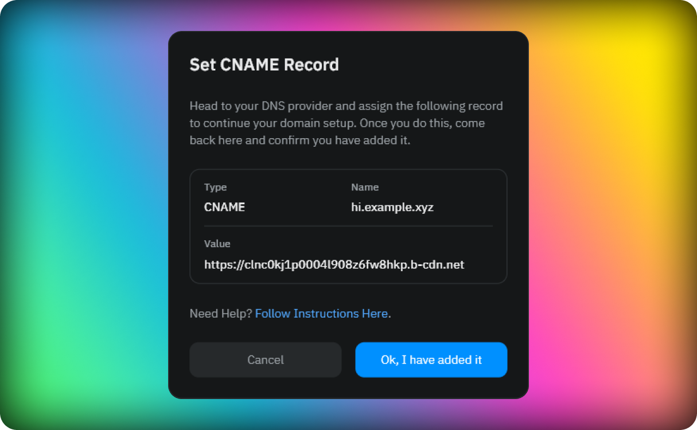

## Introduction

To set up a custom domain, we will create a unique URL for your pull zone, which will point to the last deployed content on your site. You will then need to configure your domain to the pull zone URL using a CNAME record or an ANAME, depending on your DNS provider. This ensures that when someone visits your custom domain, they will be directed to the cached content on our CDN, resulting in faster load times.

In case you want to setp up a root domain you need to user a DNS provier that supports ANAME record or CNAME as a root record. Some of the most popular DNS providers that support this:

- Cloudflare
- DNS Made Easy
- DNSimple
- CONSTELLIX
- DYN DNS
- Easy DNS
- NS1

If your DNS provider does not support ANAME record and you want to use your root domain with your Fleek site, please consider migratring to one of the providers above.

Each time you make a new deployment on your site, we will automatically update the pull zone with the latest content. This means that your visitors will always see the most up-to-date version of your website, without any additional effort on your part.

:::info

Domains on our CDN are unique and since we are sharing the same cdn for both platform (Fleek.co and Fleek.xyz) please avoid using a domain already registered in Fleek.co for the new platform as it will generate a conflict and will not be able to be registered.

:::

## Adding a custom domain

To add a custom domain to your site, first you need to have a site created. If you don't have a site yet, please follow the steps in the [Sites](/docs/Sites) section.

Once you have a site created, go to the site overview and click on the settings icon. In the settings page, click on the **Domains** tab. You will see a list of all the custom domains you have added to the site. To add a new custom domain, type it into the input available in the custom domains section and after we run some validations (mainly cehcking that the domain is valid and is not added to another site) you will be able to add it by clicking the **Add Custom Domain** button.

When the custom domain is added you will see a new row in the custom domains table with the domain you added and the status of the domain in `creating`. During this process we are creating a pull zone for your site and configuring it to use the custom domain you added. This process can take up to 5 minutes. Once the pull zone is created you will be prompted the information you need to configure your DNS provider.

:::info

When setting up a sub domain in your DNS provider make sure you add only the sub domain and not the full domain. For example, if you want to set up `hi.example.xyz` you only need to add `hi` as the sub domain in your DNS provider.

:::

After you configure your DNS provider, you have to trigger the validation process. To do this, click on the **Ok, I have add it** button in the custom domains table. This will trigger the validation process and you will see the status of the domain change to `validating`. Once the validation process is completed, you will see the status of the domain change to `Active`.

## Primary Domains

When you have correctly set up your first domain it will be marked with the tag of `Primary`. The `Primary` domain is the main domain for a site and it will be used inside of the platform for every action that is related to a site as source of truth. For example, when you deploy a site, the domain that will be used in the `view site` button will be the `Primary` domain.

### Changing a primary domain

At any point, as long as you have another `Active` domain seted up for the site you can change the `Primary` domain. To do this, you need to click on the three dots icon in the custom domains table and select the `Make Primary` option. This will change the `Primary` domain to the one you selected. It is important to remind you that you cannot set a domain as `Primary` if it is not `Active`, meaning that we have verified that the domain is correctly configured in your DNS provider.

## Deleting a custom domain

To delete a custom domain, you can on the three dots icon in the custom domains table and select the delete option. This will remove the custom domain from your site and will no longer serving the content of your site. In the case that you are deleting a `primary` domain, as part of the delete process if you have another `active` domains, you will have to select a new `primary` domain.

:::info

If you remove all the custom domains from a site, the content of the storage will still be available through the `<site-slug>.on-fleek.app` domain that you can find in your site overview.

:::
