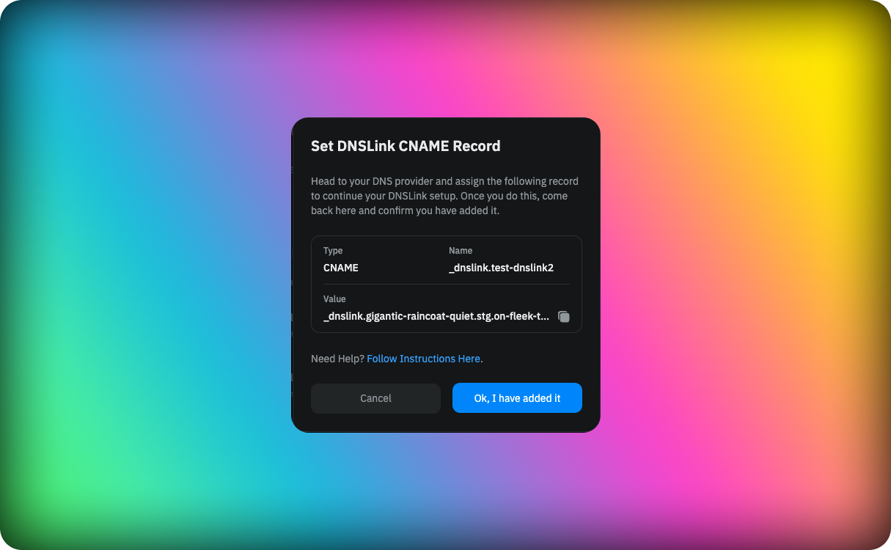
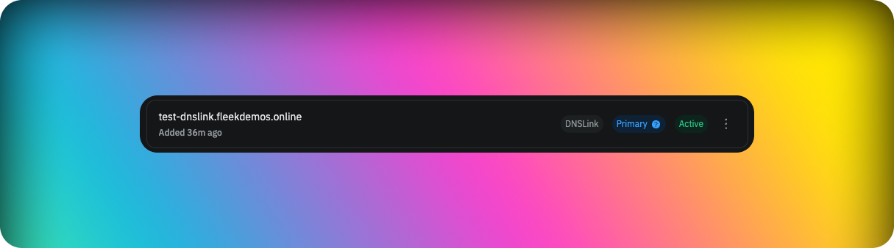

DNSLink allows the mapping of a domain name to an IPFS hash. Setting up DNSLink will allow you to use a domain name to access the latest version of your site through IPFS.

For example, accessing https://ipfs.io/ipns/docs.ipfs.tech will point to the most recent IPFS hash of the Fleek homepage. The utility of this feature comes from having an unchanging link pointing to the most recent IPFS hash, which changes with each new build.

The [IPFS documentation](https://docs.ipfs.tech/concepts/dnslink/) provides a detailed explanation of DNSLink and its utility.

## Setting up DNSLink

To set up DNSLink for your site, first you need to have a custom domain linked to your site. If you don't have a domain linked yet, please follow the steps in the [Domains](/docs/Domains/custom-domains) section.

Once you have a domain linked, you can click the three dots on the right side of the domain and select the **Set DNSLink** option. You will be prompted with a modal with the information you need to add in your custom domain to set up DNSLink.

Once you have added the DNSLink information to your domain, you will need to wait for the changes to propagate. This process can take up to 24 hours, but it usually takes less time.

A grey chip with the text DNS Link next to the domain will indicate the successful integration of DNSLink. At that point you can check your domain on any IPFS gateway like `ipfs.io/ipns/yourdomain.com` to see the latest version of your site.

