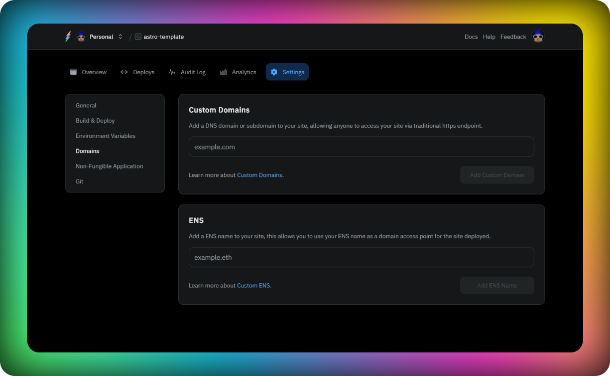

### Introduction

Fleek allows you to set up domains for your sites that allow you to provide a better experience to your users. In this section we will go through the following topics:

- Configuring a custom DNS domain.
- Configuring an ENS domain.
