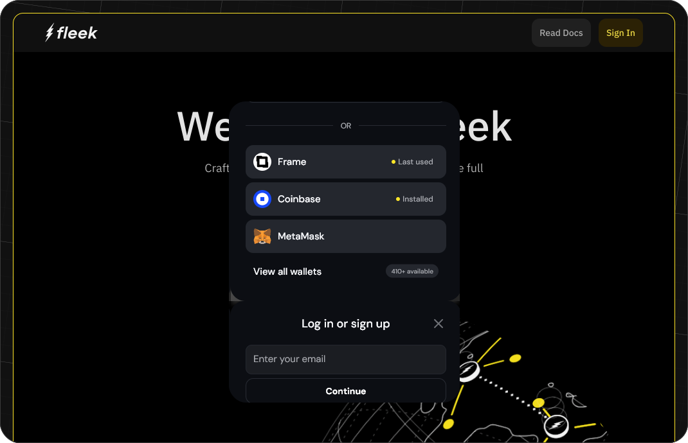
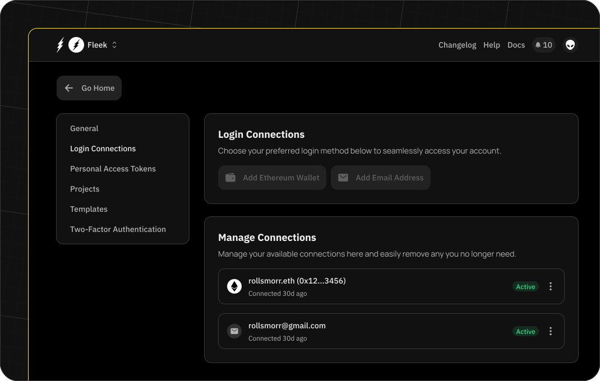
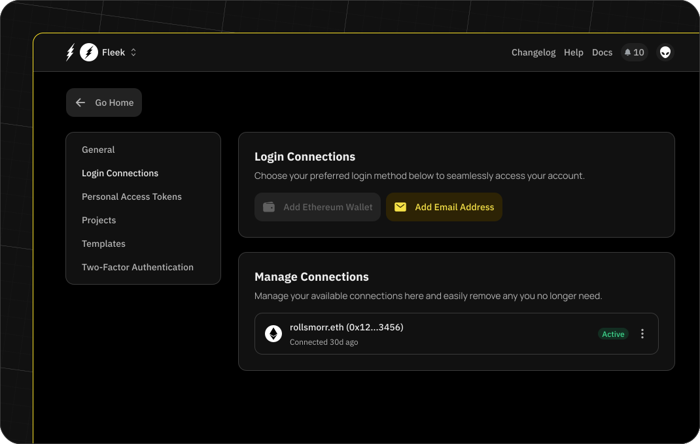
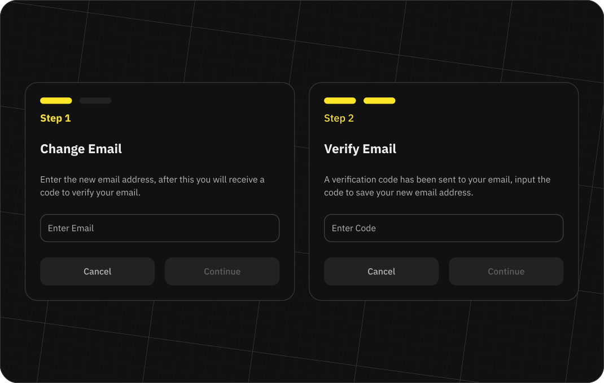
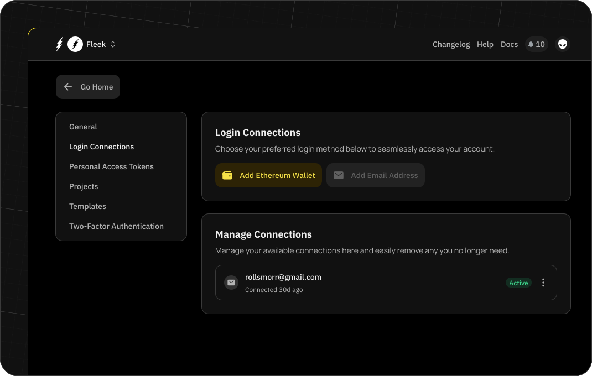
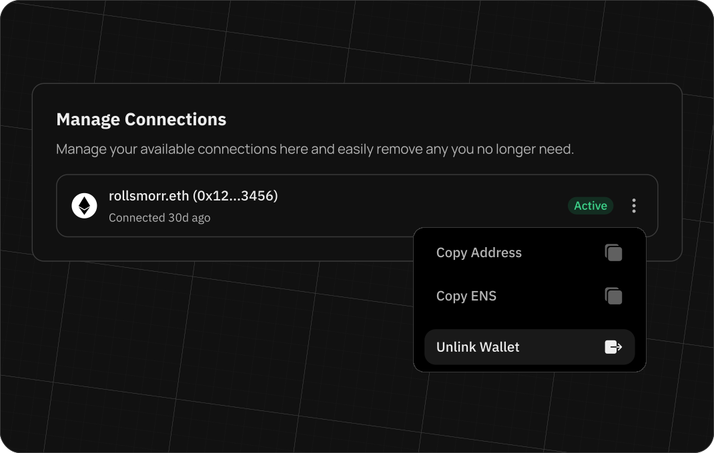
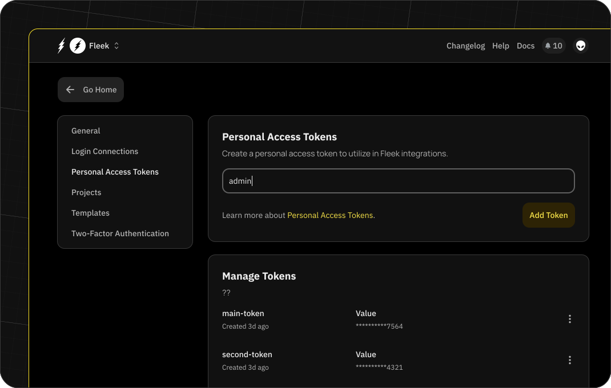

# Accounts on Fleek

Fleek's platform access can be tied to a variety of existing logins. We handle logins to the platform through a service known as Dynamic which handles the authentication of these credentials.

:::info

We plan to replace Dynamic.xyz with a new login provider in the near future that provides simpler CATCHA methods and decreases the friction associated with logging in using an email or GitHub account.

:::

## Log-in methods

You can use any of the following methods to authenticate an account within Fleek:

- Wallet authentication
- Email authentication (using OTP)
- Soon: social logins (Google, Github, X)

Using wallet authentication requires that the user has linked an Ethereum wallet to their account, while using email authentication requires that the user has linked an email address to their account.

## Account updates

Associating an email address to your Fleek account is not mandatory, but it is highly recommended as our notification system will use it to send you important information about your account and projects.

## Deleting an account

You can delete your account at any time. This action is irreversible and will delete all the projects and data associated with it. If you wish to delete your account, you can do so from the 'Account Settings' page.

## Usernames

Fleek uses usernames to identify users we will be using this in internal comunications and also in the UI. The username can be changed at any time from the 'Account Settings' page.

## Email addresses

Users can choose to link an email address to their Fleek account. As mentioned previously, this enables the user to receive account updates that our notification system sends out.

:::info

Each account is limited to having only one email linked. This limitation ensures the security and uniqueness of each account, preventing any conflicts or confusions that may arise from multiple linked email addresses.

:::

### Adding an email address

To add an email address, navigate to the 'Log In Connections' section found within 'Account Settings.' This area is dedicated to managing all aspects of your login connections.

If you created your account using an Ethereum wallet also have the option to add an email address. This can be done by:

1. Going to the 'Account Settings' page and navigating to the 'Login Connections' section.
2. Clicking on the 'Add email address' button.
3. Following the prompted steps, which include OTP validation to ensure the email address's validity.

### Updating your email address

Changing a linked email address is also a simple process:

1. Go to the 'Account settings' page and navigate to the 'Login connections' section.
2. Under 'Managed connections,' click on the three-dot icon of the email address you wish to update.
3. Select the option to change your email address.
4. Confirm the new email address using OTP validation.

## Ethereum wallets

Users can also choose to link an Ethereum wallet to their Fleek account.

### Adding an Ethereum wallet

To add an Ethereum wallet to your Fleek account:

1. Go to the 'Account settings' page and navigate to the 'Login connections' section.
2. Click on 'Add Ethereum wallet.' This will open the wallet linking modal.
3. Select your wallet of choice.
4. Scan the provided QR code.

Upon successfully scanning the QR code, the wallet becomes linked to the user's account.

:::info

Each account is limited to having only one wallet linked. This limitation ensures the security and uniqueness of each account, preventing any conflicts or confusions that may arise from multiple linked wallets.

:::

### Removing an Ethereum wallet

If you decide to unlink your wallet from your Fleek account, you can do so by:

1. Going to the 'Account settings' page and navigating to the 'Login connections' section, specifically the 'Manage connections' section within it.
2. Clicking on the three-dot icon on the wallet you wish to unlink.
3. Selecting 'Unlink wallet' from the available options.

## Personal access tokens (PATs)

Personal access tokens (PATs) are used to authenticate with Fleek's services. You can create as many tokens as you need and can delete them at any time.

### Creating a PAT

To create a PAT, start by visiting 'Account settings' and clicking on the 'Personal access tokens' tab. Click 'Create' and choose a name that will identify this PAT. You will be prompted to confirm the creation by completing the authentication process. You will then receive a token that you can use to authenticate with Fleek's services.

:::warn

Ensure that you diligently copy and store your PAT in a safe and secure manner. This token will be revealed only once, and if lost, might not be retrievable. Taking precautionary measures now can prevent potential complications or security breaches in the future.

:::

### Deleting a PAT

To delete a PAT, start by visiting 'Account settings' and clicking on the 'Personal access tokens' tab. Click on the 'Delete' button next to the token you want to delete. Once deleted, all resources using the PAT will stop working.
