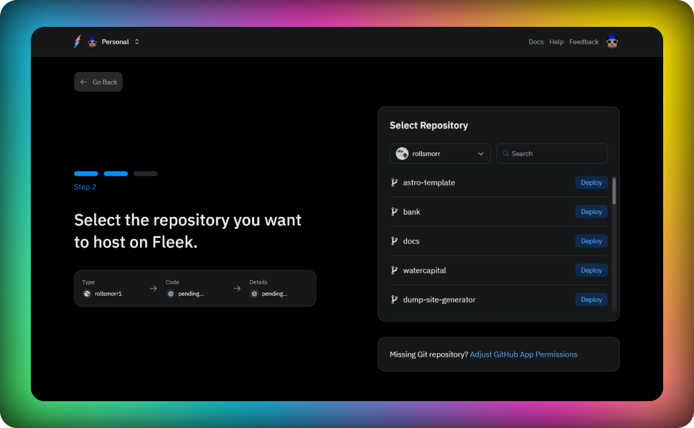
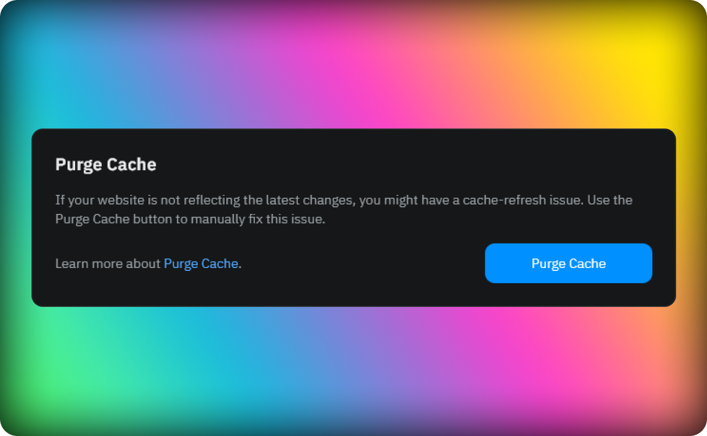
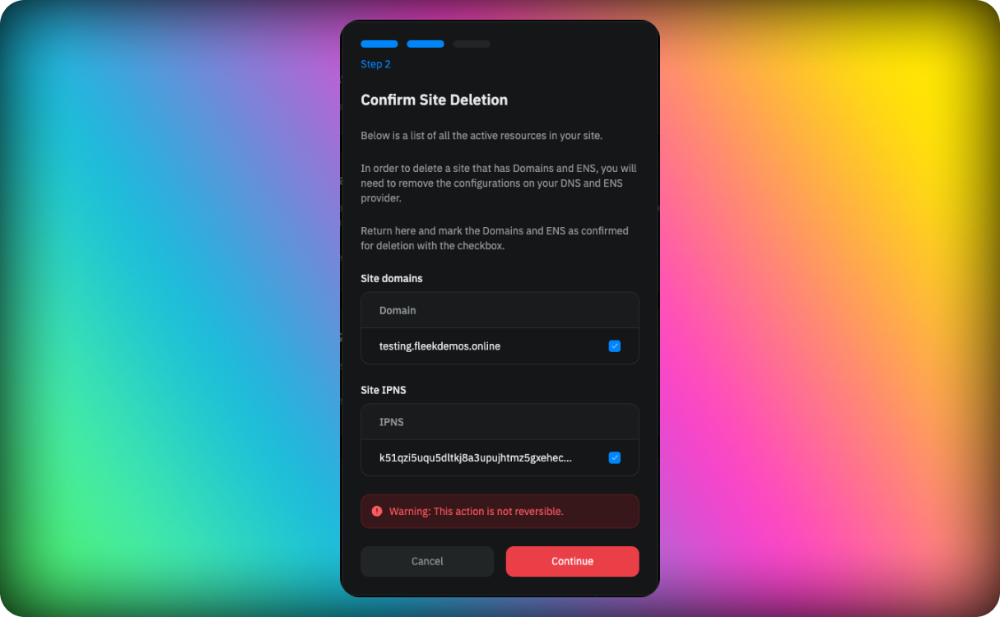

# Deployments on Fleek

Deploying a site using Fleek's pipeline is a simple process. You can connect your code repository to Fleek and we will take care of the build and deploy process. This allows you to focus on your code and not worry about the infrastructure.

This is a multistep process that will require you to connect your code repository, configure your build settings, and deploy your site.

## Connect your code repository

The first step is to connect your code repository to Fleek. You can do this by going to the Sites section and clicking on the "Connect Repository" button.

In this process you will need to select the repository provider and authorize Fleek to access your repository. Once you have authorized Fleek, you will be able to select the repository and branch you want to deploy.

## Select your repository and branch

The second step is to select the repository. By giving access to Fleek we will be listing all the available repositories you have access to. You can select the repository you want to deploy and the branch you want to deploy.

## Configure your build settings

Fleek will automatically recognize the framework, build commands and publish directory for your site. If you want to customize this, you can do it in the build settings section.

In the advance settings you can also configure the environment variables you want to use in your build process.

### Build Parameters

This are the build parameters you can configure:

- `Framework`: The framework used to build your site. EG: Gatsby, Hugo, etc.
- `Build command`: The commands to execute to build the site. EG: npm install && npm run build
- `Publish directory`: The name of the directory containing the index.html file of your site after it has been built
- `Docker image`: The name of the docker image on docker hub in which your site will be built, defaults to node:slim. Fleek provides images for many popular frameworks, but you can use any that suits your project.
- `Environment variables`: The values of your environment variables. It is here for example that you might set your environment as production

## After creating the site

Once your site is created we will trigger the initial deployment. This process can take a few minutes depending on the size of your site. Once the deployment is completed you will be able to see the site url and the status of the deployment.

### Monitor the deployment

You can monitor the deployment process by clicking on the deployments tab in the site overview. You will find the list of all the deployments for your site and the status of each deployment. By clicking on the deployment you will be able to see the logs of the deployment process.

In case a deployment failes you can retry it directly from the deployments page.

### Configure your custom domain

Once the deployment is completed you will be able to configure your custom domain. To do this, go to the settings page and click on the domains tab. In this page you will be able to add your custom domain and configure it to use your site.

You can follow a guide on how to configure your custom domain [here](/guides/troubleshooting-dns-domains-record-update-fleek).

### Configure your ENS domain

You can also configure your ENS domain. To do this, go to the settings page and click on the domains tab. In this page you will be able to add your ENS domain and configure it to use your site.

You can follow a guide on how to configure your ENS domain [here](/guides/guide-ens-domains-ipfs-ethereum-name-service).

## Concurrent Deployments

Currently Fleek supports one deployment at a time. This means that if you trigger a new deployment while another one is running, the new deployment will be queued and will start once the current deployment is completed. Possibilities of concurrent deployments will come soon with the new billing plans.

## Purging Cache

If your website is not reflecting the latest changes, you might have a cache-refresh issue. A previous cache layer might be being held by the CDN, and therefore you’re seeing the website from the cache layer, not the most updated version.

Fortunately, purging the cache manually fixes this! and you can do it right from the Fleek app if needed.

Under the hosting section in Fleek, find the affected site, and visit the Settings. In the general tab you will find the section for purging the cache. It only takes clicking the button and the process will be triggered.

## Deleting a Site

To delete a site, go to the site overview and click on the settings icon. In the general settings page, click on the **Delete Site** button. This will remove the site from your account and will no longer serve your site's content. You will be asked to confirm the removal of all associated resources within the site. Ensure you check the box to the right to acknowledge this action before proceeding for:

- All the domains
- All the IPNS keys

Deleting a site will remove all the deployments and domains associated with the site. This action cannot be undone.

## Setting up a self-managed deployment

To set up a self managed deployment you need to create a site and choose the option to manage the deployment via the Fleek CLI at the bottom of the git provider screen.

To set up the site you will need to add some information about your site:

- `Framework`: The framework used to build your site. EG: Gatsby, Hugo, etc.
- `Build command`: The commands to execute to build the site. EG: npm install && npm run build
- `Publish directory`: The name of the directory containing the index.html file of your site after it has been built

With this you will be redirected to the site overview page where you will find two different files that you need to add to your repository:

- `Fleek.json`: This file contains the configuration of your site.
- `GHA workflow`: This file contains the configuration of the Github Action workflow that will trigger the deploy process.

Though the Fleek.json file is mandatory, you can elect not to use the Github Action workflow and trigger the deploy process in your own way.

## Deploying your site

To deploy your site using the Fleek CLI you can follow the guide in the [CLI](/docs/CLI) section.
