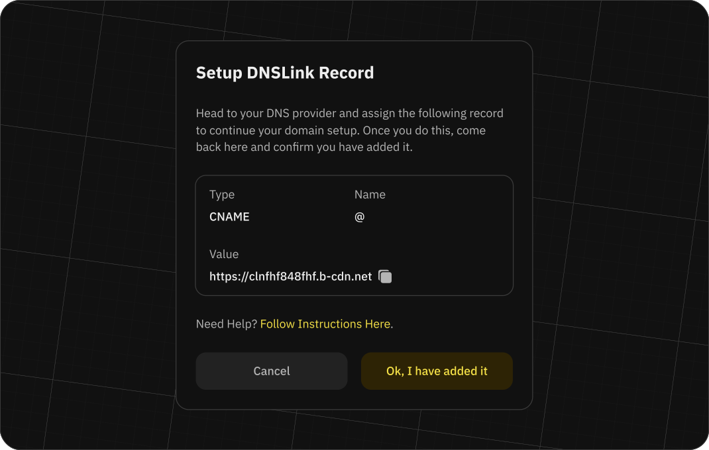

# Domains on Fleek

Fleek allows you to set up and manage domains for your sites, ensuring your content is always accessible to users. We support the management of both traditional DNS records and ENS, a decentralized alternative to DNS.

## ENS

[Ethereum Name Service Domains](https://ens.domains/es/) provide a decentralized alternative to DNS domains. These are Ethereum based names followed by the .eth TLD. One of its compelling features is its capability to map multiple records with multiple purposes.

For example, you can use an IPFS content hash or IPNS record from a site you uploaded with Fleek, with a `.eth` name resolving to that content (much like any DNS domain maps to an HTML file). For example, Eth Limo is registered to [ens.eth.limo](https://ens.eth.limo/).

### ENS name resolution

Because ENS names resolve live on Ethereum, for a user to resolve/visit an ENS domain they will need to have a compatible provider/browser installed that is able to resolve them. Using the MetaMask browser extension is one option, as it resolves .eth domains. An alternative is using a public gateway, such as ETH Limo.

By appending .limo at the end of your ENS, it simply resolves via HTTPS.

### Adding an ENS domain

To add an ENS domain to your site, first create a site. If you don't have a site yet, please follow the steps in the [Projects](/docs/projects) section.

Once you have a site created, go to the 'Site Overview' page and click on the 'Settings' icon. On the 'Settings' page, click on the 'Domains' tab. You will see a list of all the ENS records you have added to the site. To add a new ENS domain, type it into the input available in the 'ENS domains' section and, after we run some validations (mainly checking that the domain is valid and is not added to another site), you will be able to add it by clicking the 'Add ENS Domain' button.

When the ENS domain is added, you will be prompted with a modal to select your preffered method for setting up the ENS content hash record. You can choose between:

- **Automatic**: This will require you to sign a transaction directly from the Fleek application.
- **Manual**: This will allow you to manually set the ENS content hash record directly from the ENS application.

:::info

We recommend using the automatic method as it is the easiest and fastest way to set up your ENS domain. This method supports top-level domains and subnames automatically.

:::

### Automatic ENS configuration

:::warn

To set up your ENS using the automatic integration, you will need to have the wallet that owns the ENS record linked to the Fleek application.

:::

To configure your ENS using the automatic integration, follow these steps:

1. First you must choose between IPFS or IPNS as the content hash record service.
   - We recommend using IPNS for sites that are going to be updated frequently, as this means not paying gas on every update.
   - If you are not planning to update your site frequently and are comfortable paying gas to update the content hash on every deploy, you can use IPFS as the content hash record.
2. After selecting their preferred method, users will be prompted to sign a transaction. This action sets up the content hash record with the chosen hash.
3. Once set up, the site can be accessed via any ENS gateway, such as ETH.limo, by appending '.limo' to the ENS record.

### Manual ENS configuration

The manual option is suitable for users who do not have access to the wallet owning the ENS or prefer to manage updates independently.

To configure the ENS record using the manual configuration, follow these steps:

1. Select 'Set manually' as the desired method.
2. Choose between IPNS or IPFS and copy the corresponding content hash.
3. Go to the ENS application and set the content hash record manually.
4. With the 'Edit' and 'Management' view enabled, you will be able to scroll down to the records section and click 'Add/Edit record.' Scroll down to the 'Content' field and enter
   - `ipns://your-ipns-name` for an IPNS name
   - `ipfs://your-ipfs-hash`for an IPFS name
5. Once set, scroll down to confirm and validate the Ethereum transaction with your wallet.
6. To finalize the process you need to go back to the Fleek application and click the 'Ok! I have added it' button.
7. We will run a verification that the content hash was set up correctly and if everything is OK, you will see the ENS domain marked as verified.
8. Once set up, the site can be accessed via any ENS gateway, such as ETH.limo, by appending '.limo' to the ENS record.

### Manually adding an ENS subname

Normally, trying to add an ENS subdomain or subname of ENS V3 can trigger errors due to controller settings in ENS. To ensure you can easily add any ENS subdomain to any Fleek site, go to the ENS app at https://app.ens.domains/ [yourname] and:

1. Visit the 'Subnames' tab, and select the subname you want to add to Fleek.
2. Unwrap your subname.
3. Set it as a primary name.
4. Done! Go back to Fleek, and follow the normal ENS flow.

## DNS

To set up a custom domain, we will create a unique URL for your pull zone, which will point to the last deployed content on your site. You will then need to configure your domain to the pull zone URL using a CNAME record or an ANAME, depending on your DNS provider. This ensures that when someone visits your custom domain, they will be directed to the cached content on our CDN, resulting in faster load times.

In case you want to set up a root domain, you need to user a DNS provier that supports ANAME record or CNAME as a root record. Some of the most popular DNS providers that support this:

- Cloudflare
- DNS Made Easy
- DNSimple
- CONSTELLIX
- DYN DNS
- Easy DNS
- NS1

If your DNS provider does not support ANAME record and you wish to use your root domain with your Fleek site, please consider migratring to one of the providers above.

Each time you make a new deployment on your site, we will automatically update the pull zone with the latest content. This means that your visitors will always see the most up-to-date version of your website, without any additional effort on your part.

:::info

Domains on our CDN are unique. Since we are sharing the same CDN for both platforms (Fleek.co and Fleek.xyz) please avoid using a domain already registered in Fleek.co for the new platform as it will generate a conflict and will not be able to be registered.

:::

## Adding a custom domain

To add a custom domain to your site, first you'll need a site. If you don't have a site yet, please follow the steps in the [Projects](/docs/sdk/projects/) section.

Once you have created a site, go to the 'Site Overview' page and click on the 'Settings' icon. On the 'Settings' page, click on the 'Domains' tab. You will see a list of all the custom domains you have added to the site. To add a new custom domain, type it into the input available in the custom domains section and, after we run some validations (mainly cehcking that the domain is valid and is not added to another site), you will be able to add it by clicking the 'Add custom domain' button.

Once the custom domain is added, you will see a new row in the 'Custom Domains' table with the domain you added and the status of the domain in `creating`. During this process, we are creating a pull zone for your site and configuring it to use the custom domain you added. This process can take up to 5 minutes. Once the pull zone is created, you will be prompted with the information you need to configure your DNS provider.

:::info

When setting up a sub domain in your DNS provider, ensure you add only the subdomain and not the full domain. For example, if you want to set up `foo.example.xyz` you will only need to add `foo` as the sub domain in your DNS provider.

:::

After you configure your DNS provider, you will need to trigger the validation process. To do this, click on the 'OK, I have added it' button in the 'Custom Domains' table. This will trigger the validation process and you will see the status of the domain change to `validating`. Once the validation process is complete, you will see the status of the domain change to `Active`.

## Primary domains

When you have correctly set up your first domain, it will be marked with the tag of 'primary'. The 'primary' domain is the main domain for a site and will be used inside of the platform for every action that is related to a site as a source of truth. For example, when you deploy a site, the domain that will be used in the 'View site' button will be the 'primary' domain.

### Changing a primary domain

At any point, as long as you have another 'Active' domain seted up for the site you can change the 'primary' domain. To do this, you need to click on the three-dot icon in the 'Custom Domains' table and select the 'Make primary' option. This will change the 'primary' domain to the one you selected. You cannot set a domain as 'primary' if it is not 'active', meaning that we have verified that the domain is correctly configured in your DNS provider.

## Deleting a custom domain

To delete a custom domain, click on the three-dot icon in the 'Custom Domains' table and select the 'Delete' option. This will remove the custom domain from your site and will no longer serve the content of your site. In the case that you are deleting a 'primary' domain, as part of the deletion process if you have another 'active' domains, you will have to select a new 'primary' domain.

:::info

If you remove all the custom domains from a site, the content of the storage will still be available through the `<site-slug>.on-fleek.app` domain that you can find in your site overview.

:::

## DNSLink

DNSLink allows the mapping of a domain name to an IPFS hash. Setting up DNSLink will allow you to use a domain name to access the latest version of your site through IPFS.

The utility of this feature comes from having an unchanging link pointing to the most recent IPFS hash, which changes with each new build.

The [IPFS documentation](https://docs.ipfs.tech/concepts/dnslink/) provides a detailed explanation of DNSLink and its utility.

### Setting up DNSLink

To set up DNSLink for your site, first you need to have a custom domain linked to your site. If you don't have a domain linked yet, follow the steps in the [Domains](/docs/cli/domains/) section.

Once you have a domain linked, you can click the three dots on the right side of the domain and select the 'Set DNSLink' option. You will be prompted with a modal with the information you need to add in your custom domain to set up DNSLink.

Once you have added the DNSLink information to your domain, you will need to wait for the changes to propagate. This process can take up to 24 hours, but it usually takes less time.

A grey chip with the text 'DNSLink' next to the domain will indicate the successful integration of DNSLink. At that point you can check your domain on any IPFS gateway like `ipfs.io/ipns/yourdomain.com` to see the latest version of your site.

