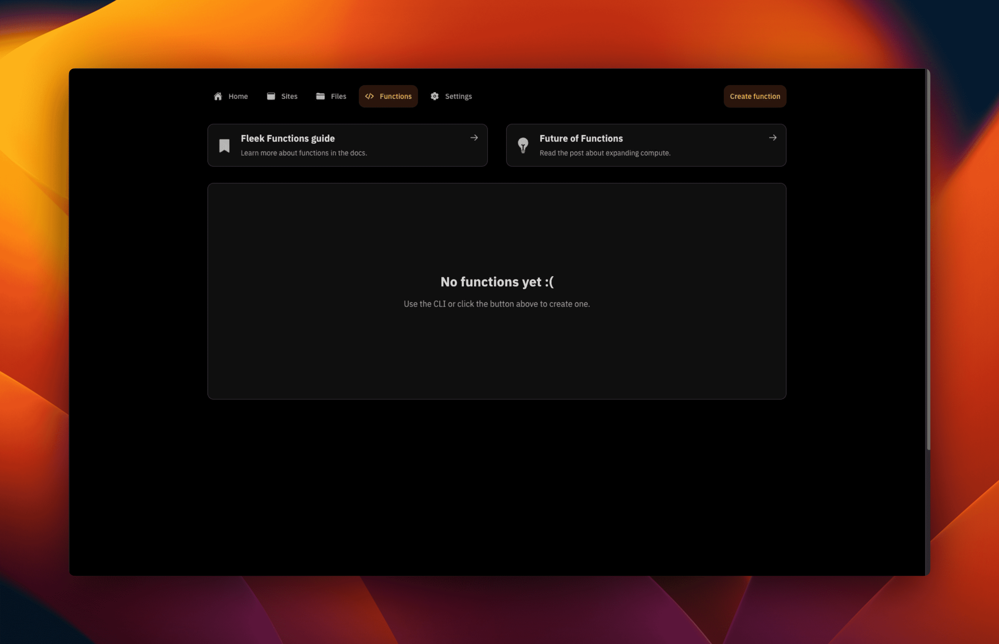
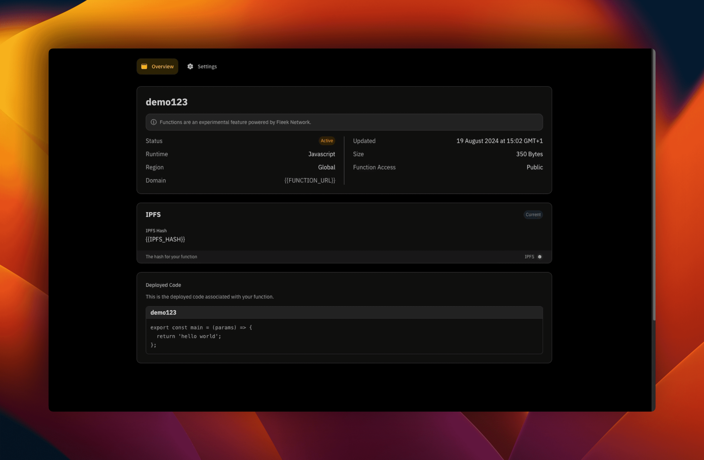
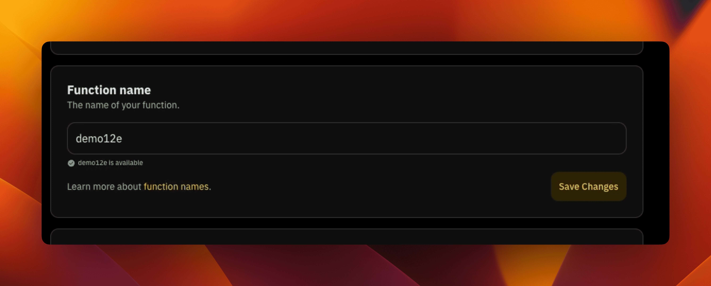
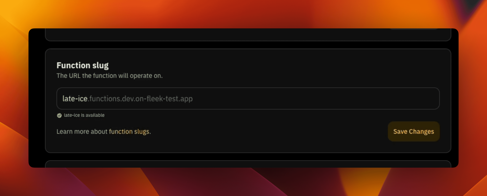
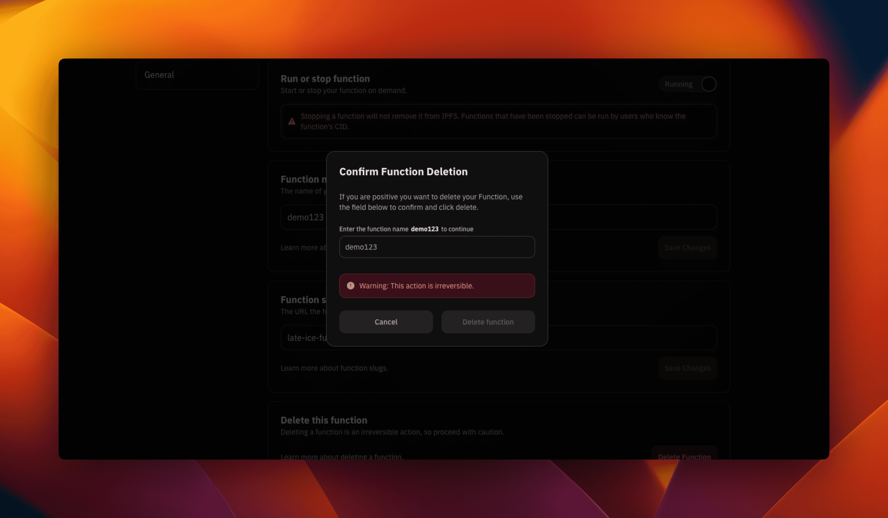

# Fleek Functions from UI

:::warn
This feature is in alpha and runs on a new testnet version of Fleek Network. Until functionality is finalized further, we do not recommend using Fleek Functions in production apps due to
changes that may be made during this ongoing development period. We have a lot of improvements planned to the entire data flow, but they require more precise engineering efforts which will
take more time. Releasing this alpha version now while we are still developing it, to get early usage and feedback, felt like the best approach to achieve the long-term goals of Fleek
Functions.
:::

Fleek Functions are code snippets that are executed server-side using Fleek Network’s on-chain cloud infrastructure.

Formerly we could only work with Fleek Functions [from the Fleek CLI](/docs/cli/functions), but, now we can create and manage Fleek Functions them from within the Fleek platform.
This still requires you have the [Fleek CLI installed on your machine](/docs/cli/#install), but, Fleek Functions can be easily interacted with and controlled to certain extents on the Fleek platform now. The extents will be pointed out in admonitions and mentioned within here.

## Create and Deploy a Fleek Function

To create a Fleek Function within a project:

1. On the project's dashboard, click on the "Functions" button on the secondary navigation:

2. The "Functions" page looks like below. Click on the "Create function" button on the extreme right-hand of the secondary navigation:
   

3. A modal appears and asks for the desired name for the Fleek Function. Type it in and click on "Create."

4. We are navigated to the Fleek Function's "Overview" page. There we see a couple of information about the function including three "Pending" states in the first section. In the second section you see information about how to deploy to the function you just created.
   :::info
   In the first section we see a value with a URL called "Domain". That is the URL that will be used by the Fleek Function.
   :::

5. Go through the steps (from step 1 through to step 4) and follow the instructions per step. The steps take you from creating the Fleek Function which will connect with the Fleek Function on the platform and gets you to deploy from your machine to the function you already created from your platform.

   - Install the [Fleek CLI](/docs/cli/#install).

   ```bash
    npm install -g @fleek-platform/cli
   ```

   - After installation, type the following command to log in to your Fleek account from the CLI:

   ```bash
    fleek login
   ```

   - We also need to switch to the Fleek project we created the Fleek Function within from the platform using the project ID. We use the command below to do that from the CLI:

   ```bash
    fleek projects switch --id={{PROJECT_ID}}
   ```

   - Create a file in a directory on your machine and name it `function.js`. In the file, write the below code:

   ```javascript
   export const main = (params) => {
     return 'hello world';
   };
   ```

   - Create the Fleek Function with the same name as the one you inputted on the Fleek platform using the below command:

   ```bash
    fleek functions create  --name {{FUNCTION_NAME}}
   ```

   - Deploy the Fleek Function, using the below command:

   ```bash
    fleek functions deploy --name {{FUNCTION_NAME}} --path <code_path>
   ```

You have successfully deployed a Fleek Function using the above steps from the Fleek platform UI and now the first section of our Fleek Function "Overview" page should look like this now with the "Pending" status updated:

:::info
The values for the "Domain" and "IPFS Hash" will show the appropriate values for your Fleek Functions.
:::



If you back to the "Functions" page, you should see a list of all your functions with the "Active" state for the deployed ones and a "Not deployed" state for the ones that have not been deployed.

## Managing Fleek Functions

Fleek Functions can now be managed directly from the Fleek platform within a project. Most of the operations that required using the Fleek CLI before can
now be from the Fleek UI.

These operations are housed in the "Settings" of the current Fleek Function you are on. To navigate there, click on the "Settings" button that is beside "Overview" button.

### Run or stop a function

Functions can be run or stopped in the settings of the current Fleek Function. This however, does not delete the deployment of the Fleek Function from IPFS (Interplanetary File System), it just stops it from running as a Fleek Function.

There are two states:

- **Running**: The Fleek Function is running and live.

- **Stopped**:: The Fleek Function has been taken down as a Fleek Function and can only be accessed by the Content ID (CID) from IPFS.

### Change function name

From the "Settings" of the current Fleek Function as well, you can change the name of the Fleek Function on demand to any name deemed fit based on requirements.



### Edit function slug

A Fleek Function's slug is contained within the URL (Uniform Resource Locator) of the Fleek Function and can be changed to a custom name based on requirements or preferences.

To illustrate the above, we consider the below Fleek Function:

```bash
https://echoing-oil-numerous.functions.dev.on-fleek-test.app/
```

"echoing-oil-numerous" represents the Fleek Function's slug within the URL and we can edit that within the Fleek Function's settings as shown below:



### Delete Fleek Function

Fleek Functions can be deleted from the settings as well by scrolling to the bottom section of the settings page and clicking on the "Delete Function" button.

This surfaces a modal that prompts the user to enter the Fleek Function name and confirm the action with the "Delete function" button that is active when the name the user enters matches the one in the modal window.


