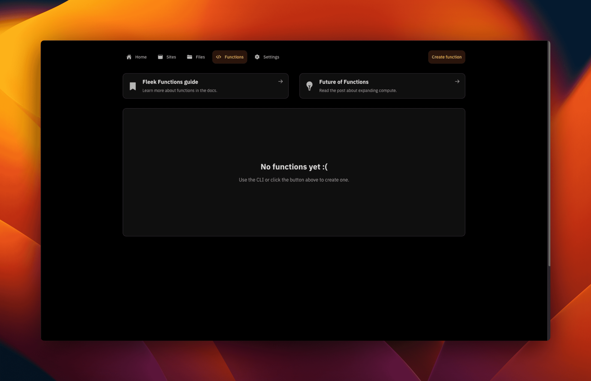
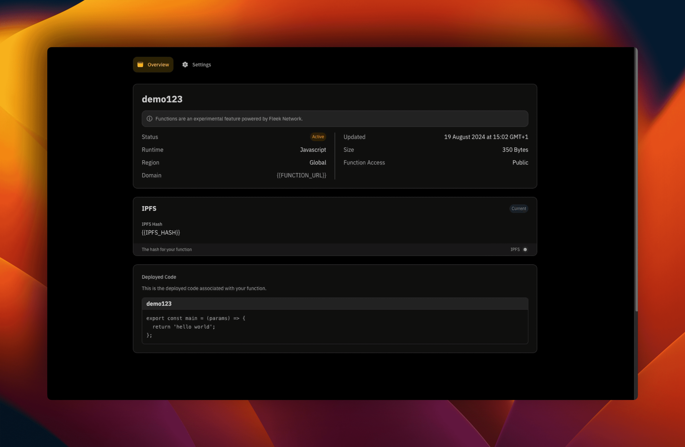
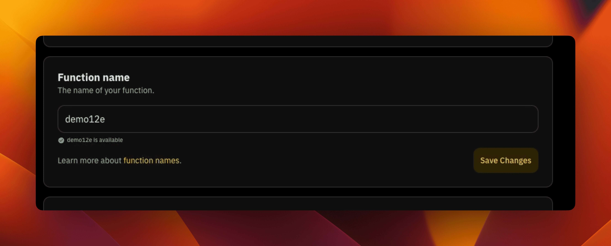
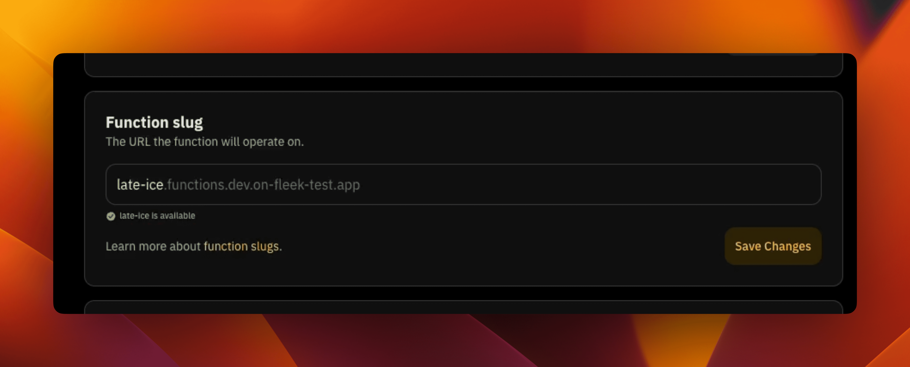
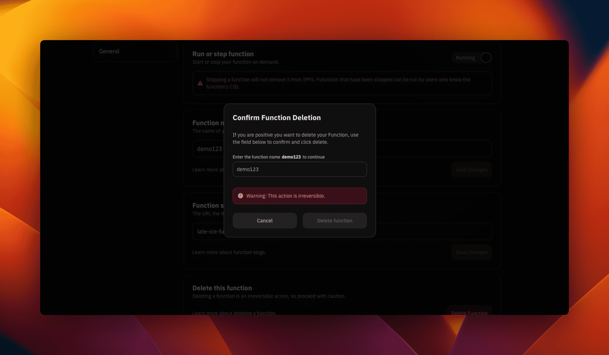

# Fleek Functions

:::warn

This feature is in alpha and runs on a new testnet version of Fleek Network. Until this functionality is finalized, we do not recommend using Fleek Functions in production apps due to changes that may be made during this ongoing development period. Fleek Functions are currently accessible within the Fleek CLI or the Fleek SDK in this alpha state, but cannot yet be created or managed within the Fleek Platform UI.

We have several improvements planned for the entire data flow, but they require more precise engineering efforts which will take more time. Releasing this alpha version now while we are still developing, to get early usage and feedback, felt like the best approach to achieve the long-term goals of Fleek Functions.

:::

Fleek Functions are code snippets that are executed server-side using Fleek Network’s on-chain cloud infrastructure.

These functions are often a more cost-effective, performant and scalable option for executing server-side code than popular alternatives such as Lambda functions, due to the architecture of the Fleek Network. These functions allow users to build cost-effective, low-overhead infrastructure for their applications while also enabling lightning-fast performance.

<div className="my-12 bg-gray-dark-6 p-[1px]" />

## Why should I use Fleek Functions in my project?

There are a few key benefits to consider when evaluating Fleek Functions for use within your application:

**Reduced latency**: The primary advantage of using Fleek Functions over a service you may be familiar with such as AWS’s Lambda functions is the edge runtime environment, which reduces the latency of your function calls. By running Fleek Functions on Fleek Network’s edge-optimized onchain cloud infrastructure, which consists of a large number of geo-aware, globally distributed nodes, Fleek minimizes the response time of these functions.

**Reduced overhead**: Because functions are only called on an as-needed basis and there are no servers to manage, Fleek Functions require far less overhead than other self-managed servers or rentals. They allow you to focus on your code, rather than on server infrastructure management.

**Auto-scaling**: Users who are in need of minimal resources during low-traffic periods or far more resources during traffic spikes can use precisely the volume of resources that they require, in an auto-scaling model that is maximally cost-effective.

**Reduced costs**: While pricing is still being fully finalized (and therefore Fleek Functions are free to use for now), there are strong indications that Fleek Functions will be significantly cheaper than current popular serverless alternatives such as Lambda functions and Vercel Functions. Thanks to Fleek Network, pricing is also fully transparent and almost entirely usage based, so you don’t need to deal with any of the price gouging that comes with most traditional cloud platforms.

**Self-sovereignty**: Using Fleek Functions means you get to remain self-sovereign, due to the permissionless, censorship resistant, and onchain nature of Fleek Network. With Fleek Functions, nobody can deplatform you or censor you or tamper with your code or data. You can finally say goodbye to all that corporate cloud platform nonsense.

## What can I do with Fleek Functions?

Put simply, you can call Fleek Functions from the front-end of your application just as you would invoke any code that returns a response from a server. Among other things, you can use Fleek Functions to:

- Call APIs to retrieve or populate data on the user interface
- Make routing requests
- Implement server-side rendering (SSR) for your entire application
- Build use cases like Next.js hosting
- Perform image optimization and resize images
- Replace any existing serverless, edge, or cloud functions you currently use in your stack

And countless other things. There isn’t much you can’t build with serverless compute frameworks these days.

## Do I need to use Fleek Functions for my Fleek project, or is Fleek able to support dynamic sites that do not use Fleek Functions?

Prior to the release of Fleek Functions, Fleek was able to support users’ dynamic sites, but by necessity users were required to manage their back-end services outside of Fleek.

Fleek can now support dynamic sites without requiring users to manage this aspect of their application elsewhere, but even in the wake of Fleek Functions’ release, it is not required.

Users still have the option of self-managing their servers or managing their back-end code through another provider. We believe Fleek Functions offer benefits over these alternatives, but do not require their exclusive use or prevent users from exploring other solutions.

## Moving Fleek Functions from alpha to production

While this feature is in alpha, there are some important caveats about its functionality, chiefly that this feature is not yet accessible within the platform UI.

### Where to use Fleek Functions in alpha

Today Fleek Functions can only be created and managed within Fleek's CLI and SDK, but soon we plan to integrate this functionality into the platform UI as well. When we do roll out Fleek Functions within the platform UI, you will find this functionality under the “Functions” tab of your project page, which currently serves as a placeholder and directs users to the information found here.

### How to use Fleek Functions in alpha

While the Fleek Functions feature is in alpha and until a future date when its functionality has been finalized, we do not recommend relying on Fleek Functions within production applications. In the interim, we encourage our users to experiment with the addition of Fleek Functions to hobby projects or sandboxes. We invite users to preview the performance and cost benefits of Fleek Functions in a controlled environment such as this to assuage any doubts about its future value to a production application.

### Later: Supporting common use cases with communal Fleek Functions

We plan to improve and solidify this feature based on feedback from the community, but to also explore ways that the community can directly contribute shared communal Fleek Functions. Developers building on Fleek often require custom back-end code to facilitate the bespoke needs of their application and users, but just as certain utility `npm` packages like `lodash` attract installs into millions of unique repos, some Fleek Functions will fulfill a need shared by a preponderance of Fleek users. An example of one such Fleek Function might be one that call the OpenWeatherMap API and returns the current temperature of the requested city.

If these functions were created in isolation, they would often duplicate the work of other community members. One might be a less battle-tested, elegant solution to the same problem another user has encountered.

Users are under no obligation to publish Fleek Functions, but we plan to highlight open-source contributions from Fleek users that we believe may be valuable to our community at large. Just as we currently highlight useful templates for users building their applications with specific frameworks and an [`awesome-fleek`](https://github.com/fleekxyz/awesome-fleek) directory of useful tools built on Fleek, we anticipate there may be value in organizing a directory of boilerplate but configurable Fleek Functions that have widespread applicability to our users’ projects.

### Release timeline for Fleek Functions

We look forward to seeing the Fleek Functions our users create and share. We believe Fleek Functions collectively represent one of the more significant value unlocks for our users since Fleek’s inception, given that it is one of the first of our features to leverage the Fleek Network.

As of today, Fleek Functions will move through the following phases:

- **Alpha release**: Fleek Functions can be created and managed through the Fleek CLI and SDK, but cannot be accessed through the Fleek Platform UI. They are not recommended for production-grade applications.
- **Beta release**: Following rigorous testing, we will move Fleek Functions to a beta state. We will still advise caution when integrating Fleek Functions into production applications at this stage, but they will be nearing their production release and thus will be less likely to change or produce unexpected side effects.
- **Production release**: The Fleek Platform UI will support the creation and management of Fleek Functions. Fleek Functions will leave beta and be recommended for production applications. We will begin facilitating a community-created directory of open-source Fleek Functions.

Ready to get started with Fleek Functions and explore the cost and performance improvements they can enable for your application? Follow the guide below.

<div className="my-12 bg-gray-dark-6 p-[1px]" />

## Creating and using Fleek Functions

Fleek Functions can now be accessed via the Fleek Platform [CLI](/docs/cli) and [Fleek Platform app](https://app.fleek.xyz). Follow the guide [here](http://localhost:4321/docs/cli/functions#create-a-draft-function) to learn how to create and deploy Fleek Functions with the Fleek CLI. You also can create and manage your Fleek Functions directly from your Fleek app:

## Create and Deploy a Fleek Function

To create a Fleek Function within a project:

1. On the project's dashboard, click on the "Functions" button on the secondary navigation:

2. The "Functions" page looks like below. Click on the "Create function" button on the extreme right-hand of the secondary navigation:
   

3. A modal appears and asks for the desired name for the Fleek Function. Type it in and click on "Create."

4. We are navigated to the Fleek Function's "Overview" page. There we see a couple of information about the function including three "Pending" states in the first section. In the second section you see information about how to deploy to the function you just created.
   :::info
   In the first section we see a value with a URL called "Domain". That is the URL that will be used by the Fleek Function.
   :::

5. Go through the steps (from step 1 through to step 4) and follow the instructions per step. The steps take you from creating the Fleek Function which will connect with the Fleek Function on the platform and gets you to deploy from your machine to the function you already created from your platform.

   - Install the [Fleek CLI](/docs/cli/#install).

   ```bash
    npm install -g @fleek-platform/cli
   ```

   - After installation, type the following command to log in to your Fleek account from the CLI:

   ```bash
    fleek login
   ```

   - We also need to switch to the Fleek project we created the Fleek Function within from the platform using the project ID. We use the command below to do that from the CLI:

   ```bash
    fleek projects switch --id={{PROJECT_ID}}
   ```

   - Create a file in a directory on your machine and name it `function.js`. In the file, write the below code:

   ```javascript
   export const main = (params) => {
     return 'hello world';
   };
   ```

   - Create the Fleek Function with the same name as the one you inputted on the Fleek platform using the below command:

   ```bash
    fleek functions create  --name {{FUNCTION_NAME}}
   ```

   - Deploy the Fleek Function, using the below command:

   ```bash
    fleek functions deploy --name {{FUNCTION_NAME}} --path <code_path>
   ```

You have successfully deployed a Fleek Function using the above steps from the Fleek platform UI and now the first section of our Fleek Function "Overview" page should look like this now with the "Pending" status updated:

:::info
The values for the "Domain" and "IPFS Hash" will show the appropriate values for your Fleek Functions.
:::



If you back to the "Functions" page, you should see a list of all your functions with the "Active" state for the deployed ones and a "Not deployed" state for the ones that have not been deployed.

## Managing Fleek Functions

Fleek Functions can now be managed directly from the Fleek platform within a project. Most of the operations that required using the Fleek CLI before can
now be from the Fleek UI.

These operations are housed in the "Settings" of the current Fleek Function you are on. To navigate there, click on the "Settings" button that is beside "Overview" button.

### Run or stop a function

Functions can be run or stopped in the settings of the current Fleek Function. This however, does not delete the deployment of the Fleek Function from IPFS (Interplanetary File System), it just stops it from running as a Fleek Function.

There are two states:

- **Running**: The Fleek Function is running and live.

- **Stopped**:: The Fleek Function has been taken down as a Fleek Function and can only be accessed by the Content ID (CID) from IPFS.

### Change the function name

From the "Settings" of the current Fleek Function as well, you can change the name of the Fleek Function on demand to any name deemed fit based on requirements.



### Edit the function slug

A Fleek Function's slug is contained within the URL (Uniform Resource Locator) of the Fleek Function and can be changed to a custom name based on requirements or preferences.

To illustrate the above, we consider the below Fleek Function:

```bash
https://echoing-oil-numerous.functions.dev.on-fleek-test.app/
```

"echoing-oil-numerous" represents the Fleek Function's slug within the URL and we can edit that within the Fleek Function's settings as shown below:



### Delete a Fleek Function

Fleek Functions can be deleted from the settings as well by scrolling to the bottom section of the settings page and clicking on the "Delete Function" button.

This surfaces a modal that prompts the user to enter the Fleek Function name and confirm the action with the "Delete function" button that is active when the name the user enters matches the one in the modal window.


