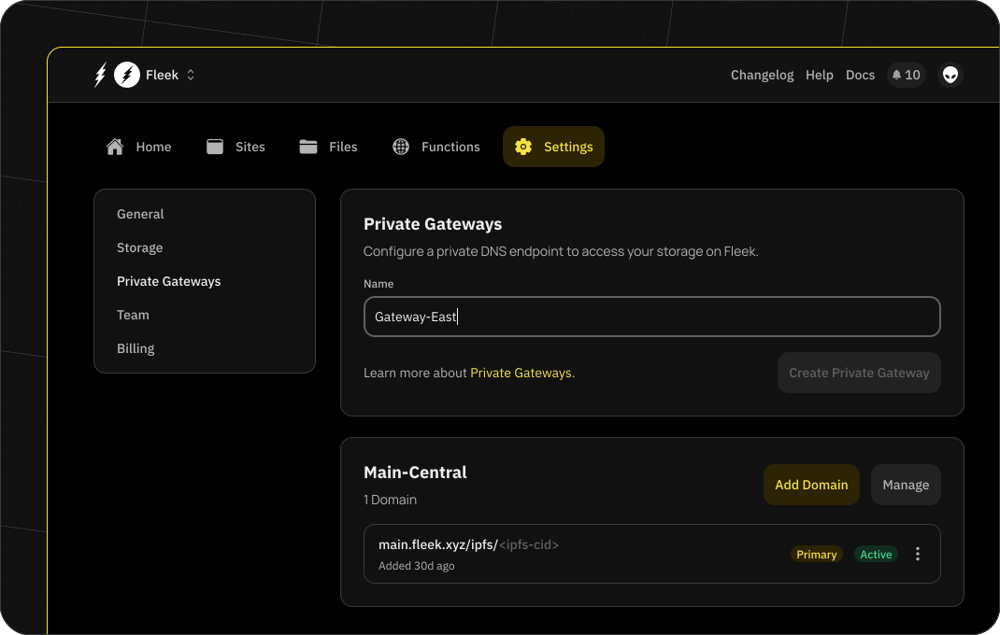
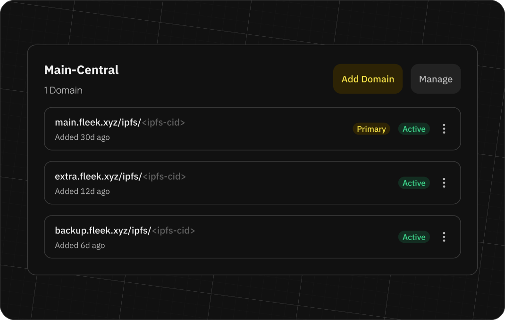
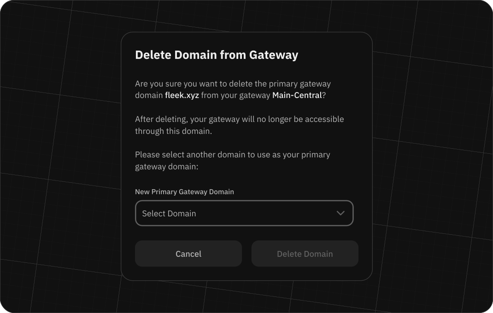

# Gateways on Fleek

Fleek enables you to use IPFS private gateway services to serve your content to your users.

## What is a private gateway?

A private gateway is a service that allows you to serve your content to your users through a custom domain. This means that you can serve your content through a domain like `https://mydomain.com` instead of `https://ipfs.io/ipfs/<hash>`. A custom domain gives your content an extra branding layer.

They are private because this gateway only allows the files pinned in your account to be served.

## Creating a private gateway

To create a private gateway, you will need to have a Fleek project and a custom domain. Currently, we are mandating that each private gateway have at least one custom domain associated with it, to avoid abuse.

To set up the gateway, go to a project's 'Settings' page and click on the 'Gateways' tab. On this tab, you will see a list of all the gateways you have created for this project. To create a new gateway, add a name and click on the 'Add Gateway' button. Once the gateway has been created, a modal will appear to add your first custom domain on top of it.

Add the domain and configure the DNS provider to point to the gateway. Once you have configured the DNS provider you can click on the 'OK, I have added it' button. At that point, we will run the verification to make sure it has been set up correctly.

Once the verification is complete, you will see the status of the gateway change to 'active' and you will be able to use it to serve your content. You can access the content on your gateway via the domain by navigating to `my-gateway-url/ipfs/<cid>` and `my-gateway-url/ipns/<cid>`, using the `<cid>` of your content.

You can set up more than one domain per gateway. To do so, click on the three-dot icon in the gateway row and select the 'Add domain' option. This will open a modal where you can add a new domain to the gateway.

## Primary domains

When you have correctly set up your first domain, it will be marked with the tag of 'primary.' The 'primary' domain is the main domain for a storage and it will be used inside of the platform for each action that is related to files as a source of truth. For example, when you store a file, the domain that will be used in the 'View file' button will be the 'primary' domain.

## Changing a primary domain

At any point, as long as you have another 'active' domain set up for the private gateway, you can change the 'primary' domain. To do so, click on the three-dot icon in the 'Custom domains' table and select the `Make primary' option. This will change the 'primary' domain to the one you selected. You cannot set a domain as 'primary' if it is not 'active,' meaning that we have verified that the domain is correctly configured in your DNS provider.

## Deleting a custom domain

To delete a custom domain, click on the three-dot icon in the 'Custom domains' table and select the 'Delete' option. This will remove the custom domain from your private gateway and will no longer serve the content in your storage. In the event that you are deleting a 'primary' domain, you will have to select a new 'primary' domain during the deletion process if you have another 'active' domain.

:::info

If you remove all of the custom domains from all of the private gateways in your project, the content of the storage will still be available through public IPFS gateways.

:::

## Deleting a private gateway

To delete a private gateway, click on the 'Manage' button in the gateway row and select the option to delete the gateway. This will remove the gateway and all the content associated with it. You will be asked to confirm the removal of all associated resources within the gateway. Ensure you check the box to the right to acknowledge this action before proceeding.

:::info

Deleting a gateway and the domains associated with it is an async process, so the content might be reflected by your domain for a few minutes. We recomend that you always remove the DNS configuration for the domain in question to avoid any issues.

:::
