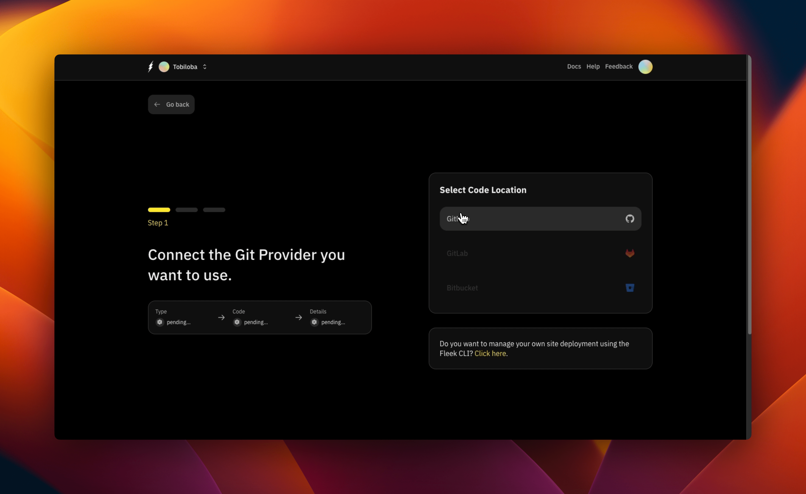
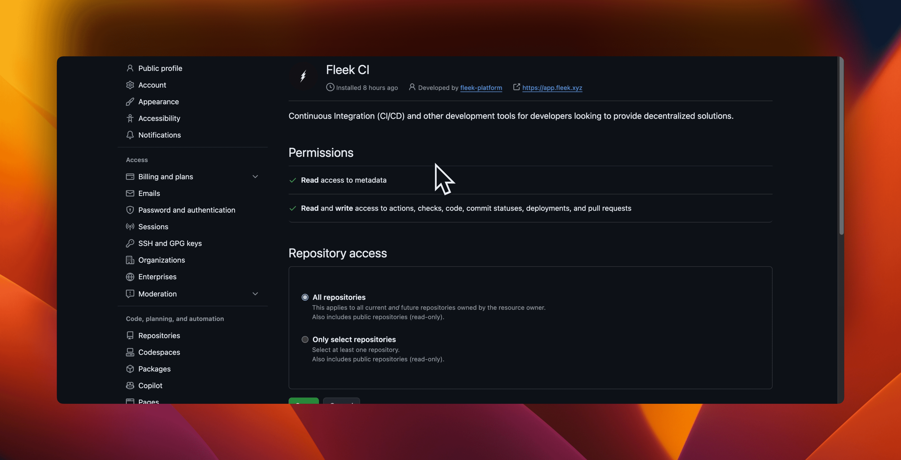

# Git Integrations With Fleek

Fleek allows for automatic deployment on push to your repository, and provides a variety of tools to manage your application from your preferred interface.
Updates pushed to the project-linked repository are automatically deployed through Fleek, and the triggers behind this can be controlled on a granular level through Fleek platform settings.

Fleek allows for automatic deployments on every branch push and merges onto the production branch of your [GitHub](./docs/git_integrations/fleek-for-github) projects.

Using Git with Fleek offers numerous benefits which includes:

- Automatic deployments on every branch push and merges onto the production branch of your GitHub projects.
- The ability to manage your deployments from an interface you are already familiar with. With insights on details and deployment logs.
- Settings for deployment like managing environment variables, custom domains, and more.

The supported provider for now is [GitHub](https://github.com/), but we are working on adding support for other Git providers in the future.

## Deploying Git Repositores with Fleek

Fleek allows deployments of Git repositories from all Git providers and it is able to select specific branches (typically `main`) to deploy from when set up.
It is an easy process to deploy repositories into production.

Once your site is deployed, Fleek offers several customization options to make your site more personal and professional. You can link a custom domain to your deployed site, providing a branded and memorable web address. Additionally, Fleek supports the integration of Ethereum Name Service (ENS) domains, allowing for a decentralized web address that aligns with the Web3 ethos. For those who prefer a simpler option, you can also edit the random name slug generated by Fleek, giving your site a more human-readable URL that’s easy to share and remember.

In essence, Fleek simplifies the deployment process while offering robust customization options, making it an excellent choice for developers looking to bring their Git-based projects into production quickly and efficiently.

### How to deploy from a Git repository

:::info
It is assumed that this your first time deploying a site on Fleek, feel free to skip steps that are not necessary for you.
:::

1. Go to your Fleek dashboard and click on the 'Sites' button at the top of the page.

2. On the "Sites" page, click on the "Add new" button and click on "Deploy my site". We will not be deploying a template here as it is not necessary for this guide. You should see the below after clicking the button:

3. Only GitHub support is available for now. We have the option to [deploy with the Fleek CLI](/docs/cli/sites) in the case of other Git providers. On this page we will be prompted to install and authorize the "Fleek CI" on GitHub since it is our first time.

4. Click on the "GitHub" option in the Git providers screen and you will be redirected to GitHub to install and authorize the "Fleek CI" application.
   :::info
   You only have to do this for your first deployment. After this initial set-up, other deployments will be automatically authorized.
   :::

5. As soon as we are done with the actions on GitHub, we should see the below screen and then be redirected back to Fleek.

6. We will then see a list of our repositories. We select the repository we want to deploy and then the card on our screen changes to have a "Configure Site" card appear on the screen. Relevant details about repository are displayed in fields within the card.

7. Check that all details are correct; the "Branch", the "Build Command" and the "Publish Directory". You can decide to "Show advanced options" to add additional information. After which we can click on the "Deploy Site" button.

8. After clicking the "Deploy Site" button, we will see a "Deploying" screen. This screen will show the progress of the deployment and the logs of the deployment. That's it!

**Further and additional relevant information can be found on the [Deployments](/docs/platform/deployments) page.**

## Managing Git integrations

:::info
This page is still behind a feature flag and not yet available to all Fleek users. If you would like to try it out, please [reach out to us](https://fleek.xyz/requests/new/).
:::

1. Go to your Fleek dashboard and click on the 'Settings' button at the top of the page.

2. Click on the 'Git Integrations' tab on the left sidebar.

:::info
The Github application buttons have 3 states - "Install App", "Authorize App", and "Active".
:::

3. Click on the "Install App" buttons. You will be redirected to Github to install and authorize the Fleek applications.

4. After authorizing the Fleek application, you will be redirected back to Fleek. The "Install App" button will now be replaced with an "Active" button.

That's it! You have successfully set up Git Integrations with Fleek. You can now manage your deployments from your Github repository within Fleek!

## Removing Git integrations

### From GitHub

You may want to remove the Git integrations from your Fleek account. To do this, Go to your [Github profile settings](https://github.com/settings/profile) and click on the 'Applications' tab on the left sidebar, you will see a list with all your installed Github applications.

You can click to go to any of the Fleek applications ("Fleek Templates DEV" or "Fleek CI DEV") and click on the "Uninstall" button to remove the Fleek application.

