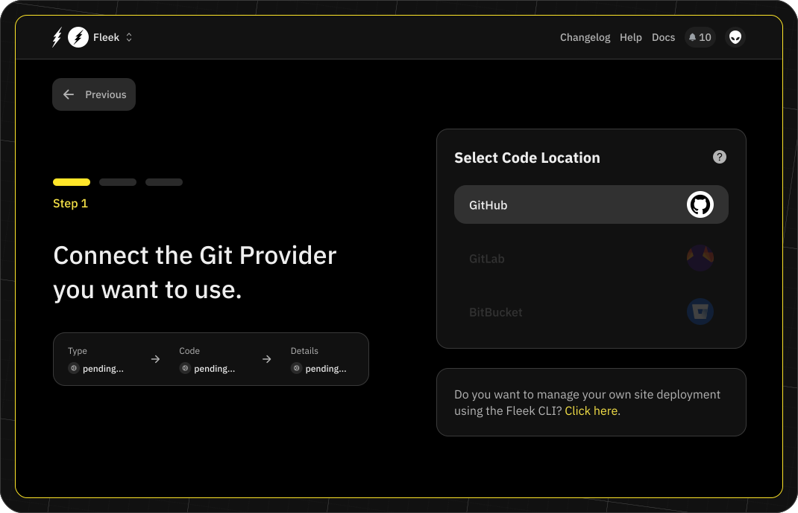
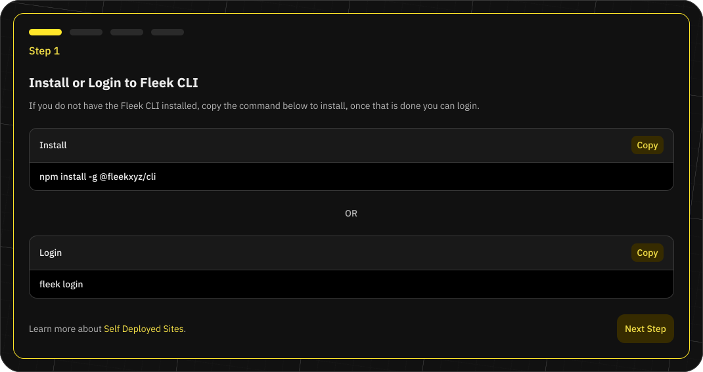

import ButtonGray from '@components/ButtonGray';

# Hosting on Fleek

Fleek's hosting services allow users to easily upload, maintain, store and serve static sites. Our goal is to provide a user-friendly platform that can help developers streamline their use of infrastructure.

## Fleek-managed deployments

In managed deployments, you will be able to connect your code repository to Fleek and we will take care of the build and deploy process. This allows you to focus on your code and not worry about the infrastructure.

This is a multi-step process that will require you to connect your code repository, configure your build settings, and deploy your site.

### Start hosting

The first step is to navigate to the "Sites" tab and click the "Add New" button, choosing the "Deploy my site" option.

### Select your repository

After choosing the "Deploy my site" option, you will be prompted to select the Git Provider where your code is located (Currently only GitHub).

In this process, you will need to authorize Fleek to access your repository. Once you have authorized Fleek, you will be able to select the repository and continue.

### Configure your build settings

Fleek will automatically name your site after the repository, auto-detect the framework, publish a directory and set up a build command for your site. You are able to select the branch you want to deploy from as well.

In the advanced settings, you can also configure the docker image, base directory, and environment variables you want to use in your build process.

### Deploy your site

Once your build settings are configured, you can click "Deploy Site," where we will trigger the initial deployment. This process can take a few minutes depending on the size of your site. Once the deployment is complete, you will be able to see the site URL and the status of the deployment.

## Self-managed deployments

In self-managed deployments, you can configure your site with your code repository. This allows you to trigger a deploy manually or connect it to your CI pipeline.

### First steps

As with managed deployments, navigate to the “Sites” tab and click the “Add New” button, choosing the “Deploy my site” option.

### Select self-deployment

To set up a self-managed deployment, choose the "Click here" option at the bottom of the git provider screen.

### Set up your site

To set up your site, you will need to add some information about it:

- **Site name**: The name of the site, e.g. your repo or project name.
- **Framework**: The framework used to build your site, e.g. Gatsby, Hugo, etc.
- **Publish directory**: The directory (e.g. 'dist') where projects with a build command compile code, bundle dependencies, and optimize content for production. Projects without a build command can set this as the directory holding the main HTML file.
- **Build command**: The commands to execute to build the site, e.g. npm install && npm run build.
- **Base directory**: The directory where Fleek checks for dependency management files, e.g. package.json

Once your site settings are configured, you can click “Deploy Site,” where you will be redirected to the Site Overview page. Here you will find two different files that you need to add to your repository. More information is provided in the next step.

### Add files to codebase

Within the Site Overview page, follow the steps to add these files to your codebase:

- Fleek.json: This file contains the configuration of your site.
- GHA workflow: This file contains the configuration of the Github Action workflow that will trigger the deploy process.

Though the Fleek.json file is mandatory, you can decide not to use the Github Action workflow and trigger the deploy process in your own way.

### Deploy a self-managed site

Once all of the files have been added to your codebase, you will be able to deploy the site using the Fleek CLI.

## Monitor deployments

You can monitor the deployment process by clicking on the 'Deploys' tab when viewing a particular project. You will find the list of all the deployments for your site and the status of each deployment. By clicking on a particular deployment, you will be able to see the logs of the deployment process.
