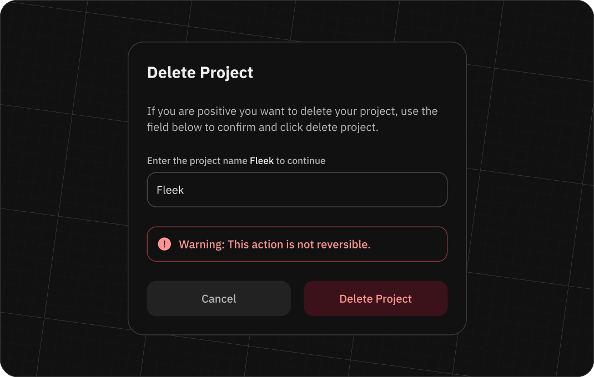

# Projects on Fleek

All platform usage will be tied to a project, so it is mandatory to have a project selected. Any user can create a project, and access can be granted to any user by providing an email address. An account can be the owner of one or more projects and, at the same time, can belong to projects owned by other accounts.

## Creating a new project

As soon as you sign up, an initial project is created for you by default. This project starts with a placeholder name and remains blank until you decide otherwise. You're free to alter the project's name whenever you wish. In the application you will find your project in the top left corner of the screen, next to the Fleek logo. Clicking on the project name will open a dropdown with all the projects you have access to. The selected project will be marked with a checkmark.

To create a new project, click on the projects dropdown and select the create project option. You will be prompted to enter a name for the project. Once you have entered the name, click on the create button and the project will be created. You will be redirected to the project dashboard.

## Changing project name

To change the project name you can click on the settings icon in the project dashboard. You will be prompted to enter a new name for the project. Once you have entered the name, click on the save button and the project name will be updated.

## Deleting a project

To remove a project, please navigate to the project dashboard and select the 'Settings' icon. You will be asked to confirm the removal of all associated resources within the project. Ensure you check the box to the right to acknowledge this action before proceeding for:

- All the sites
- All the domains linked to the sites
- All the IPNS keys linked to the sites
- All the Private Gateways
- All the domains linked to the Private Gateways
- All the files stored

Once you have confirmed the deletion, the project will be deleted. This action is irreversible.

:::info
The deletion of a project is an asynchronous process. We recommend always removing any DNS configuration pointing to the project before deleting it.
:::

## Invitations

Invitations are a way to grant access to a another user to one of your projects. The invited users will be able to perform most of the actions that the owner of the project can take, such as:

- Managing sites
- Managing domains
- Managing files
- Managing gateways

...but will be restricted from taking other actions, such as:

- Deleting the project
- Inviting new members

### Inviting a new user

To invite a new user into your project, you need to go to the project settings and select the 'Teams' tab. There you will find a list of members in the project and a button to generate a link to invite a new user.

This link is a unique link that will grant project access to a single user. Once the user has used the link to access the project, the link will be invalidated and a new link will need to be generated to invite a new user. This link is not tied to the athentication method used to access the project, so the user can choose to use their wallet, e-mail or Github account to access the project.

## Application Credentials

Application credentials are the keys to your project. They are used to authenticate your application with Fleek's services. You can create multiple application credentials for a single project and each application credential can have different permissions.

### Whitelist domains

You can whitelist domains for each application credential. This means that the application credential will only be able to make requests to the domains that are whitelisted. This is useful for security reasons, as it prevents unauthorized access to your project.

## Creating Application Credentials

To create an application credential, follow these steps:

1. Go to the [Fleek Dashboard](https://app.fleek.xyz/).
2. Select the project you want to create an application credential for.
3. Click on the `Settings` tab.
4. Click on the `Application Credentials` tab.
5. Click on the `Create Application Credential` button.
6. Enter a name for the application credential.
7. Whitelist domains for the application credential.
8. Click on the `Create` button.
9. Copy the application token.

You can now use the application token to authenticate your application with Fleek's services like the [SDK](/docs/SDK).

### Managing Application Credentials

You can manage your application credentials by going to the `Application Credentials` tab in the `Settings` tab of your project in the [Fleek Dashboard](https://app.fleek.xyz/). Here you can view, edit, and delete your application credentials.

### Updating Whitelisted Domains

You can update, add or remove whitelisted domains for an application credential by clicking on the `Edit` button next to the application credential in the `Application Credentials` tab in the `Settings` tab of your project in the [Fleek Dashboard](https://app.fleek.xyz/).

