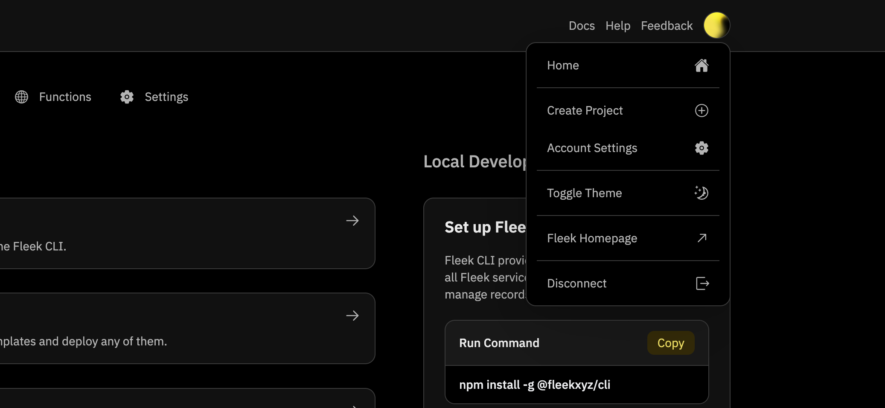
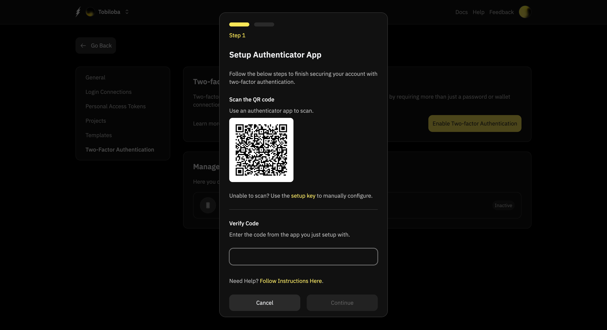
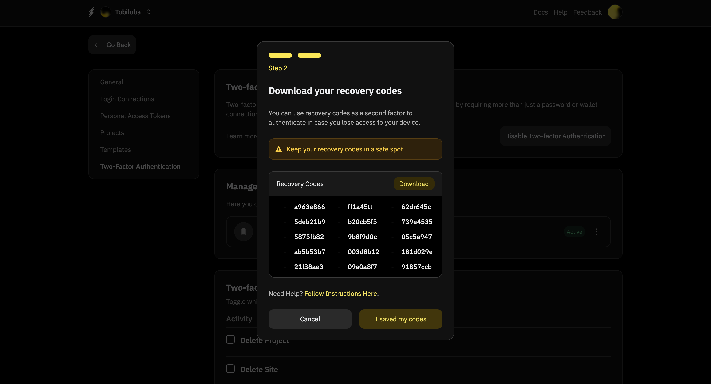
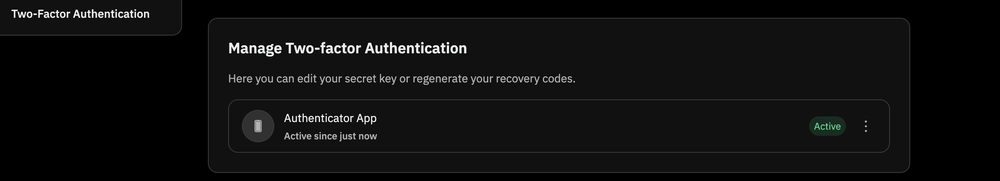
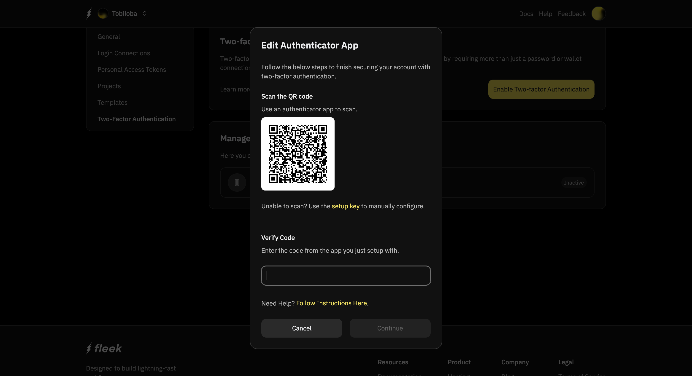
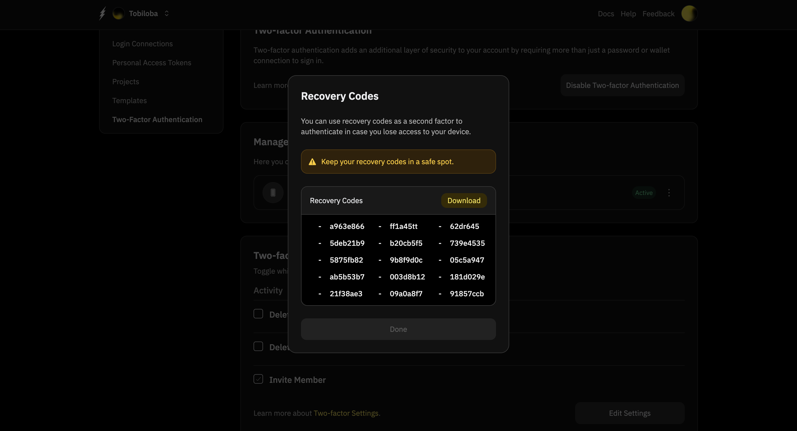
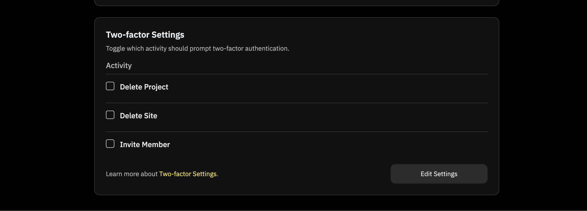
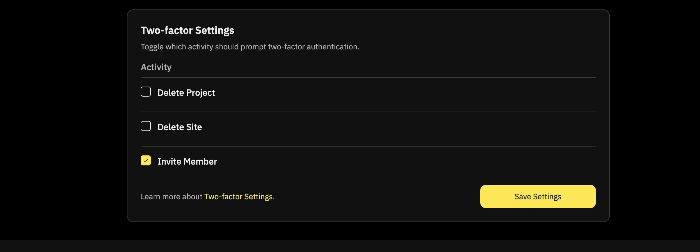
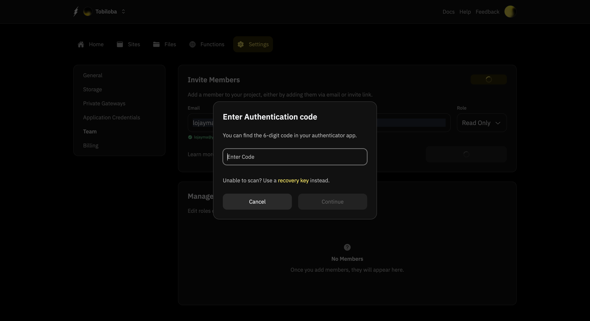
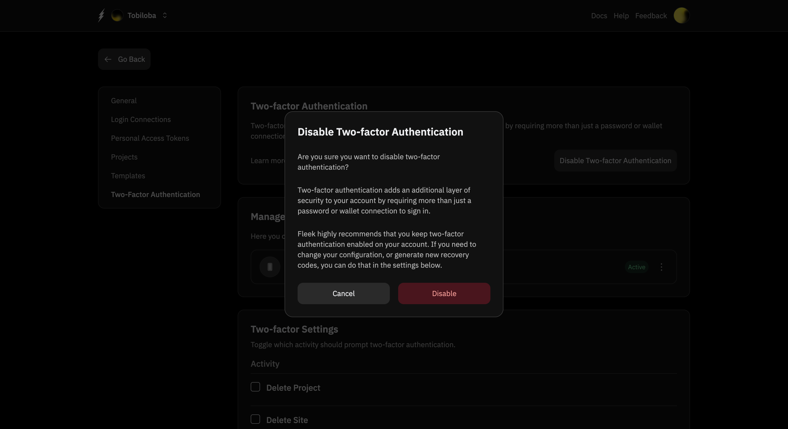

# Two-Factor Authentication (2FA) on Fleek

:::info
Two-Factor Authentication is intended to help you protect the access and control of actions within your Fleek Platform account. You may not necessarily see it enabled during the login flow.
:::

Two Factor Authentication acts as a backup mechanism for your account to ensure that actions within your account are under your full control and are intentional.

The purpose of this configuration is to protect and validate the integrity of your account so that it doesn't get misused. Configuring two-factor authentication also helps you perform properly monitored activities which are secured by inputting or scanning a code as an additional layer of verification.

## Configuring Two-Factor Authentication

A TOTP (Time-Based One-Time Password) application automatically generates an authentication code that updates at regular intervals. These apps can be downloaded to your phone or desktop. Some popular examples of TOTP apps are [Google Authenticator](https://play.google.com/store/apps/details?id=com.google.android.apps.authenticator2&hl=en), [Microsoft Authenticator](https://www.microsoft.com/en-us/security/mobile-authenticator-app) and [Authy](https://authy.com/).

1. Download a TOTP app of your choice to your phone or desktop.
2. In the upper-right corner of any page, click your profile photo, then click **Account Settings**.

3. In the left sidebar on the Settings page, click **Two-Factor Authentication**.
4. In the "Two-factor authentication" section of the page, click **Enable Two-factor Authentication**.
5. Under "Scan the QR code", do one of the following:
   - Scan the QR code with your mobile device's app. After scanning, the app displays a six-digit code that you can enter on Fleek.
   - If you can't scan the QR code, click **setup key** to see a code, the TOTP secret, that you can manually enter in your TOTP app instead.

6. The TOTP application saves your account on Fleek and generates a new authentication code every few seconds. On Fleek, type the code into the field under "Verify Code."
7. The "Continue" button becomes active, when clicked on it takes you to a second step to get your recovery codes.
8. Under "Download your recovery codes", click the **Download** button to download your recovery codes to your device. Save them to a secure location because your recovery codes can help you get back into your account if you lose access.

:::note
These are fake recovery codes for illustrative purposes only.
:::

9. After saving your two-factor recovery codes, click **I saved my codes** to enable two-factor authentication for your account.

## Managing Two-Factor Authentication

There may be cases where you lose access to your TOTP app or lose the key due to an uninstall of your TOTP app. You also may lose the directory where you downloaded your recovery codes, or delete the codes unintentionally. In these cases, you will have to generate a new TOTP key or new recovery codes. You can easily do both of these things.

1. In the "Manage Two-factor Authentication" section, you will see a rectangular bar that has an **Active** button and an ellipsis to the right of it. Click on the ellipsis.

2. When the ellipsis is clicked on a modal appears with the following options:

   - "Generate New Key"
   - "Regenerate Recovery Codes"

3. "Generate New Key" links back to [Step 5 here](#configuring-two-factor-authentication) and it helps generate the six digit code you enter on Fleek from your TOTP app.

4. "Regenerate Recovery Codes" links back to [Step 8 here](#configuring-two-factor-authentication) to generate new recovery codes for you to download.

:::note
These are fake recovery codes for illustrative purposes only.
:::

:::info
With the new codes generated for your Two-Factor Authentication setup following the steps above, the old codes will be disabled instantly and will not work in future attempts.
:::

## Two-Factor Authentication Settings

In the "Two-factor Settings" section, you can enable Two-Factor Authentication to take effect whenever certain activities are performed within your account.

They are disabled by default, but you can click on the **Edit Settings** button to toggle to the edit state so you choose which ones to enable.

There are three activities currently for which you can setup Two-Factor Authentication:

- Deleting a project
- Deleting a site
- Inviting a member.

Whenever any of the actions are about to be performed within your account, a modal pops up asking for the six-digit code in your TOTP app that you added to your Fleek account. An alternative option is to use the recovery codes you downloaded from [setting up your Two-Factor Authentication](#configuring-two-factor-authentication).

## Disable Two-Factor Authentication Settings

In the "Two-Factor Settings section", you can disable Two-Factor Authentication by clicking the **Disable Two-Factor Authentication button**. This action will open a modal window asking for confirmation with two options: **Cancel** and **Disable**.

If you decide to disable Two-factor Authentication, you go back to having a default information page with the "Enable Two-factor Authentication" button.
