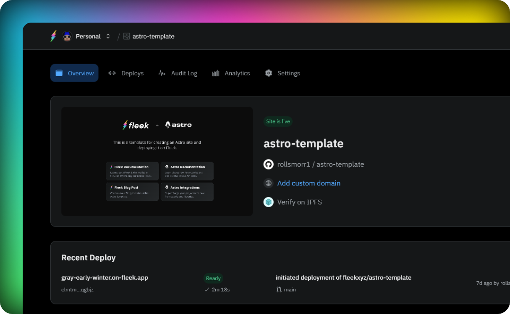

# Introduction

The Sites services in Fleek will allow users to upload and easily maintain static sites, stored and served by Web3 protocols. Our goal is to provide a user-friendly platform that can help developers streamline their use of web3 infrastructure.

There are two types of deployments in Fleek: self-custodial deployments (where the user is responsible for managing the build and deploy) and managed deployments (where Fleek manages the build and deploy)

## Managed deployments

In managed deployments you will be able to connect your code repository to Fleek and we will take care of the build and deploy process. This allows you to focus on your code and not worry about the infrastructure.

## Self Managed deployments

In self-custodial deployments, you can configure your site with your code repository. This allows you to trigger a deploy manually or connect it to your CI pipeline.

## CDN

All sites hosted and deployed on Fleek are accelerated and optimized by the Fleek Edge - the infrastructure backbone of Fleek. Geo-aware, intelligent, performant, and decentralized. Soon to be powered by Fleek Network. It provides high-availability caching, with automatic-cache refreshes on-deploy.
