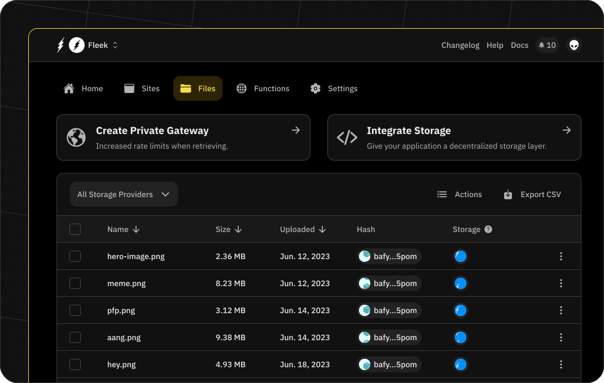

# Storage on Fleek

Fleek's storage service enables the decentralized storage of your files.

## Supported services

We support the following storage protocols:

- IPFS
- Arweave
- Filecoin

To guarantee the best performance and availability, we use a combination of these protocols. We use IPFS as the main storage protocol and we use Arweave and Filecoin as a backup layer. This allows us to provide a high availability and performance service. By default, we are using Filecoin as the backup layer, but the configuration can be changed in the storage settings for your project.

Storage is a service unique for every project. This means that you can have different storage configurations for each of your projects in Fleek.

## Add a file or directory

:::info

We are aware that there is a bug in the UI for some users using Firefox and Linux that prevents the upload dialog box from appearing. We are investigating this issue in the meantime, if you are experiencing this issue, please attempt this operation with another browser.

:::

To add a file to your storage, navigate to the `Files` section in your project dashboard and click on the `Upload File` button. This will open a modal where you can select one or multiple files to upload.

This will be uploaded to IPFS and, in the background, it will be uploading to Filecoin and/or Arweave (depending on your configuration.)

To add a directory, click the `Upload Directory` button and select the directory you want to upload.

## Accessing a file or directory

To access a file or directory, click on the three-dot icon in the file or directory row and select the `Copy URL` option. This will copy the URL to your clipboard, enabling you to access the file or directory. By default, Fleek will be using public gateways to surface the content. If you prefer, you can set up a custom domain to access the content that will allow you to have a more performant and branded experience.

To do this you can follow the steps in the [Gateways](/docs/cli/gateways/) section of our documentation.

## Deleting a file or directory

To delete a file or directory, click on the three-dot icon in the file or directory row and click the `Delete` option. This will remove the file or directory from your storage. This action is irreversible.

## Content addressing

In Fleek, all files in storage are made content-addressable by using IPFS as the addressability layer, which means all files stored on Fleek are stored on IPFS by default aside from the decentralized-storage layer of choice (Filecoin/Arweave). Each file will receive its unique immutable IPFS content hash to make it addressable under a common denominator/format that is standard in web3.

- IPFS hashes look like `QmX4XRaPP6jBSDiYr3tK7fEBWSA5QURS8WZ87ZvPRJgAqK`.

They can be accessed either via Fleek's gateways or a public gateway such as `ipfs.io/ipfs/<yourhash>`. While immutable, you can use IPNS to map dynamically changing IPFS hashes to a static hash/record (IPNS). See our [CLI](/docs/cli)/[SDK](/docs/sdk/) section for instructions on managing IPNS records.
