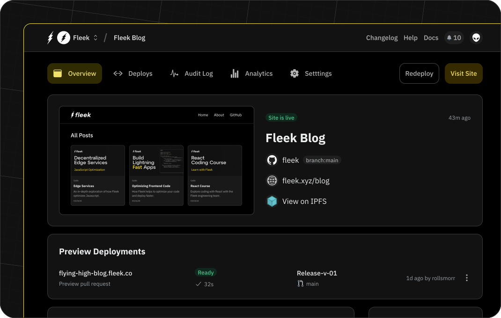

import ButtonGray from '@components/ButtonGray';

# Platform Overview

Fleek is an edge-optimized cloud platform where users can prepare, host and deploy Web sites and applications. It enables developers to build fast, performant apps.

## What can I use Fleek for?

The platform allows you to build, deploy, and scale apps regardless of the framework or library you used to output HTML. Most modern JS frameworks, such as React-based Gatsby, Go-based Hugo or Vue.js-powered VuePress are supported. Whether you’re interested in publishing a simple blog or creating a production Web app that serves a large userbase, Fleek’s tools allow you to go live effortlessly.

## For existing Web applications

If you already have a Web application you’re managing through another platform, Fleek also enables a frictionless migration process. All that you need to do in order to begin using Fleek in this way is to link to your existing repository and follow our guide.

Once your site or app is live, the Fleek platform also provides you with tools to ensure you (and your users) are happy with the site’s performance. We understand how damaging to the user experience slow loading times can be, and take several measures to optimize performance, including:

- Using Fleek Edge to run your application from 1,000+ locations globally, ensuring content is served with low latency from the source best suited to each user.
- Enabling DDoS protection to eliminate down time arising from targeted attacks
- Offering monitoring and alert services so any downtime can be quickly diagnosed

## How can I manage my application outside of the platform?

Fleek also gives users the freedom to manage their application from their preferred interface. Updates pushed to the project-linked repository are automatically deployed through Fleek, and the triggers behind this can be controlled on a granular level through Fleek platform settings. If you prefer using a CLI or a custom application that leverages our SDK, you can read more about those tools here:

- Read more about the Fleek CLI [here](/docs/cli).
- Read more about the Fleek SDK [here](/docs/sdk).

## Collaboration

If you're interested in teaming up with coworkers to manage your applications, Fleek supports a variety of collaborative features designed to smooth over joint account management. It’s easy to introduce team members who are already active on your repository to Fleek. You can assign individual permissions to invited users, share deployment previews with others, test builds, and more. Larger teams may benefit from our Enterprise plan. You can review our pricing [here](/pricing).

## Using Fleek

Speed is critical to our offerings at Fleek, and a focus on speed has informed not only the tools we expose for use externally with your Web apps but also within our own user experience. You can learn more about features within the platform by reading the pages that follow this one in our documentation or following one of our [guides](/guides).

To get started, create an account [here](https://app.fleek.xyz).

We recognize that the speed and performance of your Web application is also tied to the speed of your development process, and with that in mind have sought to make the platform as intuitive as possible. It is paramount that you feel comfortable using Fleek so that you can ship the latest version of your Web application without encountering unexpected hurdles.

## On-chain services

Certain apps may benefit from integrations with on-chain tools and services, and to that end we offer the best of on-chain storage, compute, and decentralized CDN services through the platform. Even if you don't have experience using on-chain services, we strive to make the experience as user-friendly as possible.

## Need help getting started?

Need a boilerplate to get started quickly? Our platform offers you several boilerplate templates of apps you can deploy, or you can check out several guides for walkthroughs on specific projects

- Browse our [templates](/templates).
- Read our [guides](/guides).
