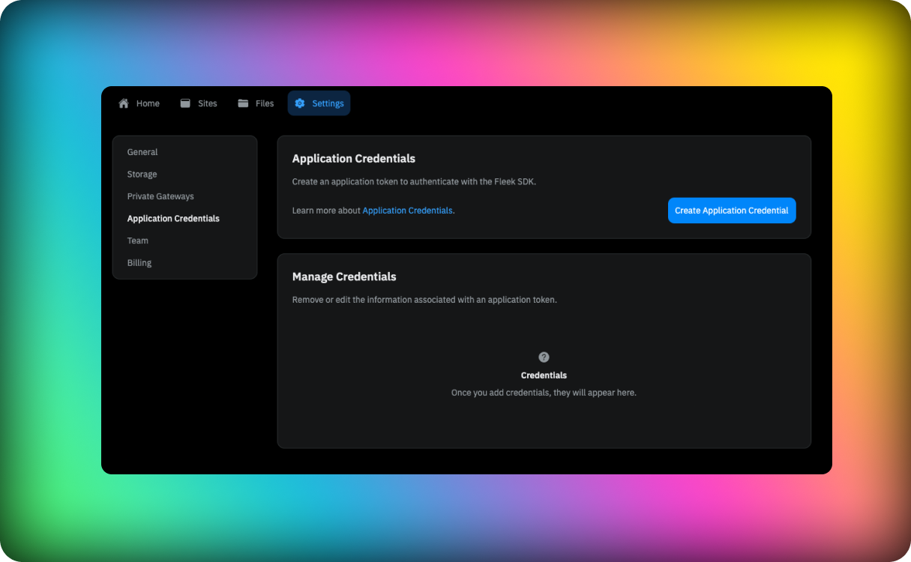
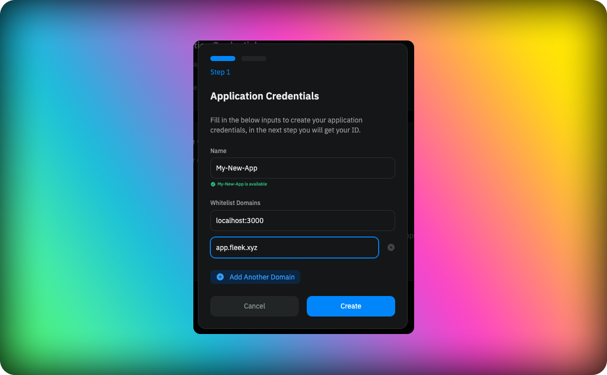
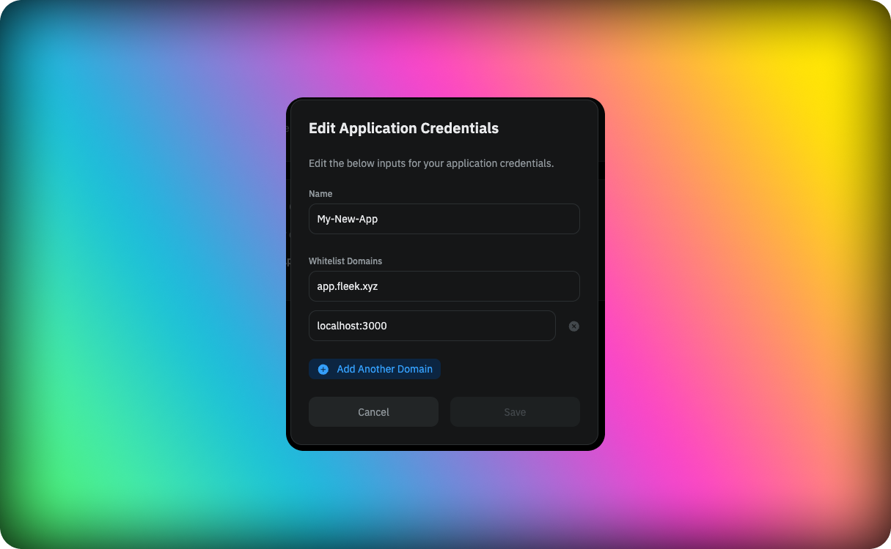

Application credentials are the keys to your project. They are used to authenticate your application with Fleek's services. You can create multiple application credentials for a single project, and each application credential can have different permissions.

## Whitelist domains

You can whitelist domains for each application credential. This means that the application credential will only be able to make requests to the domains that are whitelisted. This is useful for security reasons, as it prevents unauthorized access to your project.

## Creating Application Credentials

To create an application credential, follow these steps:

1. Go to the [Fleek Dashboard](https://app.fleek.xyz/).
2. Select the project you want to create an application credential for.
3. Click on the `Settings` tab.
4. Click on the `Application Credentials` tab.
5. Click on the `Create Application Credential` button.
6. Enter a name for the application credential.
7. Whitelist domains for the application credential.
8. Click on the `Create` button.
9. Copy the application token.

You can now use the application token to authenticate your application with Fleek's services like the [SDK](/docs/SDK/index.md).

## Managing Application Credentials

You can manage your application credentials by going to the `Application Credentials` tab in the `Settings` tab of your project in the [Fleek Dashboard](https://app.fleek.xyz/). Here you can view, edit, and delete your application credentials.

### Updating Whitelisted Domains

You can update, add or remove whitelisted domains for an application credential by clicking on the `Edit` button next to the application credential in the `Application Credentials` tab in the `Settings` tab of your project in the [Fleek Dashboard](https://app.fleek.xyz/).

