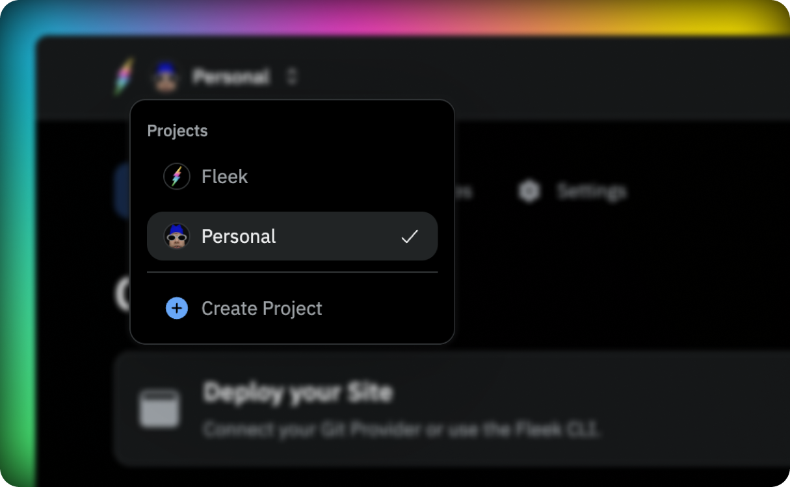
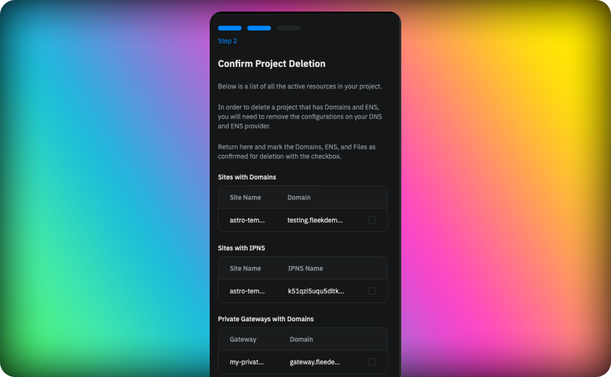

All platform usage will be tied to a project, so it is mandatory to have a project selected. Any user can create a project, and access can be granted to any user by providing an email address.

An account can be the owner of one or more projects and, at the same time, can belong to projects owned by other accounts.

## First Project

When you create your account, you will have your first project automatically created for you. This project will have a place holder name and will be empty. You can change the name of the project at any moment.

In the application you will find your project in the top left corner of the screen, next to the Fleek logo. Clicking on the project name will open a dropdown with all the projects you have access to. The selected project will be marked with a checkmark.

## Creating a new project

To create a new project, click on the projects dropdown and select the create project option. You will be prompted to enter a name for the project. Once you have entered the name, click on the create button and the project will be created. You will be redirected to the project dashboard.

## Changing project name

To change the project name you can click on the settings icon in the project dashboard. You will be prompted to enter a new name for the project. Once you have entered the name, click on the save button and the project name will be updated.

## Deleting a project

To remove a project, please navigate to the project dashboard and select the settings icon. You will be asked to confirm the removal of all associated resources within the project. Ensure you check the box to the right to acknowledge this action before proceeding for:

- All the sites
- All the domains linked to the sites
- All the IPNS keys linked to the sites
- All the Private Gateways
- All the domains linked to the Private Gateways
- All the files stored

Once you have confirmed the deletion, the project will be deleted. This action is irreversible.

:::info
The deletion of a project is an asynchronous process. We recommend always removing any DNS configuration pointing to the project before deleting it.
:::