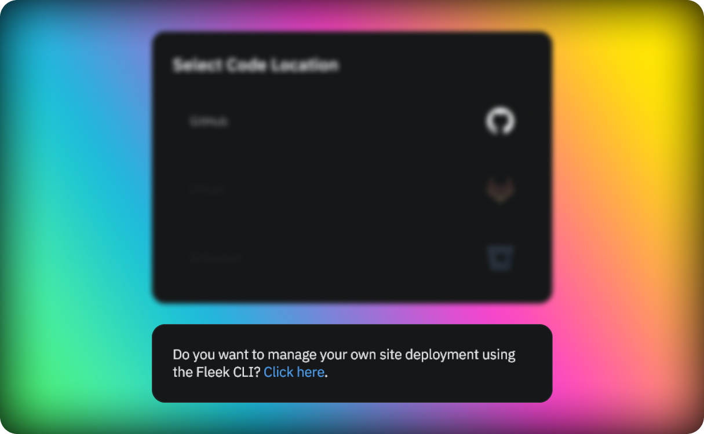

In self-custodial deployments, you can configure your site with your code repository. This allows you to trigger a deploy manually or connect it to your CI pipeline.

### Setting up a self managed deployment

To set up a self managed deployment you need to create a site and choose the option to manage the deployment via the Fleek CLI at the bottom of the git provider screen.

To set up the site you will need to add some information about your site:

- **Framework**: The framework used to build your site. EG: Gatsby, Hugo, etc.
- **Build command**: The commands to execute to build the site. EG: npm install && npm run build
- **Publish directory**: The name of the directory containing the index.html file of your site after it has been built

With this you will be redirected to the site overview page where you will find two different files that you need to add to your repository:

- Fleek.json: This file contains the configuration of your site.
- GHA workflow: This file contains the configuration of the Github Action workflow that will trigger the deploy process.

Though the Fleek.json file is mandatory you can decide not to use the Github Action workflow and trigger the deploy process in your own way.

### Deploying your site

To deploy your site using the Fleek CLI you can follow the guide in the [CLI section](/docs/cli/sites).
