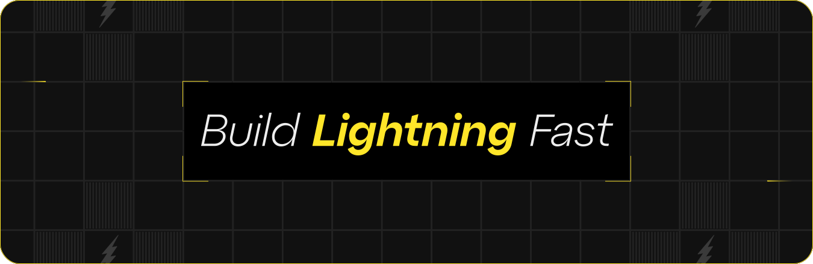

import DocsCards from '@components/DocsCards';
import ButtonGray from '@components/ButtonGray';
import ButtonYellow from '@components/ButtonYellow';
import DocsTitledCards from '@components/DocsTitledCards';

# Fleek documentation

Kickstart your Fleek journey with our documentation, detailed guides and references. Browse our platform resources for a deep dive into our features.

  

    <a href="/docs/platform">
      <ButtonYellow className="flex items-center justify-center gap-12">
        
Learn the platform

      </ButtonYellow>
    </a>
  

  

    <a href="/docs/cli">
      <ButtonGray className="flex items-center justify-center gap-12">
        
Use the CLI

      </ButtonGray>
    </a>
  

## Get started

Below are a few resources to help you get started with Fleek. Whether you're new to the platform or looking to dive deeper into our features, these sections below will help you navigate Fleek.

### Host an app

Fleek’s hosting services allow users to easily upload, maintain, store and serve static sites.

#### Use an existing repo

Your existing project can be any web project that outputs static HTML content (such as a website that contains HTML, CSS, and JavaScript). When you use any of Fleek’s supported frameworks, we'll automatically detect and set the optimal build and deployment configurations for your framework.

  <a href="/docs/platform/hosting">
    <ButtonGray className="flex items-center justify-center gap-12">
      
View hosting

    </ButtonGray>
  </a>

#### Use a template

Choose from simple frameworks or comprehensive starter kits. These templates provide a solid foundation, allowing for flexibility and easy adaptation as your project develops. Explore the options available to streamline your development process.

  <a
    href="https://app.fleek.xyz/templates"
    target="_blank"
    rel="noopener noreferrer"
  >
    <ButtonGray className="flex items-center justify-center gap-12">
      
View templates

    </ButtonGray>
  </a>

### Store files

Upload files and folders to receive a hash from IPFS, Filecoin, and Arweave, providing a unique, secure, and verifiable identifier for your digital content. This service allows you to easily track and access your files on these decentralized storage platforms, ensuring data integrity and permanence.

  <a href="/docs/platform/storage">
    <ButtonGray className="flex items-center justify-center gap-12">
      
View storage

    </ButtonGray>
  </a>

### Create functions

These functions allow users to build cost-effective, low-overhead infrastructure for their applications while also enabling lightning-fast performance.

  <a href="/docs/platform/fleek-functions">
    <ButtonGray className="flex items-center justify-center gap-12">
      
View functions

    </ButtonGray>
  </a>

## Read our guides

In this section, you'll find helpful guides designed to assist you with the most commonly-encountered tasks on Fleek. For a deeper understanding and more extensive information, our documentation is available to provide further insights and support.

  <a href="/guides" target="_blank" rel="noopener noreferrer">
    <ButtonGray className="flex items-center justify-center gap-12">
      
View guides

    </ButtonGray>
  </a>

## Follow us

Join our community and stay up-to-date with the latest news, features, and insights from our team. Follow us on social media to receive updates, engage with our community, and share your thoughts. Connect with us on Discord for real-time conversations, support, and collaboration. Together, we're shaping the future of our service.

  

    <a href="https://x.com/fleek" target="_blank" rel="noopener noreferrer">
      <ButtonGray className="flex items-center justify-center gap-12">
        
Follow us on X

      </ButtonGray>
    </a>
  

  

    <a
      href="https://discord.gg/fleek"
      target="_blank"
      rel="noopener noreferrer"
    >
      <ButtonGray className="flex items-center justify-center gap-12">
        
Join our Discord

      </ButtonGray>
    </a>
  

