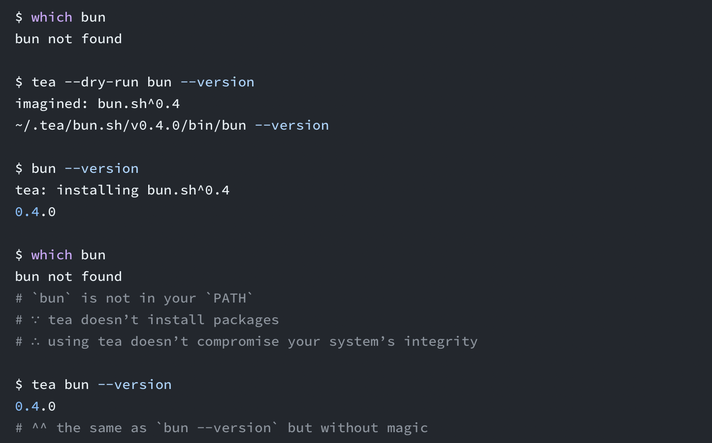
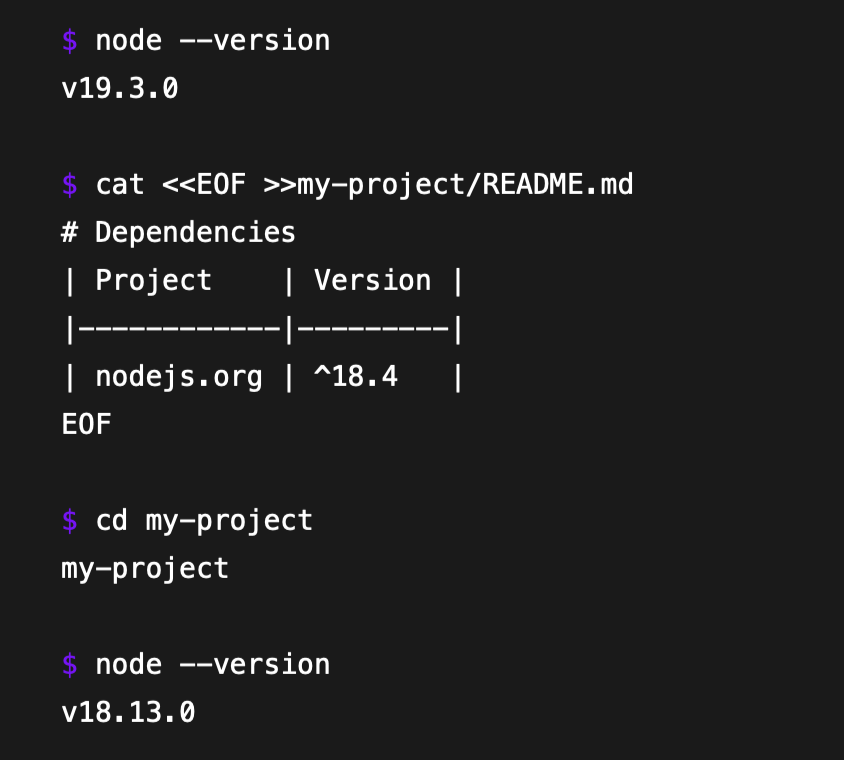
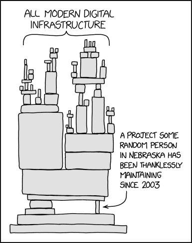
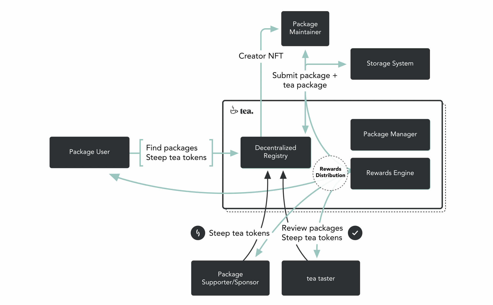

Welcome to the Build3rs Stack, Fleek’s web3 infrastructure overview series! This week we'll take a look at Tea— a web3 take on the package manager, the Swiss Army knife of modern web and app development, from the creator of Brew.

Tea was created with a promise in mind and heart: **to change how packages and dependencies are handled**, and how open-source developers are rewarded for their efforts to maintain them. _Let’s get a taste of that tea_ and look under the hood, to understand what makes this brew a delicious addition to your stack ☕

---

## TL;DR: What is Tea?

Tea is not just another package manager: it’s a **cross-platform, unified package infrastructure to install and distribute app packages**, with the added benefit of working with your CLI to install packages automatically. It uses “magic” (more on that later) to assess the tools and dependencies you need to run a program or script and install them.

This goes to solve one of the most awkward problems in development: **globally-installed tool versions.** Every product we code is different and relies on different libraries every time, but we still install most of them globally –sometimes with conflicting or buggy results. **Tea works around this by installing dependencies in closed environments**, every one of them specific for all projects you are currently working on.

Tea is also pushing the envelope around the package manager concept by using a GUI, a feature more commonly seen on app stores than package repositories. While Tea works seamlessly within the CLI, a GUI allows packages to have much more information available for users and peer reviewers.

That’s especially important because the “infrastructure” side of Tea has a purpose in mind, one that has taken ages to realize correctly: **leveraging blockchain technology to enable indirect compensation for open-source developers.** But before we go there, let’s delve deeper into Tea’s features, and how you can integrate it in your stack.

---

## Tea in Features: The “magic” of Brewing

As a developer, there’s a high chance that you already have a package manager installed in your coding machine. So, **why should you use Tea?** We mentioned two main features: the “magic”, and the developer environment.

### Tea’s “magic”

We’re using “magic” in quotes not only because it’s not literal magic, but because the creators of Tea call it that. The so-called “magic” is **a series of hooks that get integrated into your shell** when you install tea for the first time:

- A hook when changing directory that sets up project environments
- A hook for the “command not found” scenario that installs that command before running it

Therefore, when running any library or script, Tea will automatically deploy to look for the necessary packages or dependencies. If you don’t have them, then Tea installs them encapsulated in ~/.tea, to be able to retrieve them later. Packages are never installed in PATH, and aren’t accessible from the rest of the system.

As “magic” can be too much –or too automated– for some users, it can be deactivated when installing Tea.

### Developer environments

Tea can automatically determine the tools a project directory needs based on the files it finds inside. Tea’s “magic” automatically fetches the specific versions those projects need and runs them.

To make matters more interesting, Tea can parse and read YAML front matter: if you need specific versions of dependencies, you can create a markdown table encapsulated in YAML front matter in your readme.md file with the versions of the packages you need.

---

## Tea + web3 = Compensation for open-source developers

_Have you ever heard of “the Nebraska problem”?_ This theory, [coined by Randall Munroe from xkcd](https://xkcd.com/2347/), states that huge parts of our modern digital infrastructure are supported by a library created and sacredly maintained “by a random person in Nebraska” who usually does it for personal reasons [or a belief in the open-source philosophy](http://www.catb.org/~esr/writings/cathedral-bazaar/).

These libraries are all around our web infrastructure, **and their developers are rarely compensated for their job.**

How is Tea going to change that? Moving the package registry on-chain, and essentially **creating a protocol** –tea token included– to enable a reward platform for developers: package maintainers would publish their releases to a decentralized registry powered by a fault-tolerant blockchain. This means automatic & secure indirect compensation to developers by creators, users and peer reviewers in the developer world by means of the tea token (or, [as the whitepaper describes it](https://docs.tea.xyz/tea-white-paper/white-paper), “steeping tea”).

The protocol side of Tea **is still in an early stage of development**, but we hope it gets the push it needs to bring life and a sustainable compensation model to thousands of developers of libraries and dependencies that are so seldom rewarded.

---

## Getting Started With Tea

- [Using Tea](https://docs.tea.xyz/getting-started/using-tea)
- [Pantry](https://tea.xyz/packages/)
- [Quickstart CLI Guide](https://docs.tea.xyz/getting-started/install-tea)
- [FAQ](https://docs.tea.xyz/appendix/faq)
- [Tea GUI (Beta)](https://tea.xyz/gui/)
- [Install QEMU with Tea](https://tea.xyz/+qemu.org/)
- [Install sway with Tea](https://tea.xyz/+fuellabs.github.io/sway/)

---

We hope this overview has given you a good starting point for getting started on brewing Tea! Be sure to follow Tea to keep up to date on further updates.

Keep expanding your stack— [check out our previous Build3rs Stack](/guides/) for more web3 infrastructure overviews. You can also [join our Discord server](https://discord.gg/fleek) to jam with the team and learn more!

For more resources, please visit [our LinkTree](https://linktr.ee/fleek) ⚡
