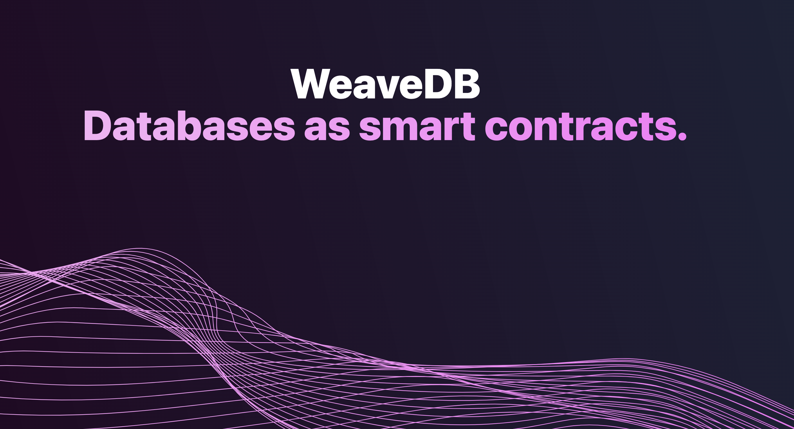

Welcome to the Build3rs Stack, our web3 infrastructure overview series! This week we’ll explore [WeaveDB](https://weavedb.dev/)- **a NoSQL Database bringing web2 UX and scalability capabilities to web3 apps.**

In brief, WeaveDB is a decentralized NoSQL database built atop Arweave and Warp Contracts, providing scalable, secure, and swift data storage for web3 dapps. Its hybrid architecture allows for instant transactions and cross-chain relaying, _bringing the benefits of a traditional, centralized database to the world of decentralized apps_.

---

## TLDR;

WeaveDB is a noSQL database platform leveraging the Arweave ecosystem, allowing decentralized applications to transition from centralized databases to a horizontal and scalable model. WeaveDB has a similar syntax and hierarchy to its centralized alternative, Google's Firestore, but **with the addition of web3 native smart contracts**.

WeaveDB enables developers to build efficient and complex decentralized applications that require quick access to data, scalability, and a web2 user experience for databases.

**How is this done?** WeaveDB encapsulates the database as a Warp SmartWeave contract, which in turn leverages Arweave as a consensus layer. In summary, it is comprised of 3 layers:

- **Smart Contract Layer**: Where the logic of the database lives. This layer receives the transactions, and handles sequencing and sub-transactions through the storage layer (described below), but performs no computation besides its own logic.
- **Storage Layer**: Used for consensus inside that smart contract through a paradigm called [SCP (Storage-based Consensus/Computation Paradigm)](https://mirror.xyz/0xDc19464589c1cfdD10AEdcC1d09336622b282652/KCYNKCIhFvTZ1DmD7IpXr3p8di31ecC283HgMDqasmU). WeaveDB (more specifically Warp) uses Arweave because of its immutability: if input and output states are permanent, the calculations can be deterministic, and computation -which is the demanding part in terms of cost and scalability- can be performed off-chain.
- **Computation Layer**: Occurs on the client side or on a series of decentralized nodes provided by Warp. They send transactions to the smart contract and receive its states to perform computation by a process of lazy evaluation.

This all enables WeaveDB to dramatically reduce query times for databases, comparable to web2 staples like Firestone. **And, as the computation is performed off-chain, the gas costs are much lower than a database that lives inside the chain** (and can be absorbed by dapp developers, not transferred to their users).

In practice, this opens the doors for the development of new dapps like social networks, blogs, forums, productivity software, and many other applications that were not possible in the current web3 environment.

---

## WeaveDB in Features: Databases For The Web3 World With Web2 UX

One of the most relevant takeaways from WeaveDB is not only the enablement of cheap, quick non-relational databases on web3, but also to retain the ease of use of web2 alternatives like Firestore to develop complex dapps. That way, developers can feel right at home when handling the logic behind it, using a JSON-like query syntax.

WeaveDB is permissionless, so it requires a precise JSON schema to regulate what kind of data can be written. The schema is not only regulated by itself but also has the logic inside the smart contract working towards validation, using a programming language called FPJSON which is unique to WeaveDB.

Similarly to Firestore, WeaveDB solves the problem of indexing by auto-indexing it with single fields. And **as the computation is performed off-chain, it does not require an indexing solution (such as API3 or The Graph)**.

In terms of usability and security, WeaveDB can use cross-chain crypto authentication (using EVM-based accounts, Internet Identity, or ArConnect), but making transactions do not necessarily require a crypto wallet.

With weaveDB, developers can have near real-time databases, simple contract development, and familiar syntax to build databases that are very easy to scale. On the other hand, users can build dynamic dapps that are complex, decentralized, permissionless, and censorship-resistant.

---

## Main Use-Cases: Dynamism for Complex Dapps

The WeaveDB databases could potentially be the dynamic engine that Dapps need to serve users with experiences that are common on web2, enabling applications that weren’t possible in the current web3 environment due to scalability issues, price of computation, or both.

### Todo Manager

WeaveDB can be used to set up a [custom task manager](https://docs.weavedb.dev/examples/todos). Each task has properties like task details, date, user_address, and more. Rules can be set up to control the access and modification of these tasks. For example, a user could configure their Todo manager to only allow the task owner to delete or mark the status of the task itself.

### Cross-Chain NFT Relayer

By default, WeaveDB can be configured to authenticate users with crypto accounts across blockchains. In a similar vein, users can spin up a [cross-chain NFT validator](https://docs.weavedb.dev/examples/relayer-nft), leveraging WeaveDB’s relayer feature, to authenticate the ownership of NFTs from any blockchain. The query data can be modified with custom access controls, allowing users to control the query rules of the collection.

### Mirror.xyz Article Bookmarking

With WeaveDB, users can make an article bookmarking app where users can bookmark and explore articles from a database of their favorite authors on Mirror.xyz.

The database is set up with three collections:

**Bookmarks**: Stores user bookmarks, each of which has `article_id`, `date`, and `user_address` as properties.

**Mirror**: Used to store articles that were saved from Mirror

**Conf**: Used for organization and bookkeeping.

Access control rules can also be set up for these collections. For instance, only the user who sets a record can delete it in the bookmarks collection. Periodic calculations of bookmark counts are also done to show trending articles! Check out this [step-by-step guide](https://docs.weavedb.dev/examples/bookmarks) for more details.

---

## Getting Started with WeaveDB

- [Quick Start Guide](https://docs.weavedb.dev/quick-start)
- [Set-Up SDK](https://docs.weavedb.dev/sdk/setup)
- [Join the WeaveDB Fellowship Program](https://medium.com/weavedb/introducing-weavedb-fellows-7ccfadabd208)

---

Hopefully that this guide has provided you with the essential information and tools to begin integrating WeaveDB into your web3 builds! Make sure to follow [WeaveDB](https://twitter.com/weave_db) for updates from their team.

Additionally, we encourage you to check out our previous guides in the [Build3rs Stack series](/guides/) and keep an eye out for upcoming ones so that you can stay informed about the latest updates about web3 infrastructure. You can also join our [Discord](https://discord.com/invite/fleek) community to connect with us quickly.

For this and more resources, visit our [LinkTree](https://linktr.ee/fleek).
