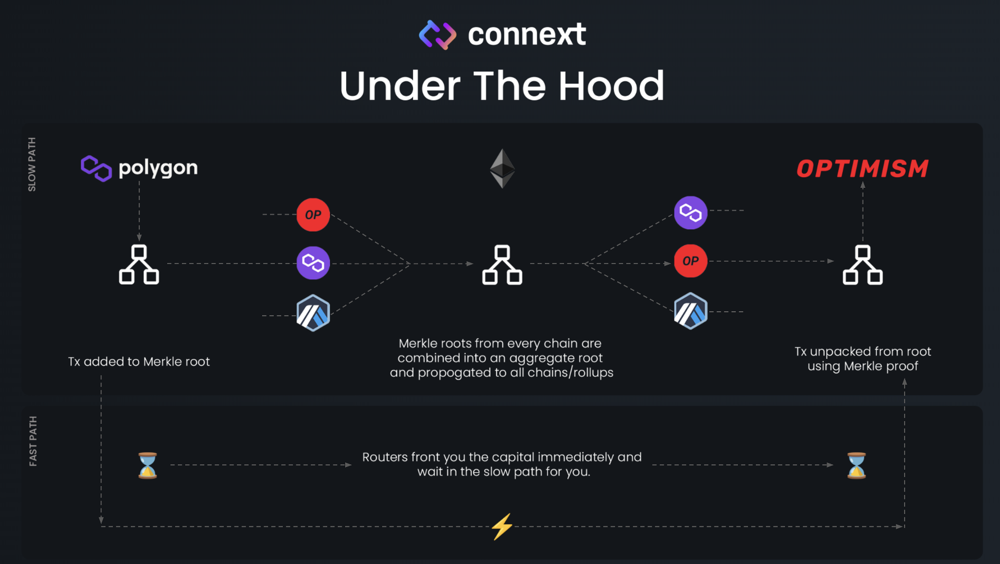
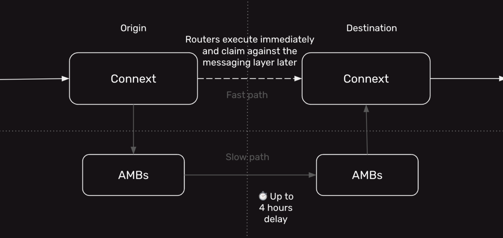

Welcome to the Build3rs Stack, our web3 infrastructure overview series! This week we are checking out [Connext](https://www.connext.network/), a protocol for securely passing data and funds between chains.

Developers can use Connext to build cross chain web3 apps that interact with multiple blockchains or rollups simultaneously. Let's jump in.

---

## TLDR; What is Connext and how does it work?

The Connext team is aiming to solve fragmented experiences for web3 apps that need to access different chains for interoperable DeFi.

Connext built a [bridge](https://blog.connext.network/the-messaging-bridge-stack-a9ae849858e0) to pass data and funds between chains. The bridge consists of three main features:

- **Transport**: Posting message data from one chain to another.
- **Verification**: Proving the correctness of the above data.
- **Execution**: Doing _something_ with the bridged data.

---

## The Heart of Connext: Modularity, Security, and Simplicity

The protocol takes a **modular** approach via hub and spoke architecture that derives security from Ethereum. The hub node communicates with multiple spoke nodes, and messages are added to a Merkle-root generated at each spoke domain. The messages are then aggregated into a single root on Ethereum L1.

Connext implements watchers for **security**. Watchers are automated off-chain actors that observe the network and halt message passing if fraud or a hack is observed. This ensures that failure on any one part of the system is minimized.

A single call, “xcall”, adds **simplicity** to the protocol, providing a simple primitive for developers to asynchronously interact with contracts living on another chain/rollup, similar to how you can call a contract living on the same chain/rollup.

---

## Network Architecture

Connext’s Architecture consists of smart contracts and off-chain actors to facilitate the bridging of data and funds between chains.

### Smart Contracts

In the Connext ecosystem, a variety of contracts handle interactions like xcalls, managing asset registration, and provisioning liquidity for routers and stableswap LPs. **Connext contracts** use [diamond pattern](https://dev.to/mudgen/understanding-diamonds-on-ethereum-1fb) to handle messages related to sending funds across chains. **Messaging contracts** manage Merkle roots containing hashed data to send through the hub-and-spoke architecture. A Connector is an abstraction around an underlying transport layer and is inherited by two [subcontracts](https://docs.connext.network/concepts/how-it-works/architecture).

### Offchain Agents

**Routers** are node operators that provide liquidity to the protocol. Routers front liquidy to enhance speed and user experience. Typically, Ethereum message transmissions take one to three hours, by fronting liquidity with Routers, Connext message transfers occur in **45 to 180 seconds!** Anyone can participate as a router and there is no minimum liquidity required. Routers accept a flat 0.05% fee for fronting liquidity.

**Sequencers** collect bids and select routers to fill message transmissions. Any number of routers can fill a single transaction, which is helpful for large transactions. Sequencers will post batches of bids to a relayer network to submit them to the chain.

**Relayers** are a decentralized network of infrastructure operators that charge a fee to execute smart contract transactions on behalf of users. Relayers play the important role of completing the last leg of the flow by performing execution on the destination domain. Connext is currently using [Gelato](https://www.gelato.network/) for relayers.

---

## Transaction Lifecycle

There are two paths a message can take from the "Origin" chain to the "Destination" domain: Fast or Slow.

For a message to be transmitted via the **fast path**, it **must meet two requirements**:

1. Only tokens and unauthenticated call data can be sent (anyone can call the function on the target contract).
2. Routers must provide sufficient liquidity for the token on the destination domain.

Routers execute the bridge almost instantaneously by providing instant liquidy on the destination domain for the user. Routers receive a fee for following the Aubritrary Message Bridge (AMB).

Messages are directed through the **Slow Path** if _either_ of the following conditions apply:

1. Messages include authenticated calldata (DAO votes across chains, altering protocol settings).
2. There's insufficient router liquidity for the bridged token on the destination domain.

Messages on the slow path follow AMB instead of being fronted liquidity by routers, slowing the process, but allowing for confidence in data correctness.

---

## Connext in Features

Connext surfaces two main features, xERC and Chain Abstraction. Both features enable Web3 apps to interact with multiple chains and rollups.

### xERC20

xERC20 refers to cross-chain ERC20 tokens designed for seamless transfer across chains without experiencing slippage or compromising security. [Traditional methods](https://medium.com/coinmonks/whats-the-difference-between-crosschain-and-omnichain-a68a8bb557b8) to make a token available on multiple chains include providing significant liquidity to a bridge on each chain (resulting in user slippage during transfers) or creating a new token representation through a bridge, locking into a bridge’s security model permanently.

Connext offers a solution that allows cross-chain transfers with no slippage. The solution is deployed and controlled by the token issuer, fully secured by Ethereum L1 and the canonical bridges of each chain. It's designed to be fungible against token representations minted by various bridges, such as roll-up bridges and the Polygon PoS bridge.

Connext brings the security of canonical bridging into a developer interface. It establishes a message highway between chains, batching data associated with cross-chain token transfers into Merkle roots. These roots are sent from each chain to Ethereum L1 through the bridges, further batched on L1, and then transmitted back to the other chain. Routers, explained above, front liquidity to speed up transmissions and enhance user experience.

### Chain Abstraction

Chain abstraction enables Web3 apps to execute logic from any chain without users needing to switch networks, sign transactions on a different chain, or spend gas on another chain. [Chain abstraction](https://docs.connext.network/usecases/chain-abstraction) is a two-step process and does not require changes to contracts. The feature allows for easy cross-chain messaging.

### Subgraphs

Connext has a GraphQL API endpoint hosted by [The Graph](https://thegraph.com/docs/en/about/#what-the-graph-is) for indexing and organizing data from Connext smart contracts. [The subgraph](https://docs.connext.network/resources/subgraphs) consumes data on transactions and can be used to query Connext bridge transactions and transaction statuses on mainnet, as well as, testnet.

---

## Examples of Projects Leveraging Connext

### Cross-chain NFTs (e.g. [NFT Hashi](https://nfthashi.com/))

Hashi is a cross-chain NFT bridge built with Connext. Projects can use NFTHashi as middleware by integrating NFTHashi contracts into a project's contracts. Learn more in [NFTHashi’s docs](https://docs.nfthashi.com/).

### Decentralized Trading Platform (e.g. [DODO](https://app.dodoex.io/?network=mainnet))

Dodo is a decentralized trading platform that uses the [Proactive Market Maker (PMM) algorithm](https://docs.dodoex.io/english/dodo-academy/pmm-overview) to provide efficient on-chain liquidity for Web3 assets. [DODO is leveraging Connext’s SDK](https://blog.connext.network/dodo-integrates-connext-599808dcb73b) to power their token bridge.

---

## Getting Started

- [Developer Documentation](https://docs.connext.network/concepts/readme)
  - [xERC20 Token Setup Guide](https://www.notion.so/be4e136a6db14191b8d61bd60563ebd0?pvs=21)
  - [Chain Abstraction Guide](https://docs.connext.network/usecases/chain-abstraction/chain-abstraction-guide)
- [Subgraphs](https://docs.connext.network/resources/subgraphs)
  - [Creating an API Key Video Tutorial](https://www.youtube.com/watch?v=UrfIpm-Vlgs)
  - [Managing your API Keys and Settings](https://thegraph.com/docs/en/querying/managing-api-keys/)
  - [Connext Network Explorer Page](https://connextscan.io/)
  - [Connext Subgraph Implementation Repo](https://github.com/connext/monorepo/tree/56a166f3ecb50cc10356dd96c257e2e4d47f29e3/packages/deployments/subgraph/src/amarok-runtime-v0)
- [Deployments](https://docs.connext.network/resources/deployments)
  - [Full List of Deployed Contracts](https://github.com/connext/monorepo/blob/main/packages/deployments/contracts/deployments.json)
- [Routers](https://docs.connext.network/routers/routers-intro)
- [Bug Bounty](https://immunefi.com/bounty/connext/)
- [YouTube](https://www.youtube.com/channel/UCJcDUTLSVg2hYEXKPY8WV7g)
- [Blog](https://blog.connext.network/)

---

We hope you enjoyed learning about Connext. Cross-chain governance is on the team's roadmap and coming soon! Follow Connext on [X](https://twitter.com/ConnextNetwork) to stay up to date on what the team is working on.

If you enjoyed learning about the protocol check out more of our [Build3rs Stack articles](/guides/).

You can also [join our Discord server](https://discord.com/invite/fleek) to jam with the team and learn more!

For more resources, visit [our LinkTree](https://linktr.ee/fleek) ⚡
