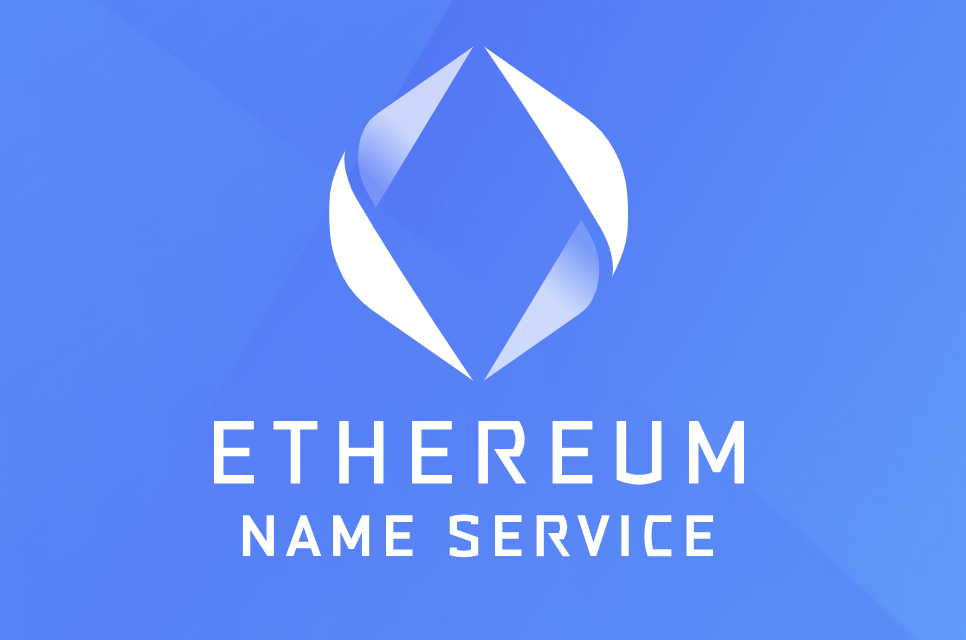

Welcome to the Build3rs Stack, Fleek’s **web3 infrastructure overview series**. This week we will take a look at ENS, Unstoppable Domains and HandShake - decentralized domain provider alternatives!

Let's dive in and explore how these protocols are aiming to reshape the traditional domain name system (DNS).

---

## What is a ‘Domain’?

In the context of traditional domains in web2, domains are human-readable addresses that are used to locate websites on the internet, like [Fleek.xyz](https://fleek.xyz/)! They are a crucial part of the traditional Domain Name System (DNS), which maps these easy-to-remember names to the IP addresses that computers use to identify each other on the network.

### Centralized vs. Decentralized Domains

To understand why alternatives like ENS, HNS and Unstoppable Domains came to be, it’s important to understand the key differences between centralized domain providers (DNS) and what web3 providers aim to achieve.

**Ownership and Control**:

Centralized domains are controlled by centralized authorities called registrars and registries. These entities manage the allocation, renewal, and transfer of domain names, and can enforce changes, removals, or deletions based on their ruling.

In contrast, decentralized domains are managed directly by their owners through blockchain technology, with no need for intermediaries. Once a decentralized domain is registered, the owner has full control over it, including the ability to transfer or sell it to others directly.

**Censorship Resistance**:
Centralized domains are susceptible to censorship, as governments and other powerful entities can pressure the centralized authorities to take down or block specific domains.

Decentralized domains, on the other hand, are inherently resistant to censorship, as they are not only not controlled by a single entity, as said above, but not resolved/served by a centralized provider or infrastructure. Their distributed nature ensures that no single party can unilaterally remove or block access to a domain.

**Interoperability and Extensibility**:
Decentralized domains enable seamless integration with other decentralized services, such as wallets, decentralized applications (dApps), and decentralized storage solutions like [IPFS](https://ipfs.tech/).

---

## What are ENS, Unstoppable Domains and Handshake and how do they work?

While not the exclusive options in decentralized naming, the following three provide a good example of what the purpose of web3 naming is:

### Ethereum Name Service (ENS)

ENS, or [Ethereum Name Service](https://ens.domains/), is a decentralized domain name service built on the Ethereum blockchain. It enables users to register and manage domain names ending in ".eth" and link them to different services & tools, such as wallets addresses, smart contracts, and decentralized applications (dApps) as their domains.

ENS also allows mapping human-readable names to IPFS content hashes (among other content types), allowing users to map content to decentralized URLs. ENS allows users to register and manage decentralized domains on Ethereum by choosing a domain name, checking its availability, and paying a registration fee per year in ETH. Over the course of the pre-paid ownership period, owners have full control over their domains, with the ability to set up records, transfer ownership, and sell domains without intermediaries. ENS uses smart contracts called resolvers to translate domain names into corresponding resources like Ethereum addresses or IPFS hashes.

### Unstoppable Domains

[Unstoppable Domains](https://unstoppabledomains.com/) is a blockchain-based domain name system that aims to simplify the process of accessing and interacting with decentralized resources. It operates on both the Ethereum and Zilliqa blockchains and offers domain names with extensions such as ".crypto" and ".zil". Compared to ENS, these domains don’t have timed ownerships, but permanent ones.

This allows users to configure domains with various records, such as Ethereum addresses or IPFS content hashes, which are stored on the blockchain and can be updated as needed. The protocol easily integrates with decentralized services like wallets, dApps, and storage solutions, ensuring seamless interaction using human-readable domain names. When accessing a decentralized resource, a lookup is performed to obtain necessary information, enabling users' wallets or dApps to interact with the intended resource.

### Handshake

[Handshake](https://handshake.org/) is a decentralized, permissionless naming protocol that aims to replace the traditional Domain Name System (DNS) with a secure and censorship-resistant alternative. Handshake focuses on the root zone, the top level of the DNS hierarchy, and uses a blockchain-based system to manage top-level domains (TLDs). These names are sold and traded on a permanent ownership basis.

By decentralizing the root zone (the “.com”, “.xyz”, “.here” of domains), Handshake enhances the security and resilience of the entire domain name systems. Based on a proof-of-work (PoW) consensus algorithm, Handshake uses a native cryptocurrency (HNS) to incentivize network participants.

---

## ENS, Unstoppable Domains, and Handshake in Features:

While different in implementation, or having unique features, these providers share some common primitives:

### Decentralized Domain Registration and Ownership:

ENS, Handshake and Unstoppable enable users to register and manage domain names on Ethereum and other blockchains. This decentralized system ensures that the domain owner has full control over their domain name, including the ability to set up records, transfer ownership, and sell the domain without the need for intermediaries or centralized authorities.

### Censorship-Resistant Domains

These providers also share a key characteristic: resistance to censorship. Since no single entity controls the system, it is virtually impossible for a government or other powerful entity to unilaterally remove or block access to a domain or affect its content.

### Identity Providers & Human Readable Addresses

Both ENS and Unstoppable Domains can also act as a web3 user’s identity and user-name. Since they can reference addresses, and other content other than a website, they can unify a person’s online identity under simple human-readable addresses (name.nft, or name.ens, instead of long addresses). They can help unify multiple concepts (identity, presence, financial) into a single name.

While the above are features they might share overall, here are some of the other features each protocol boast individually:

### ENS: Human-Readable Names for Decentralized Resources and Flexible and Extensible Record Management

**Flexible and Extensible Record Management**:
ENS domains support a wide range of record types, enabling users to associate their domain names with different blockchain addresses, content hashes, or other data. This flexibility allows ENS to be easily integrated with various decentralized services and platforms. Users can update their domain records as needed, ensuring that their ENS domains always point to the most relevant resources.

### Handshake: Integration with DNS & TLD Registration

Handshake is designed to be compatible with the existing DNS infrastructure. This means that users can continue to use their traditional domain names alongside Handshake TLDs. Resolvers that support Handshake can resolve both traditional and Handshake domains seamlessly. Furthermore, as Handshake focuses on the Top Level Domain level, you can register full-on TLDs (“.name”) instead of domains under a shared TLD (name.eth).

---

## Using ENS, Unstoppable Domains and Handshake as a Builder: Applied Use-Cases.

### ENS: Easier Address Management (e.g: [MetaMask](https://metamask.io/))

Metamask supports ENS name resolving, allowing users to save contacts with .eth domain names instead of using long Ethereum addresses for payments and transfers.

### Handshake: Passwordless Logins (e.g: [Namebase](https://www.namebase.io/blog/handshake-login/))

Handshake can allow developers to integrate a name-identity based login, without requiring passwords but simply by proving the ownership of the username itself and authenticating your identity.

### Unstoppable Domains: Decentralized Sites (e.g: [IPFS](https://ipfs.io/))

To enable users to associate their decentralized websites with IPFS hashes, Unstoppable Domains allows users to map their domains to a content hash and reflect their website, accessible via an Unstoppable domain.

---

We hope that this guide has given you the necessary information and tools to start building with decentralized domains! Make sure to follow [ENS](https://twitter.com/ensdomains), [Unstoppable Domains](https://twitter.com/unstoppableweb) and [Handshake](https://twitter.com/HNS) for further updates and developments.

Additionally, we encourage you to check out the previous guides from our [Build3rs Stack](/guides/) series and keep an eye out for upcoming ones so that you can stay informed about the latest updates about web3 infrastructure. You can also join our [Discord](https://discord.gg/fleek) community to connect with us quickly.

If you need more resources, please visit our [LinkTree](https://linktr.ee/fleek)!
