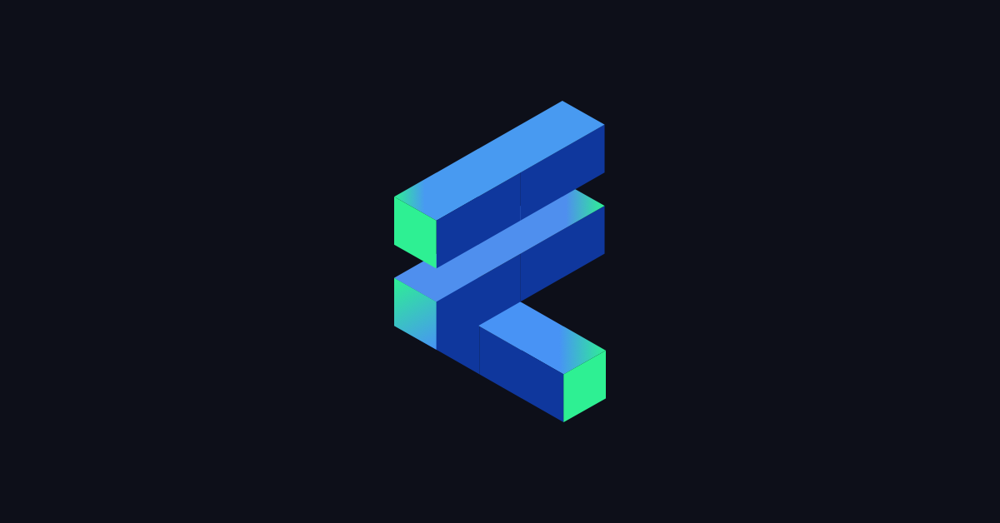

Welcome to the Build3rs Stack, Fleek’s **web3 infrastructure overview series**. This week we will take a look at **[Filecoin](https://fvm.filecoin.io/) and the Filecoin Virtual Machine** - A decentralized storage network and a runtime environment for smart contracts! We will talk in depth about these, the main features, resources, and all the necessary information to get started.

In brief, Filecoin is **a decentralized storage network** that aims to create a global, open market for data storage and retrieval services. Filecoin is built on top of the InterPlanetary File System (IPFS) and is powered by its native token, FIL, which is used to incentivize users to share their storage space and bandwidth.

And even further, there's **[Filecoin Virtual Machine](https://fvm.filecoin.io/) (FVM)** - responsible for **hosting smart contracts and executing them** on the Filecoin network, allowing users to interact with the network’s data programmatically.

Let's take a look at both!

---

## TL;DR: What is Filecoin?

Filecoin is a decentralized, **peer-to-peer storage network that combines cryptographic guarantees and economic incentives to ensure reliable and long-term storage of files**.

In the Filecoin ecosystem, users pay storage providers to host their files, and storage providers in return are responsible for maintaining and providing the accurate storage of these files over time.

The best of all? **Filecoin is open to anyone who wants to store their files or earn revenue by storing other users' files**, as long as they meet node requirements. This creates an open market for storage and retrieval services that is not controlled by any single entity. It is built upon IPFS storage and addressability primitives, employing content addressing to enable permanent data references without depending on specific devices or cloud servers.

Filecoin sets itself apart from IPFS because they have the incentive layer, which encourages the reliable storage and accessibility of content.

To achieve all of this, Filecoin leverages three main actors:

1. **Clients**: Users who want to store their data on the Filecoin network. They pay storage providers in Filecoin tokens (FIL) to host their files.

2. **Storage Miners**: Storage providers that offer their resources (storage space and bandwidth) to the network. They are responsible for storing clients' files and maintaining them over time. Storage miners earn FIL tokens as compensation for providing storage services.

3. **Retrieval Miners**: Responsible for delivering the stored data to clients when they request it. They compete to provide the fastest data retrieval service and earn FIL tokens for their efforts.

To ensure data reliability and network integrity, Filecoin employs two unique consensus mechanisms:

1. **Proof-of-Replication (PoRep)**: PoRep is a cryptographic proof system that allows a storage miner to demonstrate that they have correctly replicated a client's data in a unique and dedicated copy. This ensures that the data is securely stored on the miner's machine.
2. **Proof-of-Spacetime (PoSt)**: PoSt is a mechanism that requires storage miners to prove they are continuously storing the clients' data over a specified period. This ensures the long-term availability and integrity of the data on the network.

---

## FVM - The Filecoin Virtual Machine

FVM is a **runtime environment designed for smart contract execution**, known as actors, on the Filecoin network. It allows developers to create innovative use cases: including data access control, data DAOs (decentralized autonomous organizations), perpetual storage, collateral leasing, and Ethereum-compatible fungible and non-fungible tokens.

FVM is fully EVM-compatible, which means it supports Ethereum tooling and enables new ERC-20 tokens to be launched on the network. The most important components are:

### Data Access Control

This is an essential component of the FVM, allowing Filecoin participants to limit individual access to specific data sets. This was previously only possible using centralized storage solutions!

The FVM also enables the creation and management of data-centered DAOs, which can govern and monetize data access while pooling returns into a shared treasury.

### Perpetual Storage

Perpetual storage is another feature provided by the FVM. It allows users to store data permanently, managed by repair and replication bots that benefit from Filecoin's verifiable storage proofs. This ensures data resiliency and availability. FIL token holders can use their holdings as storage collateral and receive leasing fees in return. Community-generated reputation scores help identify reliable borrowers.

### Principal Aspects of the Filecoin Virtual Machine:

- **Smart contracts**: Smart contracts are self-executing agreements with the terms directly written into code. They are executed by FVM and can be used to create dApps on the Filecoin network.
- **FVM execution environment**: FVM provides an isolated execution environment for smart contracts. It ensures that each contract runs independently, without interfering with other contracts or the overall system. This isolation helps maintain the security and stability of the Filecoin network.
- **Gas and resource management**: this uses a concept called "gas" to manage resources and computation. Gas is a unit that measures the computational effort required to execute a smart contract. Each operation in a smart contract consumes a certain amount of gas. This gas consumption ensures that users pay for the resources they consume, discouraging spam or denial-of-service attacks on the network.
- **Consensus and state management**: FVM is responsible for managing the global state of the Filecoin network. It tracks the state of all active smart contracts and updates them according to the rules defined by the consensus algorithm. The consensus algorithm ensures that all nodes in the network agree on the state of the system and the execution of smart contracts.
- **Integration with the Filecoin network**: FVM is also tightly integrated with the Filecoin network. It interacts with the storage and retrieval markets, allowing users to store and retrieve data through smart contracts. It also enables the creation of various dApps, extending the functionality of the Filecoin platform.

---

## Filecoin in Features: Decentralized Storage, and Smart contracts over Filecoin Data with EVM compatibility.

Filecoin has a lot of features that make it different from other protocols, let’s take a look at the main ones:

**Decentralized storage**: Filecoin relies on a distributed network of storage providers who offer their storage capacity to users. This eliminates the need for centralized data centers, reducing the risk of data loss, censorship, and other issues associated with centralized storage systems.

**Smart contracts over Filecoin Data with EVM compatibility for FVM**: These smart contracts can interact with the data stored on the network, allowing developers to build dApps that harness the decentralized storage capabilities of Filecoin. To lower the barrier to entry for developers, FVM has integrated EVM runtime enabling developers to deploy their Solidity/Ethereum smart contracts with little modifications.

---

## How You Can Use Filecoin as a Builder: Applied Use-Cases.

To understand how Filecoin works and the value that it provides you, we need to know what the main real use-cases are with examples.

**Decentralized Video Streaming & Transcoding (e.g: [Livepeer](https://fleek.xyz/guides/builders-stack-livepeer/))**

By using Filecoin to store video data, users can leverage a protocol like Livepeer to source, transcode and stream the data. This reduces the risk of storage origin outages and allows for a safer storage of crucial video data.

**Decentralized Data Marketplace (e.g: [Ocean Protocol](https://oceanprotocol.com/))**

Ocean Protocol is a decentralized data marketplace that enables data sharing and monetization while preserving privacy. By using Filecoin for storage, Ocean Protocol can ensure that the data being traded is securely stored and easily accessible to authorized parties.

**Cold Storage File Backups (e.g: [Fleek](https://fleek.co/))**

Due to its higher level of security, toughness, and decentralization, Filecoin makes for a great secondary storage backup layer for any files. Fleek uses it to ensure all user files and websites have a redundant layer of security by storing them on Filecoin’s decentralized network.

---

## Getting Started with Filecoin

Anyone can easily get started with Filecoin using the tools they provide. But first, we recommend you take a look at the official documentation and some other useful resources:

- [Learn the basics of Filecoin](https://docs.filecoin.io/basics/what-is-filecoin/overview/)
- [Tool for Filecoin storage providers to manage data storage and retrievals](https://github.com/filecoin-project/boost)
- [Store your data on Filecoin](https://docs.filecoin.io/store/overview/start-storing/)
- [Become a provider](https://docs.filecoin.io/storage-provider/basics/overview/)
- [All the projects that build on Filecoin](https://ecosystem.filecoin.io/)

## Getting Started with Filecoin Virtual Machine

You can start with the [official Filecoin Virtual Machine documentation](https://docs.filecoin.io/smart-contracts/fundamentals/the-filecoin-virtual-machine/)! Here are more useful resources:

- [EVM compatibility of FVM (FEVM)](https://www.youtube.com/watch?v=lgUMVhM3FIM)
- [Filecoin.sol](https://docs.zondax.ch/fevm/filecoin-solidity/): Solidity library for FEVM development.
- [Quickstart with Remix](https://docs.filecoin.io/fvm/how-tos/quickstart/): Deploy your first FEVM actor (smart contract equivalent).
- [FVM Zero to One](https://hackernoon.com/the-filecoin-virtual-machine-everything-you-need-to-know): Learn from scratch how FVM works.
- [Start to deploy on FVM](https://spacewarp.fvm.dev/)

---

We hope that this guide provides you with the necessary info and tools to start building with Filecoin! Make sure to follow [Filecoin](https://twitter.com/Filecoin) for further updates and developments.

Additionally, we encourage you to check out our previous [Build3rs Stack](/guides/) series and keep an eye out for upcoming ones so that you can stay informed about the latest updates about web3 infrastructure. You can also join our [Discord](https://discord.com/invite/fleek) community to connect with us quickly.

If you need more resources, please visit our [LinkTree](https://linktr.ee/fleek)!
